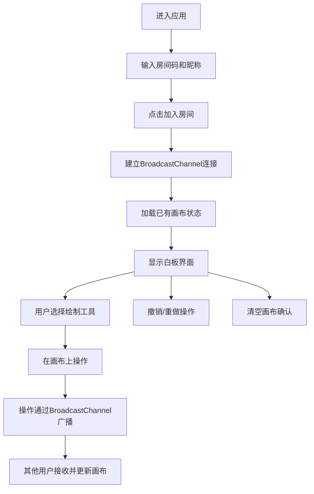

## 1. 产品概述

基于浏览器本地存储的多人实时协作白板应用，支持多用户通过房间码加入同一画布进行图形绘制、拖拽编辑和实时同步。

- 主要用途：团队远程协作、头脑风暴、在线教学、会议讨论等场景下的实时绘图协作
- 目标用户：需要远程协作的团队成员、教师学生、设计人员等
- 核心价值：无需安装任何软件，打开浏览器即可多人实时协作绘图，操作简洁，同步实时

## 2. 核心功能

### 2.1 用户角色

| 角色 | 加入方式 | 核心权限 |
|------|----------|----------|
| 协作用户 | 输入房间码和昵称加入 | 绘制图形、编辑图形、删除图形、撤销/重做、查看用户列表 |

### 2.2 功能模块

1. **房间入口页**：房间码输入、昵称输入、加入按钮
2. **白板主页面**：画布区域、工具栏、用户列表面板、房间码显示

### 2.3 页面详情

| 页面名称 | 模块名称 | 功能描述 |
|----------|----------|----------|
| 房间入口页 | 房间码输入 | 随机生成4位字母数字组合，用户可自定义房间码 |
| 房间入口页 | 昵称输入 | 用户输入昵称以标识身份 |
| 房间入口页 | 加入按钮 | 验证输入后跳转到白板界面 |
| 白板主页面 | 画布区域 | SVG画布，支持绘制、拖拽、缩放、选中操作 |
| 白板主页面 | 工具栏 | 颜色选择、线条粗细、形状切换、撤销、清空按钮 |
| 白板主页面 | 用户列表面板 | 显示在线用户及其颜色标识 |
| 白板主页面 | 房间码显示 | 显示当前房间码，支持一键复制 |

## 3. 核心流程

用户进入页面 → 输入（或使用默认）房间码和昵称 → 点击加入 → 进入白板 → 选择工具进行绘制 → 操作实时同步到其他协作者 → 可进行撤销/重做/清空操作

## 4. 用户界面设计

### 4.1 设计风格

- **主色调**：背景 #1a1a2e，画布区域 #16213e，工具栏背景 #0f3460，高亮色 #e94560
- **按钮风格**：圆角按钮，悬停背景变为高亮色带0.3s ease过渡，点击缩放0.95
- **字体**：Roboto（Google Fonts加载）
- **布局风格**：顶部工具栏（60px固定高度）+ 右侧用户面板（200px固定宽度）+ 中间画布区域
- **图标**：React Icons（FaDrawPolygon、FaCircle等）

### 4.2 页面设计概述

| 页面名称 | 模块名称 | UI元素 |
|----------|----------|--------|
| 房间入口页 | 表单区域 | 居中卡片，深色背景，两个输入框和一个高亮色按钮，平滑入场动画 |
| 白板主页面 | 工具栏 | 顶部60px高度，图标横向排列，悬停高亮，选中状态指示 |
| 白板主页面 | 用户面板 | 右侧200px宽度，顶部房间码+复制按钮，下方用户列表带颜色标识 |
| 白板主页面 | 画布区域 | 充满剩余空间，深色背景，图形元素带选中虚线框和控制点 |
| 白板主页面 | 确认对话框 | 背景模糊，中央模态框带平滑弹入动画 |
| 白板主页面 | Toast提示 | 右下角弹出，复制成功等提示 |

### 4.3 响应式

- 桌面优先设计
- 屏幕宽度 < 768px：工具栏变为两行，用户面板折叠为右侧抽屉（滑入动画0.3s，背景半透明模糊）
- 触控优化：确保按钮和控制点足够大，支持触摸拖拽

### 4.4 动效设计

- 按钮悬停：0.3s ease背景色过渡
- 按钮点击：scale 0.95再恢复
- 图形绘制和移动：0.15s ease-out过渡
- 模态框弹入：平滑缩放+淡入动画
- 抽屉滑入：0.3s translate动画
- Toast提示：淡入淡出动画
