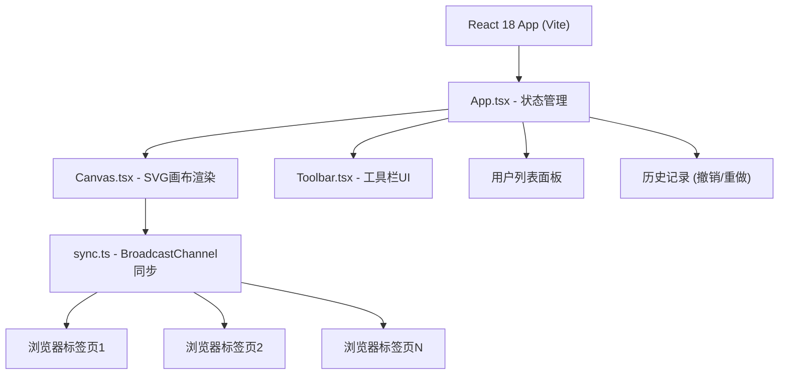

## 1. 架构设计



## 2. 技术描述

- **前端框架**：React@18 + TypeScript
- **构建工具**：Vite
- **UI库**：React Icons
- **状态管理**：React Hooks (useState, useReducer, useEffect, useRef, useCallback)
- **画布实现**：原生SVG
- **同步机制**：BroadcastChannel API
- **样式方案**：CSS Modules + 内联样式
- **颜色选择**：react-color
- **唯一ID**：uuid

## 3. 项目文件结构

| 文件路径 | 用途 |
|----------|------|
| `package.json` | 项目依赖配置 |
| `vite.config.js` | Vite构建配置（React插件、路径别名、端口） |
| `tsconfig.json` | TypeScript编译配置（严格模式、ES2020） |
| `index.html` | HTML入口页面 |
| `src/main.tsx` | React应用入口 |
| `src/App.tsx` | 主组件，管理全局状态 |
| `src/components/Canvas.tsx` | 画布组件，SVG渲染和交互 |
| `src/components/Toolbar.tsx` | 工具栏组件 |
| `src/utils/sync.ts` | BroadcastChannel同步工具 |

## 4. 数据模型

### 4.1 图形元素类型

```typescript
type ShapeType = 'rect' | 'circle' | 'line' | 'path' | 'text';

interface BaseShape {
  id: string;
  type: ShapeType;
  userId: string;
  userColor: string;
  strokeWidth: number;
  fill?: string;
  opacity: number;
  createdAt: number;
}

interface RectShape extends BaseShape {
  type: 'rect';
  x: number;
  y: number;
  width: number;
  height: number;
}

interface CircleShape extends BaseShape {
  type: 'circle';
  cx: number;
  cy: number;
  r: number;
}

interface LineShape extends BaseShape {
  type: 'line';
  x1: number;
  y1: number;
  x2: number;
  y2: number;
}

interface PathShape extends BaseShape {
  type: 'path';
  d: string;
  points: { x: number; y: number }[];
}

interface TextShape extends BaseShape {
  type: 'text';
  x: number;
  y: number;
  text: string;
  fontSize: number;
}

type Shape = RectShape | CircleShape | LineShape | PathShape | TextShape;
```

### 4.2 用户信息

```typescript
interface User {
  id: string;
  name: string;
  color: string;
  joinedAt: number;
  isActive: boolean;
}
```

### 4.3 同步消息类型

```typescript
type SyncAction = 
  | { type: 'INIT_REQUEST'; fromUserId: string }
  | { type: 'INIT_RESPONSE'; toUserId: string; shapes: Shape[]; users: User[] }
  | { type: 'SHAPE_ADD'; shape: Shape }
  | { type: 'SHAPE_UPDATE'; shape: Shape }
  | { type: 'SHAPE_DELETE'; shapeId: string }
  | { type: 'SHAPES_CLEAR' }
  | { type: 'USER_JOIN'; user: User }
  | { type: 'USER_LEAVE'; userId: string }
  | { type: 'HEARTBEAT'; userId: string };
```

## 5. 核心状态管理

### 5.1 状态结构

```typescript
interface AppState {
  roomCode: string;
  currentUser: User | null;
  users: User[];
  shapes: Shape[];
  selectedIds: string[];
  currentTool: ToolType;
  currentColor: string;
  currentStrokeWidth: number;
  history: Shape[][];
  historyIndex: number;
}
```

### 5.2 历史记录管理

- 使用数组存储历史状态快照
- `historyIndex` 指向当前状态
- 最多保留50步操作
- 撤销：`historyIndex > 0 ? historyIndex--`
- 重做：`historyIndex < history.length - 1 ? historyIndex++`

## 6. 画布交互设计

### 6.1 绘制流程

1. `mousedown`：记录起点坐标，创建临时预览图形
2. `mousemove`：更新预览图形的终点坐标
3. `mouseup`：确认图形，添加到状态，广播SHAPE_ADD消息

### 6.2 选中与拖拽

- 单击图形：选中单个
- Shift+单击：多选
- 拖拽图形主体：移动位置
- 拖拽控制点（8个）：缩放或拉伸

### 6.3 控制点位置

```
[0]左上  [1]上中  [2]右上
[3]左中            [4]右中
[5]左下  [6]下中  [7]右下
```

## 7. 性能优化策略

- 使用SVG而非Canvas，便于元素级别的操作和事件处理
- 拖拽时使用requestAnimationFrame节流
- 图形元素使用key属性优化React渲染
- 大量元素时考虑虚拟化（当前200个元素无需虚拟化）
- BroadcastChannel消息使用JSON序列化，避免冗余数据
