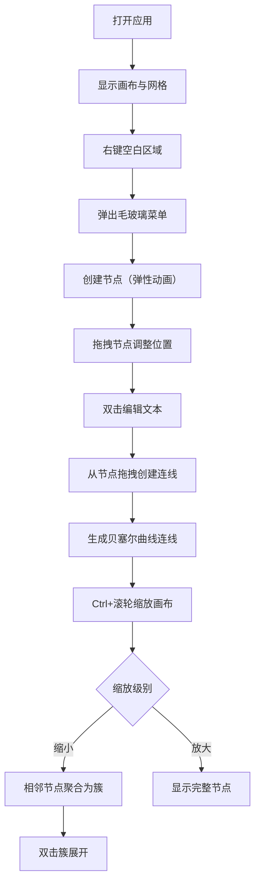

## 1. 产品概述
在线协作式思维导图编辑器，支持团队成员实时在同一张脑图上添加节点、连线并附上备注，适用于头脑风暴或项目规划场景。
- 主要用途：团队协作头脑风暴、项目规划、知识梳理
- 目标用户：产品经理、设计师、开发团队、学生群体
- 产品价值：提供高效直观的可视化协作工具，提升团队沟通效率

## 2. 核心功能

### 2.1 功能模块
1. **节点管理模块**：节点创建、拖拽移动、双击编辑文本、添加备注、删除节点、节点聚合
2. **连线管理模块**：拖拽创建带箭头连线、选中删除连线、贝塞尔曲线平滑显示
3. **画布交互模块**：右键菜单、Ctrl+滚轮缩放、网格背景、画布平移
4. **视觉渲染模块**：深色主题、节点动画、毛玻璃菜单、聚合节点显示

### 2.2 页面详情
| 页面名称 | 模块名称 | 功能描述 |
|-----------|-------------|---------------------|
| 主画布页 | 网格背景 | 提供辅助参考线，支持缩放和平移 |
| 主画布页 | 节点操作 | 右键创建、拖拽移动、双击编辑、备注弹窗 |
| 主画布页 | 连线操作 | 拖拽生成带箭头连线、选中删除 |
| 主画布页 | 节点聚合 | 缩小时相邻节点自动聚合为灰色圆点簇，双击展开 |
| 主画布页 | 右键菜单 | 毛玻璃效果，提供创建节点等操作 |

## 3. 核心流程

### 3.1 主要用户流程
1. 用户打开应用，看到深色主题画布和网格背景
2. 右键点击空白区域，弹出毛玻璃菜单，选择创建节点
3. 新节点以弹性弹出动画出现，用户可拖拽移动位置
4. 双击节点进入文本编辑模式，修改节点内容
5. 从节点边缘拖拽到另一节点，生成带箭头的贝塞尔曲线连线
6. 点击连线选中后可删除
7. 按住Ctrl滚轮缩放画布，缩小时相邻节点自动聚合
8. 双击聚合簇可展开查看详细节点

## 4. 用户界面设计

### 4.1 设计风格
- **主色调**：深灰背景 #2D2D2D，亮绿主色 #00E676，浅蓝辅助色 #00BFA6
- **节点样式**：圆角矩形，带轻微阴影，过渡动画 0.3s ease
- **连线样式**：贝塞尔曲线平滑流动，带箭头指示
- **动效**：新建节点弹性弹出效果，悬停高亮
- **菜单**：右键菜单毛玻璃效果（半透明带模糊）
- **布局**：Flex自动居中，适配平板到宽屏显示器

### 4.2 页面设计概述
| 页面名称 | 模块名称 | UI元素 |
|-----------|-------------|-------------|
| 主画布页 | 网格背景 | 浅灰色细线网格，随缩放调整密度 |
| 主画布页 | 节点 | 圆角矩形、亮绿/浅蓝边框、阴影、0.3s过渡动画 |
| 主画布页 | 连线 | 贝塞尔曲线、箭头、选中高亮 |
| 主画布页 | 右键菜单 | 毛玻璃半透明、圆角、深色文字 |
| 主画布页 | 聚合簇 | 灰色圆点、双击展开动画 |

### 4.3 响应式
- 桌面端优先设计
- 画布使用 Flex 布局自动居中
- 支持平板到宽屏显示器适配
- 触控设备基础操作支持

### 4.4 性能要求
- 节点拖拽帧率不低于30fps
- 支持200个节点流畅操作
- 缩放动画平滑无卡顿
