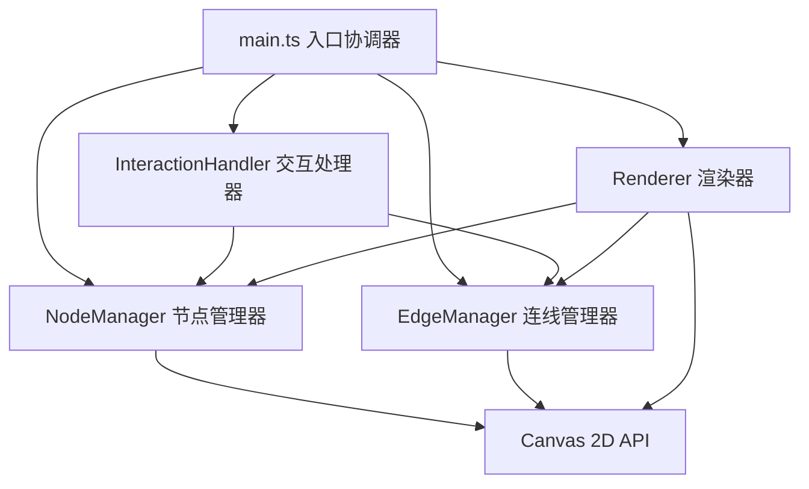

## 1. 架构设计



## 2. 技术描述
- **前端框架**：原生 TypeScript + HTML5 Canvas API
- **构建工具**：Vite
- **类型系统**：TypeScript 严格模式
- **无后端依赖**：纯前端应用，数据内存存储
- **初始化方式**：手动创建项目结构（非React/Vue模板）

## 3. 文件结构定义
| 文件路径 | 用途 |
|-------|---------|
| package.json | 项目依赖与脚本配置 |
| index.html | 入口页面，Canvas挂载点 |
| tsconfig.json | TypeScript编译配置（严格模式、ES2020） |
| vite.config.js | Vite开发服务器配置 |
| src/main.ts | 全局初始化，协调各模块，启动渲染循环 |
| src/NodeManager.ts | 节点创建、拖拽、编辑、删除、聚合管理 |
| src/EdgeManager.ts | 连线创建、拖拽生成、删除管理 |
| src/Renderer.ts | Canvas绘制：网格、节点、连线、菜单、高亮 |
| src/InteractionHandler.ts | 事件监听与动作分发 |

## 4. 数据模型定义

### 4.1 节点数据结构
```typescript
interface MindMapNode {
  id: string;
  x: number;
  y: number;
  width: number;
  height: number;
  text: string;
  note: string;
  color: string;
  isCluster: boolean;
  clusterChildren: string[];
  createdAt: number;
  scale: number;
}
```

### 4.2 连线数据结构
```typescript
interface MindMapEdge {
  id: string;
  sourceId: string;
  targetId: string;
  createdAt: number;
}
```

### 4.3 视图状态
```typescript
interface ViewState {
  offsetX: number;
  offsetY: number;
  scale: number;
  selectedNodeId: string | null;
  selectedEdgeId: string | null;
  isEditing: boolean;
  editingNodeId: string | null;
  hoveredNodeId: string | null;
}
```

## 5. 核心算法说明

### 5.1 节点聚合算法
- 当缩放比例 < 阈值（如0.5）时启用聚合
- 使用距离阈值（连线<20px对应屏幕距离）判断相邻节点
- 将距离过近的节点合并为灰色圆点簇
- 记录簇包含的子节点ID，双击展开

### 5.2 贝塞尔曲线绘制
- 根据源节点和目标节点位置计算控制点
- 控制点偏移量 = 节点距离 × 0.5
- 使用 quadraticCurveTo 或 bezierCurveTo 绘制平滑曲线
- 箭头使用三角形路径绘制在连线末端

### 5.3 坐标变换系统
- 维护视图变换矩阵（偏移+缩放）
- 屏幕坐标 → 画布坐标转换：`canvasX = (screenX - offsetX) / scale`
- 画布坐标 → 屏幕坐标转换：`screenX = canvasX * scale + offsetX`
- 所有交互事件先转换坐标再处理
