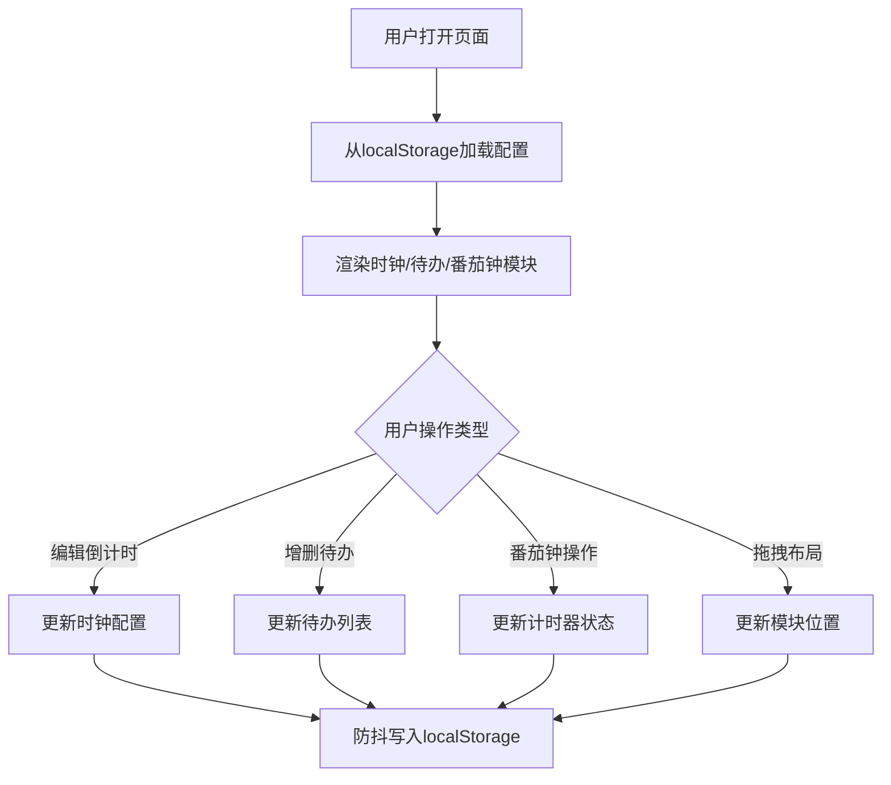

## 1. 产品概述

基于浏览器本地存储的个性化桌面时钟与待办事项融合看板，将时钟、倒计时、待办清单和番茄钟计时器整合到一个视觉优雅的界面上，适合在上班或学习时放在屏幕角落当作专注辅助工具。

- 核心目标：为用户提供一个视觉精美、功能完备的桌面专注工具
- 目标用户：需要时间管理和任务追踪的上班族、学生群体
- 产品价值：无需安装、本地存储、个性化定制的轻量级专注工具

## 2. 核心功能

### 2.1 功能模块

1. **时钟模块**：动态光晕时钟、多倒计时管理
2. **待办清单模块**：增删改查、拖拽排序、动画效果
3. **番茄钟模块**：圆形进度环、音效提示、自定义时段
4. **布局系统**：模块拖拽排列、响应式适配

### 2.2 页面详情

| 页面名称 | 模块名称 | 功能描述 |
|-----------|-------------|---------------------|
| 主看板 | 时钟面板 | 显示当前时间（精确到秒，Digital-7风格，12/24小时切换），Canvas动态光晕（按时段变色，正弦脉动），最多3个自定义倒计时 |
| 主看板 | 待办面板 | 添加/完成/删除待办项，自定义复选框动画，拖拽排序，完成动画，localStorage持久化 |
| 主看板 | 番茄钟面板 | 25/5分钟默认设置，SVG圆形进度环（颜色渐变），Web Audio滴答声和白噪声，自定义时段 |
| 主看板 | 布局容器 | react-grid-layout拖拽排列，毛玻璃卡片，深色主题，响应式布局 |

## 3. 核心流程

## 4. 用户界面设计

### 4.1 设计风格

- **主题色**：深色主题，背景径向渐变从 #0a0a1a 到 #1a1a3a
- **卡片效果**：毛玻璃（rgba(255,255,255,0.08)，模糊12px，圆角16px）
- **边框**：极细 #ffffff20
- **阴影**：深色透光 rgba(0,0,0,0.4) 扩散6px
- **字体色彩**：正文 #e0e0e0，标题 #f0f0f0，细微文字阴影
- **字体**：Share Tech Mono（时钟数字），系统默认字体

### 4.2 光晕配色方案

| 时段 | 渐变色 |
|------|--------|
| 0-6点 | 深蓝渐变 |
| 6-12点 | 金黄渐变 |
| 12-18点 | 橙红渐变 |
| 18-24点 | 紫蓝渐变 |

### 4.3 响应式设计

- **手机（<768px）**：纵向单列堆叠，100%宽度，0.5rem间距
- **平板（768-1024px）**：两列网格
- **电脑（>1024px）**：四列自适应排列

### 4.4 动画效果

- 时钟光晕：半径30-80px正弦脉动（周期5秒），透明度0.3-0.7浮动
- 待办完成：删除线→下沉→淡出到透明（0.6秒）
- 复选框：填充色从 #00b4d8 渐变为 #90e0ef（0.2秒勾选路径动画）
- 拖拽：卡片缩放1.05倍并旋转2度（0.2秒 ease-out）
- 番茄钟：HSL颜色从红色渐变为绿色
