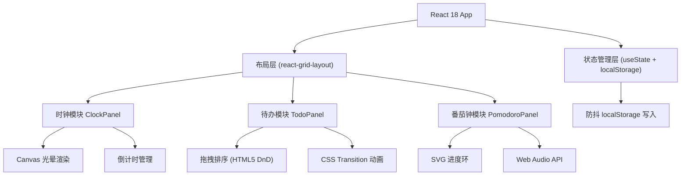

## 1. 架构设计



## 2. 技术描述

- **前端框架**：React@18 + TypeScript
- **构建工具**：Vite@5
- **布局库**：react-grid-layout
- **ID生成**：uuid
- **字体**：Google Fonts - Share Tech Mono
- **数据持久化**：localStorage（300ms防抖）

## 3. 项目文件结构

```
├── package.json
├── vite.config.js
├── tsconfig.json
├── index.html
└── src/
    ├── main.tsx
    ├── App.tsx
    ├── components/
    │   ├── ClockPanel.tsx
    │   ├── TodoPanel.tsx
    │   └── PomodoroPanel.tsx
    └── styles/
        └── global.css
```

## 4. 数据模型

### 4.1 倒计时项
```typescript
interface CountdownItem {
  id: string;
  label: string;
  targetTime: number;
  color: string;
}
```

### 4.2 待办项
```typescript
interface TodoItem {
  id: string;
  text: string;
  completed: boolean;
  createdAt: number;
}
```

### 4.3 番茄钟配置
```typescript
interface PomodoroConfig {
  workMinutes: number;
  breakMinutes: number;
}
```

### 4.4 布局配置
```typescript
interface LayoutItem {
  i: string;
  x: number;
  y: number;
  w: number;
  h: number;
}
```

### 4.5 全局存储
```typescript
interface AppState {
  is24Hour: boolean;
  countdowns: CountdownItem[];
  todos: TodoItem[];
  pomodoro: PomodoroConfig;
  layout: LayoutItem[];
}
```

## 5. 性能优化策略

1. **时钟动画**：使用 requestAnimationFrame 驱动更新
2. **光晕渲染**：使用 Canvas 代替 DOM 避免布局抖动
3. **localStorage**：300ms 防抖合并多次写入
4. **拖拽优化**：拖拽过程中使用 will-change 和 transform 避免额外重排
5. **CSS动画**：优先使用 transform 和 opacity 属性实现动画
