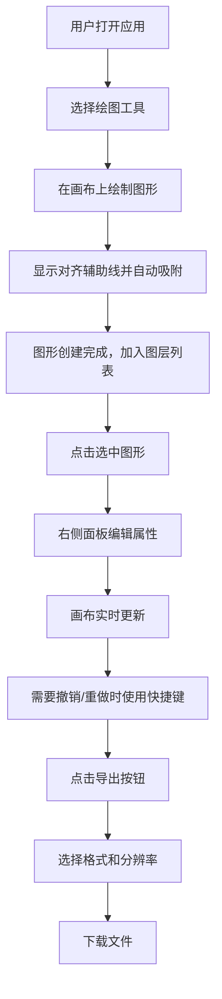

## 1. 产品概述

一款轻量级在线SVG矢量绘图应用，让用户无需安装专业设计软件即可在浏览器中完成简单矢量图形的创建、编辑、图层管理和导出。

- 核心用户：设计师、开发人员、内容创作者
- 核心价值：便捷、高效、零安装的矢量绘图体验
- 解决痛点：专业设计软件门槛高、成本高、启动慢

## 2. 核心功能

### 2.1 功能模块

1. **绘图工具模块**：选择工具、矩形、圆形、椭圆、直线、折线、三次贝塞尔曲线
2. **对齐辅助模块**：绘制/拖拽时实时显示红色虚线辅助线，15px触发范围，10px吸附阈值
3. **图层管理模块**：右侧面板列表展示，支持拖拽排序、重命名、增删、可见性切换、合并
4. **属性编辑模块**：位置(X/Y)、尺寸、旋转、填充、描边、透明度实时编辑
5. **历史记录模块**：50步撤销/重做，Ctrl+Z/Ctrl+Shift+Z快捷键
6. **导出模块**：SVG/PNG格式导出，PNG支持1x/2x/3x分辨率

### 2.2 页面详情

| 页面名称 | 模块名称 | 功能描述 |
|---------|---------|---------|
| 主工作区 | 左侧工具栏 | 垂直固定60px宽毛玻璃工具栏，含选择、绘图工具和导出按钮 |
| 主工作区 | 中央画布 | #f0f0f0浅灰背景带20px网格，支持绘制、拖拽、选中、取消选中 |
| 主工作区 | 右侧面板 | 280px宽，包含图层列表和属性编辑两个标签页/区域 |
| 导出模态框 | 格式选择 | SVG/PNG切换，PNG分辨率选项，导出按钮 |

## 3. 核心流程

## 4. 用户界面设计

### 4.1 设计风格

- **主题色调**：极简深色主题，主背景#1e1e2e，画布#f0f0f0
- **视觉效果**：毛玻璃半透明面板(rgba(30,30,46,0.85))、微弱投影(3px偏移6px模糊0.2透明度)
- **按钮风格**：44x44px圆角方形，选中时底部下划线从中间展开动画(0.2s)
- **字体**：现代无衬线字体，清晰易读
- **布局**：三栏式(左工具栏+中画布+右面板)，桌面端优化
- **动画**：所有交互0.15-0.3s平滑过渡(transform/opacity)

### 4.2 响应式设计

- 桌面端(≥800px)：三栏完整布局
- 移动端(<800px)：工具栏收起为汉堡菜单，属性面板变为底部浮层

### 4.3 性能要求

- 编辑帧率≥50fps
- 拖拽响应延迟<50ms
