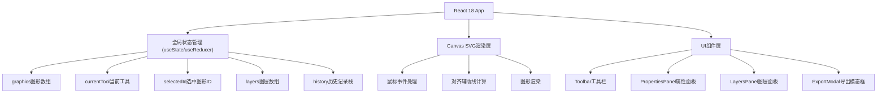

## 1. 架构设计



## 2. 技术选型

- **前端框架**：React 18 + TypeScript
- **构建工具**：Vite
- **状态管理**：React useState + 自定义Hook (useHistory)
- **图标库**：lucide-react
- **文件导出**：file-saver
- **唯一ID**：uuid
- **样式方案**：原生CSS + CSS变量

## 3. 项目结构

```
src/
├── components/
│   ├── Toolbar.tsx          # 左侧工具栏
│   ├── Canvas.tsx           # SVG画布核心组件
│   ├── PropertiesPanel.tsx  # 属性编辑面板
│   ├── LayersPanel.tsx      # 图层管理面板
│   └── ExportModal.tsx      # 导出模态框
├── hooks/
│   └── useHistory.ts        # 撤销/重做历史管理Hook
├── types/
│   └── index.ts             # TypeScript类型定义
├── utils/
│   └── svgUtils.ts          # SVG相关工具函数
├── App.tsx                  # 主应用组件
├── main.tsx                 # 应用入口
└── styles.css               # 全局样式
```

## 4. 核心数据模型

### 4.1 图形类型定义

```typescript
type GraphicType = 'rect' | 'circle' | 'ellipse' | 'line' | 'polyline' | 'bezier';

interface Graphic {
  id: string;
  type: GraphicType;
  x: number;
  y: number;
  width: number;
  height: number;
  rotation: number;
  fill: string;
  stroke: string;
  strokeWidth: number;
  opacity: number;
  layerIndex: number;
  points?: { x: number; y: number }[];  // 折线/贝塞尔曲线的控制点
}
```

### 4.2 图层类型定义

```typescript
interface Layer {
  id: string;
  name: string;
  visible: boolean;
  graphics: string[];  // 该图层包含的图形ID列表
}
```

### 4.3 应用状态

```typescript
interface AppState {
  currentTool: GraphicType | 'select';
  graphics: Graphic[];
  selectedId: string | null;
  layers: Layer[];
  zoom: number;
}
```

## 5. 关键技术点

### 5.1 SVG渲染策略
- 使用单个`<svg>`元素作为画布
- 每个图形对应一个SVG元素，按图层顺序渲染
- 使用CSS transform处理旋转和位移

### 5.2 对齐辅助线算法
- 维护所有图形的边界框(bbox)信息
- 拖拽时计算当前图形与其他图形的边缘/中心距离
- 距离≤15px时显示虚线，≤10px时自动吸附

### 5.3 历史记录管理
- 深拷贝graphics和layers数组作为snapshot
- 最多保留50条记录，超出自动丢弃最早记录
- 撤销/重做时整体替换状态

### 5.4 PNG导出方案
- 创建隐藏Canvas元素
- 将SVG序列化为dataURL加载到Image
- 按所选分辨率(1x/2x/3x)绘制到Canvas
- 调用toDataURL获取PNG并用file-saver下载
