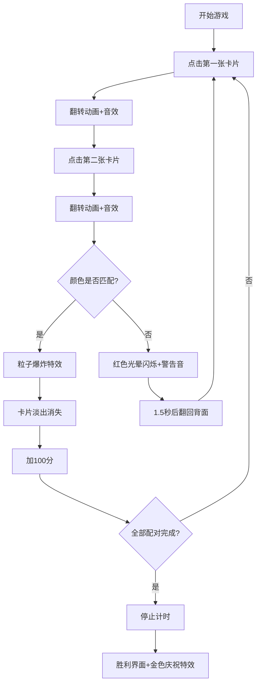

## 1. 产品概述
基于三维粒子系统的记忆匹配卡片翻转交互可视化游戏，玩家通过鼠标点击翻牌配对，配对成功时触发绚丽的粒子爆炸特效。
- 核心目标：提供沉浸式的3D记忆配对游戏体验，结合粒子特效和音效增强趣味性
- 目标用户：休闲游戏爱好者、3D交互体验探索者

## 2. 核心功能

### 2.1 功能模块
1. **3D卡片系统**：4x4共16张卡片网格排列，支持点击翻转、配对检测
2. **粒子特效系统**：配对成功触发彩色粒子爆炸，游戏胜利触发金色庆祝特效
3. **音效系统**：翻牌音效、配对成功/失败音效、胜利音效
4. **计分计时系统**：实时显示得分和用时，胜利后统计结果
5. **HUD界面**：半透明毛玻璃效果的计分板，动态数字缩放动画

### 2.2 页面详情
| 页面名称 | 模块名称 | 功能描述 |
|-----------|-------------|---------------------|
| 游戏主界面 | 3D场景 | 16张卡片4x4排列，支持鼠标点击翻牌 |
| 游戏主界面 | HUD面板 | 顶部半透明面板显示得分和用时 |
| 游戏主界面 | 胜利弹窗 | 配对全部完成后显示总用时和总分 |

## 3. 核心流程
玩家进入游戏 → 点击任意卡片开始计时 → 卡片翻转动画并播放音效 → 点击第二张卡片 → 检测配对：
- 配对成功：粒子爆炸特效 + 卡片淡出消失 + 加100分
- 配对失败：红色光晕闪烁 + 低沉警告音 + 1.5秒后翻回背面
→ 全部配对完成 → 停止计时 → 显示胜利界面 + 金色粒子庆祝特效

## 4. 用户界面设计

### 4.1 设计风格
- **主色调**：深夜空蓝 #0a0a1a（背景）、金色 #FFD700（得分高亮）、暖色系粒子（HSL 0-360°, 80%, 60%）
- **卡片风格**：半透明深灰色背面（#333, 透明度0.8）+ 白色线框边缘 + 随机纯色正面
- **字体**：白色 sans-serif，字号24px（HUD），金色大字体（得分）
- **动效**：卡片翻转ease-out缓动（0.6秒）、得分缩放动画（1.2x→1x, 0.3秒）、粒子2秒生命周期

### 4.2 页面设计概述
| 页面名称 | 模块名称 | UI元素 |
|-----------|-------------|-------------|
| 游戏主界面 | 3D场景 | 4x4卡片网格、柔和阴影、左上45度平行光 |
| 游戏主界面 | HUD面板 | 深色毛玻璃背景rgba(0,0,0,0.6)、得分（金色动态缩放）、用时（精确到0.1秒） |
| 游戏主界面 | 胜利弹窗 | 居中显示、总用时、总分、金色庆祝粒子 |

### 4.3 响应式
- 桌面端全屏3D场景
- 自适应窗口大小，保持正确的相机宽高比
- 鼠标点击交互优化

### 4.4 3D场景指导
- **环境氛围**：深夜空蓝色背景，营造神秘科技感
- **光照设置**：半透明平行光从左上45度照射，启用阴影映射，卡片底部投射柔和阴影
- **摄像机设置**：位于Z轴5位置朝向原点，卡片悬浮在Z轴-5位置
- **交互动画**：卡片绕Y轴翻转180度，ease-out缓动0.6秒
- **粒子特效**：
  - 配对成功：每个卡片位置发射数百个暖色粒子（初速度2-5单位/秒，2秒生命周期，颜色HSL 0-360°随机）
  - 胜利庆祝：场景中心发射数千个金色粒子，5秒后渐隐
- **性能优化**：使用BufferGeometry和InstancedMesh减少Draw Call，粒子数量控制在500以内，确保30FPS以上
