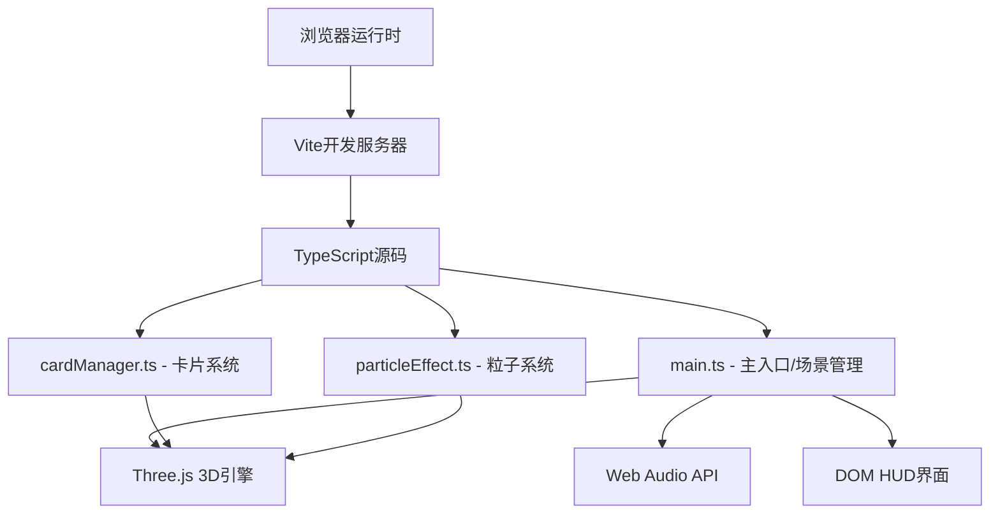

## 1. 架构设计



## 2. 技术说明
- **前端框架**：纯TypeScript（无React/Vue），直接操作Three.js和DOM
- **3D引擎**：Three.js @latest + @types/three
- **构建工具**：Vite @latest（输出目录dist，端口5173）
- **语言**：TypeScript（严格模式，target ES2020，module ESNext）
- **音频**：Web Audio API（程序化生成音效，无需音频文件）
- **无后端**：纯前端单页应用

## 3. 项目文件结构
| 文件路径 | 用途 |
|-------|---------|
| package.json | 依赖配置（three, @types/three, vite, typescript）、启动脚本 |
| vite.config.js | Vite基础配置（输出dist，端口5173） |
| tsconfig.json | TypeScript配置（严格模式，ES2020） |
| index.html | 入口页面（全屏canvas容器，背景#0a0a1a） |
| src/main.ts | 主入口：场景/相机/渲染器初始化，游戏状态流转，HUD管理，音效播放 |
| src/cardManager.ts | 卡片管理：16张卡片网格创建、点击检测、翻转动画、配对逻辑 |
| src/particleEffect.ts | 粒子系统：配对成功粒子爆炸、胜利庆祝粒子效果 |

## 4. 核心类型定义

```typescript
interface CardData {
  id: number;
  color: THREE.Color;
  isFlipped: boolean;
  isMatched: boolean;
  mesh: THREE.Group;
  targetRotation: number;
  currentRotation: number;
}

interface ParticleData {
  position: THREE.Vector3;
  velocity: THREE.Vector3;
  color: THREE.Color;
  life: number;
  maxLife: number;
  size: number;
}

type GameState = 'idle' | 'playing' | 'checking' | 'won';
```

## 5. 核心模块设计

### 5.1 ParticleEffect 模块
- 使用 THREE.BufferGeometry + THREE.Points 实现高性能粒子渲染
- 对象池模式管理粒子生命周期，避免频繁GC
- 支持两种发射模式：卡片位置爆炸（暖色粒子）、场景中心庆祝（金色粒子）
- 粒子属性：位置、速度、颜色、生命周期、大小
- Shader实现粒子大小和透明度随时间衰减

### 5.2 CardManager 模块
- 创建4x4网格（卡片尺寸2x2x0.3，间距0.5）
- 预先准备8对颜色，随机打乱分配到16张卡片
- 卡片结构：THREE.Group包含背面立方体 + 正面纹理平面
- Raycaster实现鼠标点击检测
- requestAnimationFrame驱动翻转动画（ease-out缓动）
- 配对状态机：等待第一张 → 等待第二张 → 检测配对 → 成功/失败处理

### 5.3 main.ts 主模块
- Scene + PerspectiveCamera + WebGLRenderer初始化
- 阴影映射配置（PCFSoftShadowMap）
- 方向光（左上45度）+ 环境光
- DOM HUD元素创建和更新（得分、用时）
- Web Audio API音效生成：
  - 翻牌音：短促上升音调（OscillatorNode + GainNode）
  - 失败音：200Hz递减波形（0.15秒）
  - 胜利音：简单上升和弦
- 游戏状态机管理
- requestAnimationFrame主循环渲染

## 6. 性能优化策略
1. **粒子系统**：使用单个BufferGeometry存储所有粒子，一次Draw Call渲染；粒子数量上限500
2. **卡片网格**：共享几何体和材质实例，减少内存占用
3. **动画循环**：统一requestAnimationFrame循环，避免多个定时器
4. **纹理优化**：纯色纹理使用CanvasTexture程序化生成，无需外部资源
5. **阴影优化**：仅卡片接收和投射阴影，阴影贴图尺寸适度
