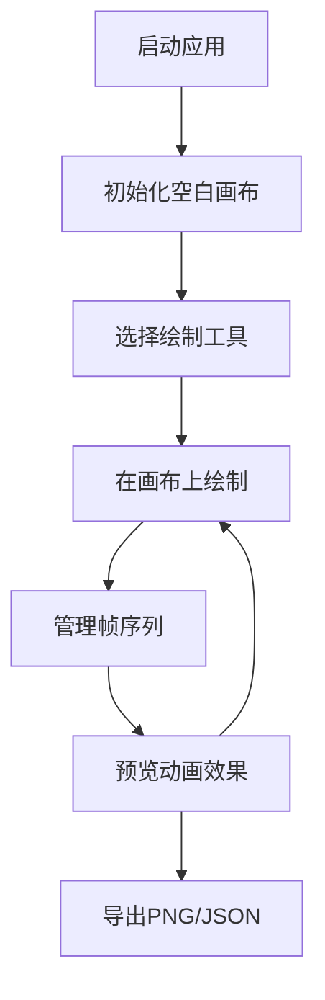

## 1. 产品概述

像素角色编辑器与动画预览应用是一款面向独立插画师、游戏开发者和社交媒体创作者的在线工具，用于快速生成和导出可自定义的像素风角色精灵图。解决现有在线工具不支持多层像素绘制与动画帧编辑的痛点。

- 目标用户：独立插画师、游戏开发者、社交媒体内容创作者
- 核心价值：在浏览器中提供专业级的像素绘制、帧动画编辑和导出功能

## 2. 核心功能

### 2.1 功能模块

1. **像素绘制模块**：32x32像素网格绘制，支持画笔、橡皮擦、填充桶、取色器
2. **帧管理模块**：多帧创建、删除、复制、拖拽排序
3. **动画预览模块**：帧序列循环播放、FPS调节、进度显示
4. **调色板模块**：PICO-8预设调色板、自定义颜色添加
5. **导入导出模块**：PNG精灵图导出、JSON项目导入导出
6. **撤销重做模块**：最多20步操作撤销/重做

### 2.2 页面详情

| 页面名称 | 模块名称 | 功能描述 |
|----------|----------|----------|
| 主编辑器 | 工具栏 | 画笔/橡皮擦/填充桶/取色器工具切换，撤销/重做，画笔大小调节 |
| 主编辑器 | 像素画布 | 32x32网格绘制，鼠标悬停坐标显示，左键绘制右键擦除 |
| 主编辑器 | 调色板 | 32色PICO-8预设，自定义颜色，当前颜色预览 |
| 主编辑器 | 动画预览 | FPS滑块，播放/暂停控制，进度条，帧序号显示 |
| 主编辑器 | 帧面板 | 缩略图列表，添加/删除/复制帧，拖拽排序 |

## 3. 核心流程

用户打开应用 → 在32x32画布上绘制像素 → 通过工具栏切换工具和颜色 → 使用帧面板管理多帧 → 在动画预览区查看效果 → 导出PNG精灵图和JSON项目文件

## 4. 用户界面设计

### 4.1 设计风格

- **主色调**：深色主题，背景#2d2d2d，面板#3a3a3a，文字#e0e0e0
- **高亮色**：橙色#ff9500用于当前选中帧和活动状态
- **画布风格**：32x32像素网格，交替透明格子背景（#1a1a1a/#222222），2px虚线边框
- **按钮样式**：图标按钮，悬停变色0.2s过渡，选中工具高亮边框
- **字体**：等宽字体用于像素坐标显示，无衬线字体用于界面文字
- **图标**：使用Lucide图标库

### 4.2 页面设计概述

| 页面名称 | 模块名称 | UI元素 |
|----------|----------|----------|
| 主编辑器 | 工具栏 | 图标按钮组、画笔大小选择器、最近使用颜色、tooltip提示 |
| 主编辑器 | 像素画布 | 网格渲染、鼠标交互、坐标悬停提示、平滑过渡动画 |
| 主编辑器 | 调色板 | 4x8颜色网格（24px方块）、颜色拾取器、大色块预览 |
| 主编辑器 | 动画预览 | 预览画布（≤400x400）、FPS滑块（2-24）、播放/暂停按钮、进度条 |
| 主编辑器 | 帧面板 | 横向滚动缩略图（64x64）、橙色选中边框、拖拽预览、操作按钮 |

### 4.3 响应式

- 桌面端优先设计
- 画布区域固定尺寸确保像素精度
- 帧面板横向滚动适配不同屏幕宽度

## 5. 性能约束

- 绘制操作响应时间 < 16ms（60FPS）
- 帧动画切换延迟 < 50ms
- 撤销/重做操作 O(1) 时间复杂度
