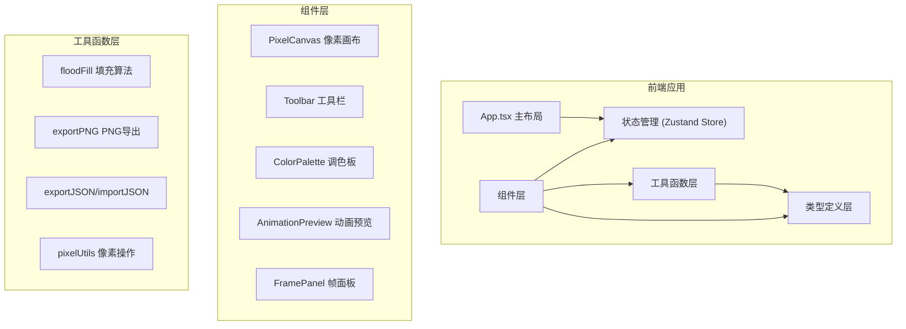

## 1. 架构设计



## 2. 技术描述

- **前端框架**：React 18 + TypeScript
- **构建工具**：Vite
- **状态管理**：Zustand
- **样式方案**：TailwindCSS 3 + 原生CSS
- **图标库**：Lucide React
- **数据处理**：jszip（打包导出）、uuid（帧唯一标识）
- **渲染方式**：Canvas API 用于像素绘制和预览

## 3. 文件结构

```
src/
├── types/
│   └── index.ts          # 全局类型定义
├── store/
│   └── useEditorStore.ts # Zustand状态管理
├── utils/
│   ├── pixelUtils.ts     # 像素操作工具函数
│   ├── floodFill.ts      # 洪水填充算法
│   └── ioUtils.ts        # 导入导出工具
├── components/
│   ├── PixelCanvas.tsx   # 像素画布组件
│   ├── Toolbar.tsx       # 工具栏组件
│   ├── ColorPalette.tsx  # 调色板组件
│   ├── AnimationPreview.tsx # 动画预览组件
│   └── FramePanel.tsx    # 帧管理面板组件
├── App.tsx               # 主布局组件
├── main.tsx              # 入口文件
└── index.css             # 全局样式
```

## 4. 数据模型

### 4.1 核心类型定义

```typescript
// 帧数据
interface Frame {
  id: string;
  pixels: string[][]; // 32x32颜色矩阵，透明像素为空字符串
}

// 工具类型
type ToolType = 'brush' | 'eraser' | 'fill' | 'picker';

// 撤销重做历史
interface HistoryState {
  past: Frame[][];
  future: Frame[][];
}

// 编辑器状态
interface EditorState {
  frames: Frame[];
  currentFrameIndex: number;
  currentColor: string;
  currentTool: ToolType;
  brushSize: number;
  recentColors: string[];
  customColors: string[];
  isPlaying: boolean;
  fps: number;
  history: HistoryState;
}
```

### 4.2 数据流向

1. 用户操作 → 触发store action → 更新frames/history状态
2. 状态变更 → PixelCanvas/AnimationPreview 重新渲染
3. 撤销/重做 → 从history栈读取快照 → 替换frames
4. 导出 → 读取frames数据 → 转换为PNG/JSON → 下载

## 5. 性能优化

- 使用Canvas API进行像素级渲染，避免React重绘开销
- 历史快照使用浅层复制，仅在变更帧时复制对应帧数据
- 动画播放使用requestAnimationFrame，确保平滑帧率
- 鼠标拖拽绘制使用节流/防抖优化
- 帧缩略图使用离屏Canvas预渲染缓存
