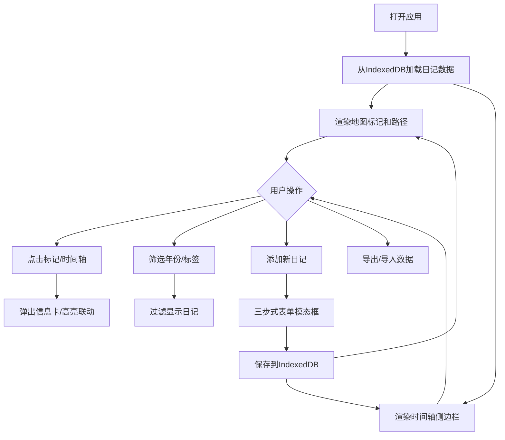

## 1. 产品概述

虚拟旅途日记是一款基于地理位置和地图可视化的个人旅行记录应用，让用户在地图上标记去过的每个地方，附带照片、文字感受和天气信息，生成可视化的旅途时间线，便于回忆和分享。

- 目标用户：热爱旅行、喜欢记录生活的个人用户
- 核心价值：将碎片化的旅行记忆通过地图和时间线的方式可视化呈现，创造沉浸式的回忆体验
- 目标价值：成为用户首选的个人旅行记忆管理工具

## 2. 核心功能

### 2.1 用户角色
| 角色 | 注册方式 | 核心权限 |
|------|----------|----------|
| 普通用户 | 无需注册，本地使用 | 完整使用所有功能，数据存储于本地浏览器 |

### 2.2 功能模块
1. **地图视图**：Leaflet地图、自定义标记点、贝塞尔曲线路径、信息卡弹窗
2. **时间轴侧边栏**：日记列表、年份/标签筛选、高亮联动、节点间距自适应
3. **日记管理**：添加/编辑日记、三步式表单、照片上传、天气获取、Markdown渲染
4. **数据管理**：IndexedDB本地存储、JSON导入导出、进度展示、格式校验

### 2.3 页面详情
| 页面名称 | 模块名称 | 功能描述 |
|----------|----------|----------|
| 主页面 | 地图视图 | OpenStreetMap瓦片加载，自定义圆形缩略图标记，点击弹出磨砂玻璃信息卡，贝塞尔曲线连接路径带流动动画 |
| 主页面 | 时间轴侧边栏 | 可折叠侧边栏（收起40px/展开320px），垂直虚线时间轴，彩色节点按旅行类型区分，点击高亮地图标记 |
| 主页面 | 筛选控制 | 年份下拉选择器，彩色标签按钮（选中放大1.1倍+外发光） |
| 主页面 | 操作栏 | 添加日记按钮、导出数据按钮、导入数据按钮 |
| 添加日记模态框 | 步骤一：选位置 | 全屏模态框，地图点击选择位置，临时蓝色图钉标记，反向地理编码获取地名 |
| 添加日记模态框 | 步骤二：填内容 | 日期选择、文字感受输入（Markdown，最多1000字）、照片拖拽上传（虚线边框，拖入变色） |
| 添加日记模态框 | 步骤三：看天气 | 自动获取天气信息（OpenWeatherMap API），可手动刷新，温度和天气图标展示 |

## 3. 核心流程

用户打开应用 → 加载本地IndexedDB数据 → 渲染地图标记和时间轴 → 用户可：
- 点击时间轴/地图标记查看详情
- 通过年份或标签筛选日记
- 点击添加按钮创建新日记（三步式表单）
- 导出/导入全部日记数据

## 4. 用户界面设计

### 4.1 设计风格
- **主色调**：深色主题，主背景#1a1a2e，卡片背景#2d2d3f，文字主色#e0e0e0，强调色#4fc3f7
- **按钮样式**：圆角按钮，hover时放大1.1倍+外发光效果，300ms平滑过渡
- **字体**：使用现代无衬线字体，层级分明
- **布局风格**：地图全屏布局，右侧可折叠侧边栏，模态框居中展示
- **视觉效果**：磨砂玻璃效果（backdrop-filter）、贝塞尔曲线渐变路径、流动虚线动画

### 4.2 页面设计概览
| 页面名称 | 模块名称 | UI元素 |
|----------|----------|----------|
| 主页面 | 地图视图 | Leaflet地图容器占满剩余空间，圆形缩略图标记（40px直径+2px白边+阴影），磨砂玻璃信息卡（圆角16px，半透明边框），渐变贝塞尔曲线路径（#4facfe→#00f2fe，3px线宽，流动虚线动画） |
| 主页面 | 时间轴 | 深色背景#2d2d3f，垂直虚线#555连接，12px直径彩色节点（蓝/绿/红对应工作/休闲/探险），节点间距60-160px自适应 |
| 添加日记 | 模态框 | 全屏半透明遮罩（0.6透明度），居中模态框（宽75vw，高80vh，最大800px，圆角20px），三步进度指示器，300ms淡入淡出动画 |

### 4.3 响应式设计
- **桌面端（≥768px）**：右侧侧边栏布局，地图控件默认位置
- **移动端（<768px）**：侧边栏变为底部抽屉（固定高度200px，可向上拖拽展开），地图缩放控件移至左上角，避免与抽屉冲突

### 4.4 性能要求
- 地图标记重新渲染 ≤ 100ms
- 时间轴滚动 60fps
- 所有交互过渡动画 300ms ease-in-out
