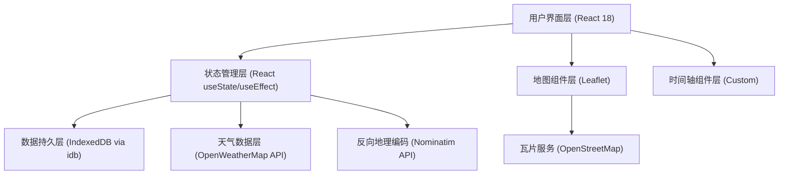

## 1. 架构设计



## 2. 技术描述

- **前端框架**：React 18 + TypeScript 5
- **构建工具**：Vite 5
- **地图库**：Leaflet 1.9 + @types/leaflet
- **本地数据库**：IndexedDB（通过 idb 库操作）
- **Markdown渲染**：react-markdown
- **UUID生成**：uuid
- **样式方案**：原生CSS（CSS变量主题系统）

## 3. 文件结构

| 文件路径 | 用途 |
|----------|------|
| `package.json` | 项目依赖和脚本配置 |
| `index.html` | Vite入口HTML，包含#root和#map容器 |
| `vite.config.js` | Vite配置（React插件，路径别名@，端口5173） |
| `tsconfig.json` | TypeScript配置（严格模式，ES2020，ESNext，react-jsx） |
| `src/main.tsx` | React应用入口挂载点 |
| `src/App.tsx` | 主应用组件，全局状态管理，组合MapView和Timeline |
| `src/MapView.tsx` | Leaflet地图容器，管理标记图层和贝塞尔曲线路径 |
| `src/Timeline.tsx` | 时间轴侧边栏，日记列表渲染，筛选和高亮逻辑 |
| `src/DiaryModal.tsx` | 添加/编辑日记模态框，三步式表单 |
| `src/db.ts` | IndexedDB操作封装（CRUD + 导入导出） |
| `src/types.ts` | 全局TypeScript类型定义 |
| `src/styles.css` | 全局样式，主题变量，动画效果 |
| `src/utils.ts` | 工具函数（天气图标、日期格式化、Base64处理等） |

## 4. 数据模型

### 4.1 TypeScript类型定义

```typescript
type TravelType = 'work' | 'leisure' | 'adventure';

interface Location {
  lat: number;
  lng: number;
  name: string;
}

interface WeatherInfo {
  temp: number;
  icon: string;
  description: string;
  fetchedAt: number;
}

interface DiaryEntry {
  id: string;
  location: Location;
  date: string;
  weather: WeatherInfo | null;
  photo: string | null;
  content: string;
  tags: string[];
  travelType: TravelType;
  createdAt: number;
  updatedAt: number;
}
```

### 4.2 IndexedDB Schema

- **数据库名**：TravelDiaryDB
- **版本**：1
- **Object Store**：`diaries`
  - Key Path：`id`
  - 索引：`date`、`travelType`

### 4.3 天气缓存策略

- 天气数据缓存24小时
- 缓存key：`weather_{lat}_{lng}_{date}`
- 检查`fetchedAt`时间戳判断是否过期

## 5. 状态管理

### 5.1 全局状态（App.tsx）
- `diaries: DiaryEntry[]` - 所有日记条目
- `filteredDiaries: DiaryEntry[]` - 筛选后的日记
- `selectedYear: number | null` - 筛选年份
- `selectedTags: string[]` - 筛选标签
- `highlightedId: string | null` - 当前高亮的日记ID
- `sidebarCollapsed: boolean` - 侧边栏折叠状态
- `modalOpen: boolean` - 模态框开关
- `editingEntry: DiaryEntry | null` - 正在编辑的日记

### 5.2 组件内部状态
- **MapView**：地图实例引用、标记图层组、路径图层组
- **Timeline**：滚动容器引用
- **DiaryModal**：当前步骤、表单数据、临时地图标记

## 6. 关键算法和实现要点

### 6.1 贝塞尔曲线路径
- 两点之间生成二次贝塞尔曲线，控制点偏移两点中点的垂直方向
- 使用SVG `d`属性渲染，配合CSS `stroke-dasharray` + `stroke-dashoffset` 动画实现流动效果

### 6.2 时间轴节点间距
- 计算相邻日记日期差（天数）
- 映射公式：`间距 = min(max(60, 天数 × 5), 160)`

### 6.3 自定义标记图标
- 使用照片Base64创建圆形40px缩略图，2px白色边框，box-shadow
- Leaflet `L.divIcon` 自定义HTML内容

### 6.4 响应式适配
- CSS Media Query `@media (max-width: 768px)` 切换底部抽屉模式
- Leaflet地图控件位置动态调整

### 6.5 性能优化
- 地图标记使用LayerGroup统一管理，批量渲染
- 时间轴使用CSS `will-change: transform` 优化滚动性能
- 照片上传前压缩到最大2MB
