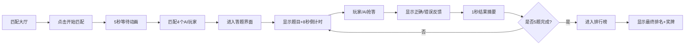

## 1. 产品概述

在线团队竞速答题对战平台，让用户与AI对手进行实时知识抢答对战，体验紧张刺激的答题竞技乐趣。

- 核心目标：提供流畅、有趣的实时抢答对战体验，通过排行榜和计分机制增强竞技性
- 目标用户：喜欢知识竞赛、休闲竞技游戏的年轻用户群体
- 市场价值：低门槛、高趣味性的知识竞技产品，可用于团队破冰、朋友娱乐、知识学习等场景

## 2. 核心功能

### 2.1 用户角色

| 角色 | 注册方式 | 核心权限 |
|------|----------|----------|
| 玩家 | 直接进入（无需注册） | 开始匹配、答题抢答、查看排行榜 |

### 2.2 功能模块

1. **匹配大厅**：匹配面板、开始匹配按钮、等待动画
2. **答题界面**：题目展示、选项抢答、倒计时进度条、实时得分显示、小排行榜
3. **排行榜**：最终排名展示、奖牌授予、入场动画

### 2.3 页面详情

| 页面名称 | 模块名称 | 功能描述 |
|----------|----------|----------|
| 匹配大厅 | 匹配面板 | 显示"开始匹配"按钮，点击后展示旋转脉冲圆点等待动画，5秒后自动匹配4个AI玩家 |
| 答题界面 | 题目卡片 | 居中白色圆角卡片，显示当前题目、4个选项按钮 |
| 答题界面 | 倒计时进度条 | 位于题卡上方，8秒倒计时，蓝到红渐变，最后2秒加速闪烁 |
| 答题界面 | 题号与得分 | 顶部显示当前题号（如3/5）和玩家实时得分 |
| 答题界面 | 实时小排行榜 | 底部显示前三名玩家实时排名 |
| 答题界面 | 结果摘要 | 每题完成后显示1秒正确率和得分变化 |
| 排行榜 | 最终榜单 | 显示5人排名，前三名金银铜奖牌，入场滑入动画 |

## 3. 核心流程

用户打开页面 → 进入匹配大厅 → 点击开始匹配 → 等待5秒匹配成功 → 进入答题界面 → 进行5道题抢答对战 → 每题8秒倒计时可抢答 → 答完显示1秒结果摘要 → 自动进入下一题 → 5题完成后跳转排行榜 → 查看最终排名

## 4. 用户界面设计

### 4.1 设计风格

- 主色调：蓝紫渐变背景（#667eea → #764ba2）
- 辅助色：淡紫色选项（#e0c3fc）、正确绿色、错误红色
- 按钮样式：圆角按钮，带阴影，悬停上浮动画
- 视觉特效：毛玻璃效果（backdrop-filter: blur）
- 字体：现代无衬线字体，清晰易读

### 4.2 页面设计概览

| 页面名称 | 模块名称 | UI元素 |
|----------|----------|--------|
| 匹配大厅 | 匹配面板 | 毛玻璃卡片居中、标题、开始匹配按钮（悬停上浮）、旋转脉冲圆点动画 |
| 答题界面 | 整体布局 | 蓝紫渐变背景、垂直居中布局、毛玻璃效果卡片 |
| 答题界面 | 顶部栏 | 题号显示、玩家得分、实时更新 |
| 答题界面 | 倒计时条 | 蓝红渐变进度条、最后2秒闪烁动画 |
| 答题界面 | 题卡 | 白色圆角卡片、阴影、题目文字居中 |
| 答题界面 | 选项按钮 | 圆角淡紫色按钮、悬停变亮、正确变绿闪光、错误变红抖动 |
| 答题界面 | 小排行榜 | 底部前三名显示、实时更新 |
| 排行榜 | 榜单 | 名次依次从底部滑入、偏移和延迟随名次递增、前三名奖牌、名次变化闪烁高亮 |

### 4.3 响应式设计

- 手机端（<640px）：题卡全宽、选项上下排列、紧凑布局
- 桌面端（>1024px）：题卡最大宽度600px居中、选项两列排列、舒适间距

## 5. 动画与交互细节

- 匹配等待：三个圆点旋转脉冲动画
- 倒计时条：requestAnimationFrame驱动，最后2秒加速闪烁
- 选项抢答：正确绿色闪光动画、错误红色抖动动画，按钮按下0.1s缩放反馈
- 卡片悬停：微上浮0.2s过渡动画
- 排行榜入场：按名次从底部滑入，偏移距离和延迟递增
- 计分变化：数字变化带过渡动画
