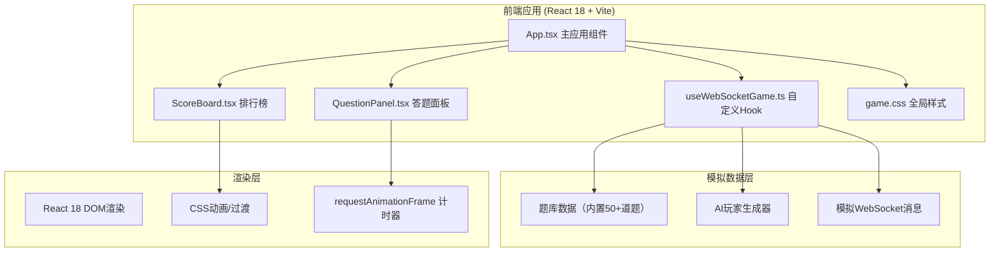

## 1. 架构设计



## 2. 技术描述

- **前端框架**: React 18 + TypeScript
- **构建工具**: Vite（端口3000）
- **状态管理**: React Hooks（useState, useEffect, useRef）+ 自定义Hook
- **样式方案**: 纯CSS（game.css），包含毛玻璃效果、渐变、动画
- **WebSocket模拟**: ws库（仅用于模拟，所有逻辑在前端完成）
- **计时方案**: requestAnimationFrame驱动倒计时，避免setInterval延迟
- **后端**: 无（纯前端单页应用，所有逻辑和数据在前端模拟）

## 3. 状态路由定义

| 状态/面板 | 触发条件 | 说明 |
|-----------|----------|------|
| Lobby（匹配大厅） | 初始状态 / 从排行榜返回 | 显示匹配面板和开始按钮 |
| Matching（匹配中） | 点击开始匹配后 | 显示等待动画，5秒后跳转 |
| Playing（答题中） | 匹配成功后自动进入 | 进行5道题抢答对战 |
| QuestionResult（题目结果） | 每题抢答完成/超时后 | 显示1秒结果摘要 |
| Leaderboard（排行榜） | 5题完成后自动跳转 | 显示最终排名和奖牌 |

## 4. 核心数据模型

### 4.1 玩家数据结构

```typescript
interface Player {
  id: string;
  name: string;
  avatar: string;       // 头像emoji
  score: number;
  isHuman: boolean;
  answered: boolean;    // 当前题目是否已答
  lastAnswerCorrect?: boolean;
}
```

### 4.2 题目数据结构

```typescript
interface Question {
  id: number;
  text: string;
  options: string[];
  correctIndex: number;
}
```

### 4.3 游戏状态结构

```typescript
interface GameState {
  phase: 'lobby' | 'matching' | 'playing' | 'result' | 'leaderboard';
  players: Player[];
  questions: Question[];
  currentQuestionIndex: number;
  currentQuestion: Question | null;
  timeLeft: number;           // 当前题目剩余时间(ms)
  playerAnswer: number | null; // 玩家选择的选项
  playerResult: 'correct' | 'wrong' | null | 'timeout';
  questionStartTime: number;
  totalQuestions: number;
  roundScoreChange: number;
  correctRate: number;
}
```

## 5. 项目文件结构

```
auto8/
├── package.json
├── vite.config.js
├── tsconfig.json
├── index.html
├── src/
│   ├── main.tsx              # React根渲染入口
│   ├── App.tsx               # 主应用组件，状态管理和面板切换
│   ├── hooks/
│   │   └── useWebSocketGame.ts  # 游戏核心逻辑Hook
│   ├── components/
│   │   ├── QuestionPanel.tsx    # 答题面板组件
│   │   └── ScoreBoard.tsx       # 排行榜组件
│   └── styles/
│       └── game.css          # 全局样式
```

## 6. 核心逻辑设计

### 6.1 匹配逻辑
- 点击"开始匹配" → phase切换为'matching'
- 启动5秒倒计时（显示脉冲动画）
- 倒计时结束 → 生成4个AI玩家（随机头像和用户名）
- phase切换为'playing'，开始第一题

### 6.2 抢答机制
- 每题开始时启动8秒倒计时（requestAnimationFrame驱动）
- 玩家点击选项 → 记录答案，立即显示正确/错误反馈
- AI玩家：随机延迟0.5-3秒后作答，60%概率答对
- 所有玩家作答或倒计时结束 → 进入'result'状态
- 显示1秒结果摘要（正确率和得分变化）→ 自动进入下一题

### 6.3 计分规则
- 正确：+10分
- 错误：-5分
- 未答：0分

### 6.4 排行榜逻辑
- 5题完成后按分数降序排序
- 前三名分别授予🥇🥈🥉奖牌
- 入场动画：按名次依次从底部滑入，偏移距离和延迟递增
- 名次变化闪烁高亮效果

## 7. 性能优化要点

1. 使用requestAnimationFrame驱动倒计时，避免setInterval累积延迟
2. 使用useRef保存计时器引用，避免闭包陷阱
3. 合理拆分组件，减少不必要的重渲染
4. CSS动画优先使用transform和opacity，保证GPU加速
5. 题库数据静态化，避免重复生成
