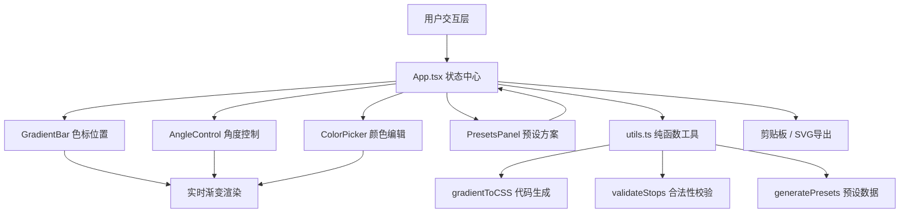

## 1. 架构设计



## 2. 技术栈说明
- **前端框架**：React 18 + TypeScript 严格模式
- **构建工具**：Vite（端口5173，@指向src别名）
- **颜色选择库**：react-colorful（HSL颜色选择器）
- **唯一ID**：uuid
- **目标版本**：ES2020 + ESNext modules
- **JSX**：react-jsx

## 3. 文件结构
```
package.json          - 依赖与脚本
vite.config.js        - Vite配置
tsconfig.json         - TS配置
index.html            - 入口HTML
src/
├── App.tsx           - 根组件：状态管理、快捷键、导出
├── GradientBar.tsx   - 渐变条：色标拖拽（React.memo）
├── ColorPicker.tsx   - HSL颜色选择器封装
├── AngleControl.tsx  - 角度旋钮（Canvas绘制）
├── PresetsPanel.tsx  - 预设方案面板
└── utils.ts          - 纯函数工具
```

## 4. 核心数据模型
```typescript
interface ColorStop {
  id: string;
  color: { h: number; s: number; l: number };
  position: number; // 0-100 百分比
}

interface GradientState {
  stops: ColorStop[];
  angle: number;
}

interface Preset {
  name: string;
  stops: ColorStop[];
  angle: number;
}
```

## 5. 状态管理
- 使用 React useState + useReducer 管理色标数组、角度
- useRef 保存10步历史记录栈实现 Ctrl+Z 撤销
- 拖拽操作使用 requestAnimationFrame 节流，避免过度重渲染
- GradientBar 组件使用 React.memo 包裹，减少不必要重渲染
