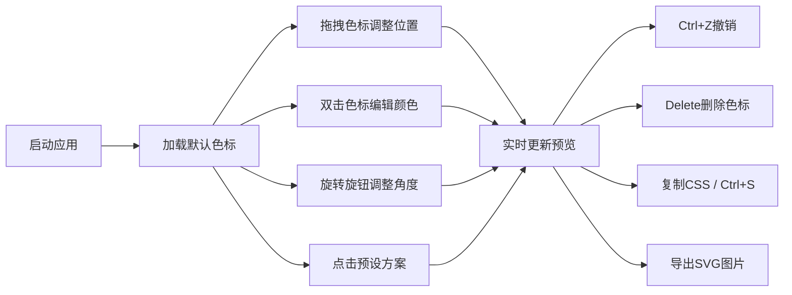

## 1. 产品概述

CSS Gradient Studio 是一款面向设计师和前端开发者的浏览器端渐变配色工具，通过直观的鼠标拖拽和键盘快捷键，帮助用户快速拼接、调整和导出多色阶 CSS 渐变方案，解决手写渐变代码时难以直观预览和实时微调的痛点。

## 2. 核心功能

### 2.1 功能模块
1. **渐变编辑器主页**：色标拖拽条、角度控制旋钮、实时预览框、色标编辑区、预设面板、导出按钮

### 2.2 页面详情
| 页面名称 | 模块名称 | 功能描述 |
|-----------|-------------|---------------------|
| 渐变编辑器主页 | 渐变条 | 水平渐变预览条，支持色标小圆点拖拽调整位置，最小间隔10px |
| 渐变编辑器主页 | 颜色选择器 | HSL颜色选择器，双击色标弹出，支持色相/饱和度/亮度调整及十六进制值显示 |
| 渐变编辑器主页 | 角度旋钮 | 80px圆环旋钮，0-360°旋转，中心显示角度数值，实时更新预览 |
| 渐变编辑器主页 | 预览框 | 200x100px渐变预览框，实时渲染当前角度和所有色标 |
| 渐变编辑器主页 | 色标编辑区 | 可拖拽矩形色块卡片，显示颜色缩略图、HSL值和位置百分比 |
| 渐变编辑器主页 | 预设面板 | 横向滚动6+预设方案卡片，点击一键应用 |
| 渐变编辑器主页 | 导出区 | 一键复制CSS代码到剪贴板、导出SVG图片 |

## 3. 核心流程

用户打开应用 → 默认加载初始渐变色标 → 通过拖拽小圆点调整色标位置 → 双击色标打开HSL选择器调整颜色 → 旋转角度旋钮调整渐变方向 → 可选择预设方案快速替换 → 使用Ctrl+Z撤销操作 → 点击复制按钮或Ctrl+S导出CSS代码 → 点击导出SVG下载渐变图片

## 4. 用户界面设计

### 4.1 设计风格
- 主色调：深色主题 #1a1a2e，文字 #e0e0e0
- 强调色：蓝色虚线边框 #0066ff 用于选中高亮
- 按钮风格：圆角8px，悬停微动画反馈
- 字体：系统sans-serif，字号12px-14px
- 布局：居中最大宽度1200px，左右各80px留白
- 交互：拖拽放大1.05倍+阴影、旋钮缓出动画0.05s、预设卡片悬停上移4px

### 4.2 页面设计概览
| 页面名称 | 模块名称 | UI元素 |
|-----------|-------------|-------------|
| 渐变编辑器主页 | 渐变条 | 100%宽60px高、圆角12px、1px浅灰边框、16px色标小圆点 |
| 渐变编辑器主页 | 角度旋钮 | 80px直径圆环、中心指针、14px角度数字 |
| 渐变编辑器主页 | 预览框 | 200x100px、圆角8px |
| 渐变编辑器主页 | 色标卡片 | 80x40px矩形、圆角6px、颜色缩略图+HSL值+位置% |
| 渐变编辑器主页 | 预设卡片 | 120x60px、圆角8px、下方12px名称文字#666 |

### 4.3 响应式
- 桌面端优先（>768px）：渐变条与旋钮水平排列，色标卡80px宽，预设面板横向滚动
- 移动端（≤768px）：旋钮在上渐变条在下垂直排列，色标卡100%宽，预设网格每行2个

## 5. 性能要求
- 拖拽/旋钮响应 < 50ms（requestAnimationFrame节流）
- 渐变预览帧率 ≥ 55fps
- 色标上限10个时无卡顿
