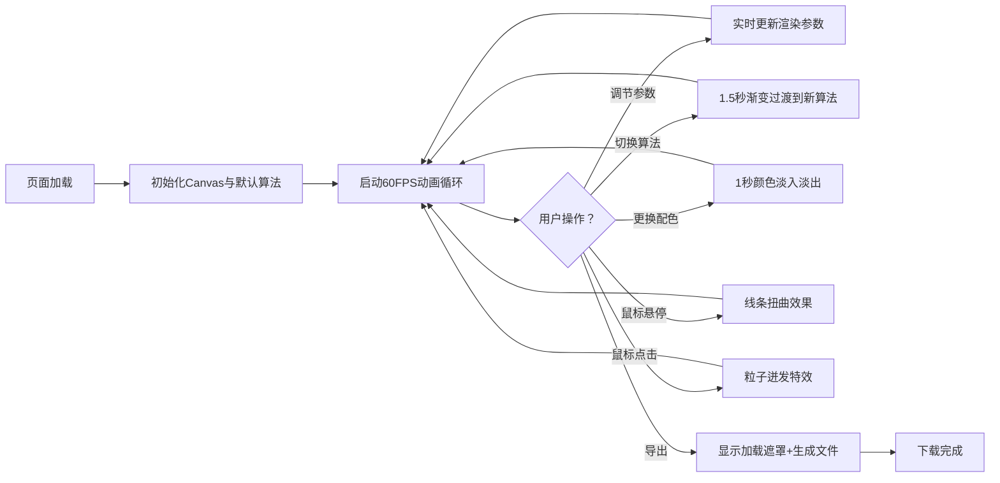

## 1. 产品概述

基于Canvas的二维抽象艺术生成器，允许用户通过调节参数实时生成独特的动态抽象画，并支持导出为PNG和SVG格式。面向数字艺术爱好者、设计师和创意工作者，提供沉浸式的参数化艺术创作体验。

## 2. 核心功能

### 2.1 用户角色
| 角色 | 注册方式 | 核心权限 |
|------|----------|----------|
| 普通用户 | 无需注册 | 使用所有艺术生成、参数调节和导出功能 |

### 2.2 功能模块
1. **主画布区域**: 全屏Canvas动态渲染抽象艺术图形
2. **算法选择区**: 6种图形算法切换按钮，带平滑过渡动画
3. **参数调节区**: 密度、粗细、旋转速度、颜色偏移滑块
4. **颜色预设区**: 6种配色主题 + 自定义颜色选择器
5. **导出功能区**: PNG和SVG格式导出按钮

### 2.3 页面详情
| 页面名称 | 模块名称 | 功能描述 |
|----------|----------|----------|
| 主应用页 | Canvas画布 | 全屏渲染动态抽象图形，响应鼠标交互 |
| 主应用页 | 控制面板 | 右侧悬浮磨砂玻璃风格控制面板，包含算法、参数、颜色、导出四个区域 |
| 主应用页 | 算法切换 | 6种算法按钮横向排列，选中高亮，1.5秒渐变过渡 |
| 主应用页 | 参数滑块 | 4个自定义样式滑块，实时调节，响应<50ms |
| 主应用页 | 颜色主题 | 6种预设色块 + 自定义颜色选择器，1秒淡入淡出过渡 |
| 主应用页 | 导出功能 | PNG/SVG导出按钮，带加载遮罩和旋转动画 |
| 主应用页 | 鼠标交互 | 悬停扭曲效果、点击粒子迸发特效 |

## 3. 核心流程

用户打开页面 → 默认算法自动开始动画渲染 → 调节参数/切换算法/更换配色 → 实时预览效果 → 悬停/点击画布产生交互效果 → 点击导出按钮 → 显示加载遮罩 → 下载PNG/SVG文件

## 4. 用户界面设计

### 4.1 设计风格
- **主色调**: 深色主题 #0a0a0a，强调色 #ff6b6b（珊瑚红）和 #4ecdc4（薄荷青）
- **按钮风格**: 圆角矩形，选中背景渐变动画0.3s
- **字体**: 现代无衬线字体，文本 #e0e0e0，辅助文本 #888
- **布局风格**: 桌面端画布+右侧控制面板；移动端画布+底部控制面板
- **视觉特效**: 磨砂玻璃 backdrop-filter: blur(10px)，外发光动画

### 4.2 页面设计概述
| 页面名称 | 模块名称 | UI元素 |
|----------|----------|--------|
| 主应用页 | Canvas画布 | 全屏尺寸，背景#0a0a0a，动态渲染 |
| 主应用页 | 控制面板 | 宽280px，圆角12px，半透明磨砂玻璃，边框1px rgba(255,255,255,0.2) |
| 主应用页 | 算法按钮 | 60x40px，圆角8px，背景#2d2d3f，选中#ff6b6b |
| 主应用页 | 滑块控件 | 宽200px高6px轨道#333，滑块直径18px颜色#ff6b6b |
| 主应用页 | 颜色色块 | 80x80px，圆角8px，3x2排列，选中外发光 |
| 主应用页 | 导出按钮 | 圆角矩形，背景#4ecdc4，悬停变亮 |
| 主应用页 | 加载遮罩 | rgba(0,0,0,0.5)，居中"正在处理..."+旋转加载动画 |

### 4.3 响应式
- 桌面优先设计，屏幕宽度≥900px时控制面板位于画布右侧（宽280px）
- 屏幕宽度<900px时控制面板移至画布下方，宽度100%
- 所有交互元素支持触摸操作

### 4.4 性能要求
- 动画帧率稳定60FPS
- 参数调整和交互响应延迟≤100ms
