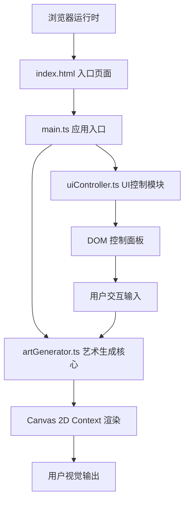

## 1. 架构设计



## 2. 技术描述

- **前端框架**: 无框架，原生TypeScript + HTML5 Canvas 2D API
- **构建工具**: Vite@5.x（原生ESM HMR）
- **开发语言**: TypeScript@5.x（strict模式，target ES2020，module ESNext）
- **样式方案**: 原生CSS（内联style标签，无CSS框架）
- **依赖**: typescript, vite（零运行时第三方依赖）

### 项目结构
```
.
├── package.json
├── vite.config.js
├── tsconfig.json
├── index.html
└── src/
    ├── main.ts          # 应用入口：Canvas初始化、事件绑定、动画循环
    ├── artGenerator.ts  # 核心：6种图形算法、参数管理、渲染帧输出
    └── uiController.ts  # UI层：控制面板DOM生成、参数事件监听
```

## 3. 模块职责定义

### 3.1 artGenerator.ts — ArtGenerator 类

| 方法/属性 | 说明 |
|-----------|------|
| `constructor(canvas: HTMLCanvasElement)` | 绑定Canvas上下文，初始化参数 |
| `generateArt()` | 启动当前算法的渲染准备 |
| `resetArt()` | 重置当前算法的内部状态（随机种子等） |
| `setAlgorithm(algo: AlgorithmType)` | 切换算法，触发1.5秒渐变过渡 |
| `setParam(key: ParamKey, value: number)` | 更新渲染参数（密度/粗细/转速/色偏） |
| `setColorTheme(theme: ColorTheme)` | 设置颜色主题，触发1秒颜色过渡 |
| `setCustomColors(primary: string, secondary: string, bg: string)` | 自定义颜色 |
| `setMouse(pos: {x,y} \| null)` | 更新鼠标位置（用于扭曲效果） |
| `emitParticles(x, y)` | 触发点击位置的粒子迸发 |
| `renderFrame()` | 每帧调用：计算→绘制→过渡→粒子→返回 |
| `exportPNG(): Promise<Blob>` | 导出当前帧为PNG Blob |
| `exportSVG(): Promise<string>` | 导出当前帧为SVG字符串 |

**内置6种算法**:
1. `flowCurves` — 流动曲线（Perlin噪声流线）
2. `fractalTree` — 分形树（递归分支）
3. `ringArray` — 圆环阵列（同心/偏心圆环）
4. `randomScatter` — 随机散点（抖动分布）
5. `waveLines` — 波形线条（叠加正弦波）
6. `moirePattern` — 莫尔条纹（两组平行条纹干涉）

### 3.2 uiController.ts — UIController 类

| 方法/属性 | 说明 |
|-----------|------|
| `constructor(container: HTMLElement, generator: ArtGenerator)` | 挂载容器与generator引用 |
| `build()` | 构建全部4个区域的DOM并绑定事件 |
| `setActiveAlgorithm(name)` | 更新算法按钮选中态 |
| `setActiveTheme(name)` | 更新颜色预设选中发光态 |
| `showLoadingOverlay()` | 显示导出加载遮罩 |
| `hideLoadingOverlay()` | 隐藏导出加载遮罩 |

### 3.3 main.ts — 入口编排

- 创建Canvas元素并自适应窗口大小（含devicePixelRatio处理）
- 实例化 ArtGenerator 与 UIController
- 绑定 window resize / mousemove / mouseleave / click 事件
- 启动 requestAnimationFrame 动画循环（60FPS）
- 处理导出按钮的异步下载逻辑

## 4. 类型定义（artGenerator.ts 内）

```typescript
type AlgorithmType = 'flowCurves' | 'fractalTree' | 'ringArray' | 'randomScatter' | 'waveLines' | 'moirePattern';

interface RenderParams {
  density: number;       // 0.1 - 1.0
  lineWidth: number;     // 1 - 10 px
  rotationSpeed: number; // 0 - 5 deg/frame
  colorOffset: number;   // 0 - 360 deg
}

interface ColorTheme {
  name: string;
  primary: [string, string];   // 2种主色
  accents: [string, string, string]; // 3种辅助色
  background: string;          // 背景色
}

interface Particle {
  x: number; y: number;
  vx: number; vy: number;
  size: number; color: string;
  life: number; maxLife: number;
}
```

## 5. 关键技术实现要点

### 5.1 算法渐变过渡
- 维护 `prevCanvas` + `currCanvas` 两个离屏缓冲
- 过渡进度 t ∈ [0,1]（1.5s），使用 `t < 0.5 ? 1-2t : 2t-1` 作为混合alpha
- 主画布 `globalAlpha = a` 绘制prev，`globalAlpha = 1-a` 绘制curr

### 5.2 颜色过渡
- 当前颜色与目标颜色转为 HSL，每帧按 (1/60) 比例线性插值，1秒完成
- 背景色同步应用到 `ctx.fillRect` 清屏阶段

### 5.3 鼠标扭曲
- 维护 `mousePos: {x,y} | null`，每帧各算法在采样点计算 `d = dist(point, mousePos)`
- 若 `d < 50px`，沿 `(point - mousePos)` 法向偏移 `(50 - d) * 0.6`

### 5.4 粒子迸发
- 点击时生成30个Particle，随机方向向量，大小5-15px
- 每帧 `life -= 1/30`（0.5s），位置 += 速度，alpha = life/maxLife
- 颜色从当前主题主色/辅助色随机选取

### 5.5 Canvas高清渲染
- `canvas.width = innerWidth * devicePixelRatio`
- `canvas.height = innerHeight * devicePixelRatio`
- `ctx.scale(devicePixelRatio, devicePixelRatio)`
- CSS样式尺寸仍为 `innerWidth x innerHeight`

### 5.6 SVG导出
- 将当帧的所有绘制指令转换为SVG元素（`<path>`, `<circle>`, `<line>`, `<rect>` 等）
- 使用 `<svg xmlns="..." width=".." height=".." viewBox="..">` 包裹
- 创建Blob触发 `<a download>` 下载

## 6. 性能保障策略

1. **离屏缓冲复用**: 算法渲染到离屏canvas，不直接操作主画布（除最终合成）
2. **参数节流**: 滑块事件使用 requestAnimationFrame 调度，避免一帧多次重绘
3. **对象池**: Particle对象池化复用，避免GC压力
4. **数学计算**: 三角函数/噪声函数结果缓存；旋转使用预计算sin/cos
5. **绘制批量**: 相同样式的图元尽量合并 `beginPath` 一次描边/填充
