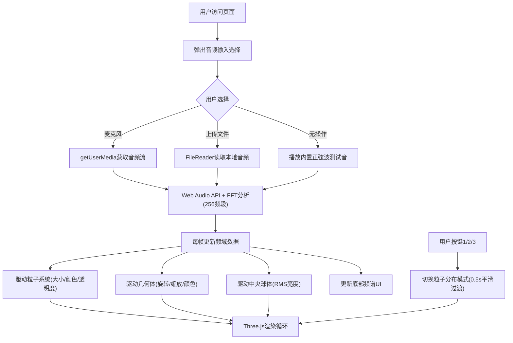

## 1. 产品概述

沉浸式3D音乐可视化作品，将音频频谱实时映射到漂浮在太空中的动态几何物体上，适用于线上展览或直播背景。面向数字艺术家、内容创作者和音乐爱好者，提供具有赛博朋克太空美学的音频驱动视觉体验。

## 2. 核心功能

### 2.1 功能模块
1. **音频输入模块**：支持麦克风输入、本地音频文件上传（mp3/wav/ogg）、内置8秒正弦波测试音
2. **粒子可视化系统**：2000个粒子根据音频频谱动态变化大小、颜色、透明度，支持三种分布模式
3. **几何体可视化系统**：20个旋转几何体（立方体、十二面体、环面结）随音频节奏脉冲缩放
4. **中央发光球体**：随整体音频RMS亮度变化的视觉焦点
5. **实时频谱UI**：底部半透明频谱柱状图，左上角操作提示

### 2.2 页面详情
| 页面名称 | 模块名称 | 功能描述 |
|-----------|-------------|---------------------|
| 主页面 | 3D场景 | Three.js渲染的粒子系统、几何体、发光球体 |
| 主页面 | 音频输入弹窗 | 首次访问时选择麦克风/上传文件/默认测试音 |
| 主页面 | 操作提示 | 左上角显示1-3键切换模式提示 |
| 主页面 | 频谱柱状图 | 底部80px高纯音频频谱可视化 |

## 3. 核心流程

用户访问页面 → 弹出音频输入选择框 → 用户选择（麦克风/上传文件/默认测试音）→ Web Audio API开始FFT分析 → 每帧获取频域数据 → 驱动粒子大小/颜色/透明度和几何体旋转/缩放 → 渲染3D场景 → 用户按键切换可视化模式 → 粒子分布平滑过渡

## 4. 用户界面设计

### 4.1 设计风格
- **主色调**：深空背景 #050510
- **辅助色**：霓虹粉 #ff6b6b、青蓝 #4ecdc4、霓虹青 #00ffff（发光色）
- **按钮样式**：半透明背景，带发光边框
- **字体**：Arial，操作提示14px
- **布局风格**：全屏沉浸式3D场景，UI元素悬浮于场景之上
- **发光效果**：所有UI元素带有#00ffff发光（text-shadow/box-shadow，模糊4px）

### 4.2 页面设计概述
| 页面名称 | 模块名称 | UI元素 |
|-----------|-------------|-------------|
| 主页面 | 3D场景 | 深空背景、粒子球壳分布、20个几何体悬浮、中心发光球体 |
| 主页面 | 操作提示 | 左上角半透明文字，rgba(255,255,255,0.6)，带青蓝光晕 |
| 主页面 | 频谱柱状图 | 底部80px高，柱宽3px，#ff6b6b到#4ecdc4渐变，顶部圆角，自适应宽度 |
| 主页面 | 音频输入弹窗 | 居中模态框，三个选项按钮，赛博朋克风格边框发光 |

### 4.3 响应式
- 桌面端优先，保持16:9比例内全屏显示
- 最小支持分辨率：1024x768
- 窗口resize时自动调整相机和渲染器尺寸
- 触摸设备支持触摸吸引粒子效果

### 4.4 3D场景指导
- **环境**：纯深空背景 #050510，无需HDRI
- **光照**：环境光 + 点光源（中心发光球体位置），营造悬浮感
- **相机**：PerspectiveCamera，初始位置Z轴正方向，视距合适
- **动画**：粒子整体Y轴缓慢旋转（0.02rad/s），几何体各自随机轴旋转，鼠标/触摸粒子吸引
- **后期**：轻微辉光效果增强赛博朋克感
- **性能预算**：2000粒子 + 20几何体，目标30FPS以上（集成显卡）
