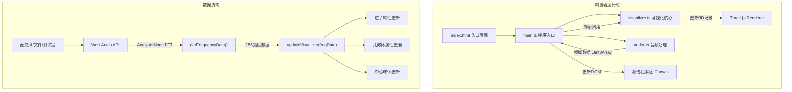

## 1. 架构设计



## 2. 技术描述

- **前端框架**：TypeScript + Three.js + Vite
- **初始化工具**：Vite vanilla-ts 模板
- **渲染引擎**：Three.js (r160+)
- **音频处理**：Web Audio API (AnalyserNode, FFT size 512 → 256频段)
- **无后端**：纯前端应用

## 3. 文件结构与调用关系

```
project/
├── package.json              # 依赖: three, @types/three, vite, typescript
├── vite.config.js            # Vite配置: 端口5173, HMR, dist输出
├── tsconfig.json             # TS配置: 严格模式, ES2020, ESNext
├── index.html                # 入口: 全屏canvas容器, 背景#050510
└── src/
    ├── main.ts               # [入口] 初始化Three.js场景/相机/渲染器
    │                         #   调用: audio.ts(initAudio, getFrequencyData)
    │                         #   调用: visualizer.ts(updateVisualizer)
    │                         #   职责: 事件绑定(resize/键盘/鼠标), 动画循环, UI渲染
    ├── visualizer.ts         # [核心] 创建2000粒子 + 20几何体 + 中心球体
    │                         #   导出: updateVisualizer(scene, freqData, deltaTime)
    │                         #   职责: 粒子大小/颜色/透明度, 几何体旋转/缩放, 模式切换lerp
    └── audio.ts              # [音频] Web Audio API封装
                              #   导出: initAudio(sourceType, file?)
                              #   导出: getFrequencyData() → Uint8Array(256)
                              #   职责: 麦克风/文件/测试音切换, FFT分析
```

### 调用关系说明
1. **main.ts → audio.ts**
   - 启动时调用 `initAudio()` 选择音频源
   - 动画循环每帧调用 `getFrequencyData()` 获取频谱数据

2. **main.ts → visualizer.ts**
   - 启动时调用 `createVisualizer(scene)` 初始化3D对象
   - 动画循环每帧调用 `updateVisualizer(freqData, deltaTime, mousePos)`

3. **visualizer.ts 内部数据流**
   - 输入：频域数据 → 分离低频(20-250Hz)/中频(250-2000Hz)/高频(2000-20000Hz) → 计算RMS
   - 输出：粒子positions/colors/sizes数组更新、几何体scale/rotation/color更新、中心球体emissive更新

## 4. 核心数据结构

```typescript
// audio.ts
interface AudioState {
  audioContext: AudioContext | null;
  analyser: AnalyserNode | null;
  frequencyData: Uint8Array;  // 长度256, 值0-255
  sourceType: 'mic' | 'file' | 'test';
}

// visualizer.ts
interface ParticleData {
  basePosition: Float32Array;  // 初始位置 (3*2000)
  baseSize: Float32Array;      // 初始大小 (2000)
  baseColor: Float32Array;     // 初始颜色RGB (3*2000)
  baseHue: Float32Array;       // 初始色相 (2000)
}

interface VisualizerMode {
  current: 'sphere' | 'nebula' | 'explode';
  target: 'sphere' | 'nebula' | 'explode';
  transitionProgress: number;  // 0-1, lerp过渡进度
}

interface GeometryObject {
  mesh: THREE.Mesh;
  rotationAxis: THREE.Vector3;
  baseRotationSpeed: number;
  baseScale: number;
  basePosition: THREE.Vector3;
}
```

## 5. 性能优化策略

1. **粒子系统**：使用 `THREE.Points` + `BufferGeometry`，单draw call渲染2000粒子
2. **几何体**：复用 `BoxGeometry`、`DodecahedronGeometry`、`TorusKnotGeometry` 实例，共享材质
3. **频谱UI**：使用单个Canvas 2D绘制，避免DOM元素过多
4. **动画循环**：使用 `requestAnimationFrame` + deltaTime控制速度，避免setInterval
5. **音频分析**：FFT size 512（生成256频段数据），平衡精度与性能
6. **过渡动画**：lerp线性插值，无需额外计算
