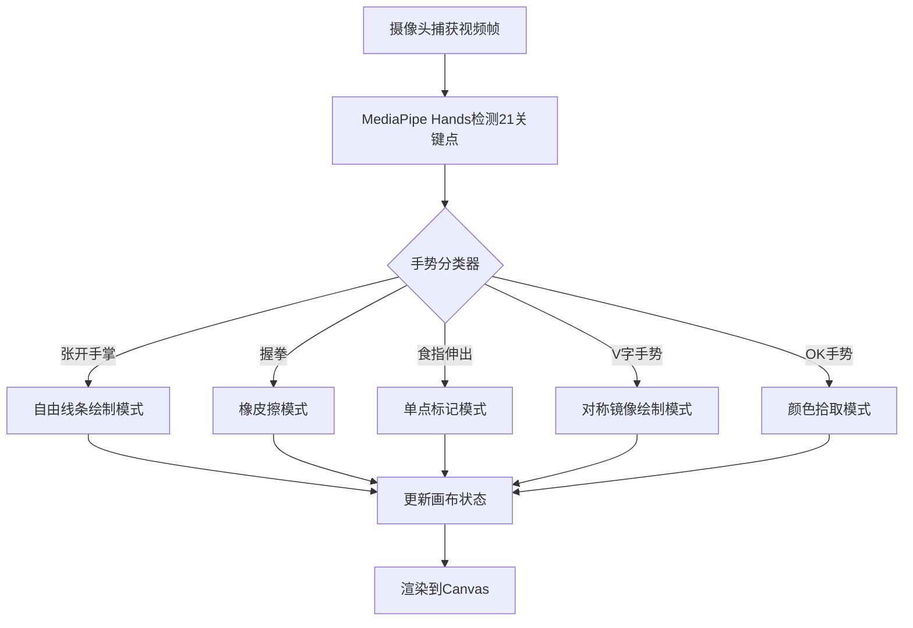

## 1. 产品概述

基于浏览器摄像头的实时手势识别交互式绘图应用，解决无触摸屏环境下用手势进行自然绘画的痛点。用户可通过张开手掌、握拳、比V字等手势控制画笔模式、颜色、粗细，完成创意绘画并导出为PNG/SVG格式。

- 核心目标：提供零接触、直观的沉浸式绘画体验
- 目标用户：数码艺术家、设计师、教育工作者、创意爱好者
- 市场价值：填补无触控设备上自然绘画交互的空白

## 2. 核心功能

### 2.1 功能模块

1. **手势识别模块**：MediaPipe Hands实时检测21个手部关键点，识别5种手势并映射画笔模式
2. **画布绘制模块**：自适应画布，支持自由绘制、橡皮擦、单点标记、对称镜像、颜色拾取
3. **画笔控制模块**：12色调色板、粗细滑块（2-80px）、撤销（最多50步）、清空画布
4. **导出模块**：PNG导出（1920x1080，透明背景）、SVG矢量导出

### 2.2 页面详情

| 页面名称 | 模块名称 | 功能描述 |
|-----------|-------------|---------------------|
| 主页面 | 视频捕获层 | 隐藏式摄像头视频流，实时采集手部图像 |
| 主页面 | 手势识别引擎 | MediaPipe Hands CDN加载，21关键点检测，5种手势分类 |
| 主页面 | 画布区域 | 自适应窗口画布（最小1280x720），半透明白色网格背景 |
| 主页面 | 手势提示浮层 | 左上角磨砂玻璃效果，显示当前手势名称和置信度 |
| 主页面 | 底部控制栏 | 半透明控制栏，手势图标、撤销、清空、颜色预览、粗细滑块 |
| 主页面 | 调色板 | 12色圆盘形调色板，选中放大1.2倍带阴影 |
| 主页面 | 导出按钮 | 右上角渐变圆形按钮，导出PNG和SVG |

## 3. 核心流程

### 3.1 用户操作流程

用户打开应用 → 请求摄像头权限 → 摄像头启动并开始手势检测 → 用户通过手势切换画笔模式 → 在画布上进行绘画创作 → 可随时撤销/清空/切换颜色粗细 → 完成后导出作品

### 3.2 手势映射流程

## 4. 用户界面设计

### 4.1 设计风格

- **主题**：深色科技感主题（背景 #0f0f23）
- **主色调**：渐变紫蓝（#667eea → #764ba2）
- **强调色**：珊瑚红（#ff6b6b）用于撤销，薄荷绿（#4ecdc4）用于清空
- **字体**：现代无衬线字体，优先系统 sans-serif
- **布局**：画布居中，上下各80px外边距，左右20px
- **动效**：按钮悬停缩放/旋转、过渡0.2s ease、选中放大效果

### 4.2 页面设计概览

| 页面名称 | 模块名称 | UI元素 |
|-----------|-------------|-------------|
| 主页面 | 画布区域 | 30x30半透明白色网格（#e0e0e0，透明度0.3），最小1280x720 |
| 主页面 | 手势提示浮层 | 圆角16px，磨砂玻璃backdrop-filter，内边距12px，显示手势名+置信度% |
| 主页面 | 底部控制栏 | 背景rgba(0,0,0,0.4)，高60px，圆角20px，左右间距20px |
| 主页面 | 控制按钮 | 圆形40px，撤销#ff6b6b悬停#e55a5a，清空#4ecdc4悬停#6eddd5 |
| 主页面 | 调色板 | 12色圆盘，直径30px，圆角50%，1px白边，选中放大1.2倍+柔和阴影 |
| 主页面 | 粗细滑块 | 轨道渐变#ddd→#333，手柄直径20px，范围2-80px |
| 主页面 | 导出按钮 | 右上角圆形44px，渐变#667eea→#764ba2，悬停旋转5度+缩放1.1 |
| 主页面 | 手势图标 | 40x40白色填充，动态显示当前手势 |

### 4.3 响应式设计

桌面端优先设计，画布最小尺寸1280x720，窗口缩小时保持比例，控制栏自适应宽度。

## 5. 性能指标

- 手势检测延迟：< 100ms，帧率 > 25fps
- 画布渲染帧率：稳定60fps
- 摄像头分辨率：不低于640x480
- 手势识别准确率：不低于85%
