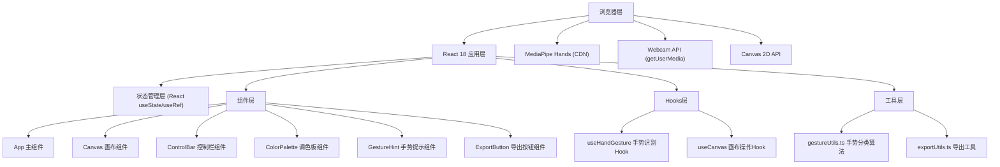

## 1. 架构设计



## 2. 技术描述

- **前端框架**：React 18 + TypeScript
- **构建工具**：Vite 5.x
- **手势识别**：MediaPipe Hands（通过CDN动态加载，无需npm安装）
- **状态管理**：React useState / useRef / useReducer（无需额外状态库）
- **样式方案**：原生CSS + CSS Modules（或内联样式，按需求简洁实现）
- **图标方案**：内联SVG图标（手势图标），无需额外图标库

## 3. 文件结构

```
e:\solo\VersionFast\tasks\auto88\
├── index.html                          # 入口HTML，全屏容器div#root
├── package.json                        # 依赖和脚本
├── vite.config.js                      # Vite配置（React插件、路径别名、端口5173）
├── tsconfig.json                       # TypeScript配置（严格模式、ES2020）
├── src/
│   ├── main.tsx                        # React入口
│   ├── App.tsx                         # 主组件，协调所有功能
│   ├── components/
│   │   ├── Canvas.tsx                  # 画布组件
│   │   ├── ControlBar.tsx              # 底部控制栏
│   │   ├── ColorPalette.tsx            # 调色板组件
│   │   ├── GestureHint.tsx             # 手势提示浮层
│   │   └── ExportButton.tsx            # 导出按钮
│   ├── hooks/
│   │   ├── useHandGesture.ts           # 手势识别Hook
│   │   └── useCanvas.ts                # 画布操作Hook
│   └── utils/
│       ├── gestureUtils.ts             # 手势分类算法
│       └── exportUtils.ts              # PNG/SVG导出工具
└── .trae/
    └── documents/
        ├── PRD.md
        └── TechArch.md
```

## 4. 核心数据类型定义

```typescript
// 手势类型
type GestureType = 'open' | 'fist' | 'point' | 'victory' | 'ok' | 'none';

interface GestureResult {
  type: GestureType;
  confidence: number;
  landmarks: Array<{ x: number; y: number; z: number }>;
  fingertipX: number;
  fingertipY: number;
}

// 画笔模式
type BrushMode = 'free' | 'erase' | 'point' | 'mirror' | 'picker';

// 画笔状态
interface BrushState {
  color: string;
  size: number;
  mode: BrushMode;
}

// 画布绘制记录（用于撤销）
interface DrawAction {
  type: 'stroke' | 'erase' | 'point';
  points: Array<{ x: number; y: number }>;
  color: string;
  size: number;
  mode: BrushMode;
}

// 预设颜色
const PALETTE_COLORS = [
  '#000000', '#ffffff', '#ef4444', '#f97316',
  '#eab308', '#22c55e', '#06b6d4', '#3b82f6',
  '#8b5cf6', '#ec4899', '#f43f5e', '#78716c'
];
```

## 5. 手势识别算法

基于MediaPipe Hands输出的21个3D关键点，通过几何距离计算判断手指伸直状态：

| 手势 | 判断条件 |
|------|---------|
| 张开手掌 (open) | 5根手指全部伸直 |
| 握拳 (fist) | 所有手指弯曲 |
| 食指伸出 (point) | 仅食指伸直，其余弯曲 |
| V字手势 (victory) | 食指和中指伸直，拇指、无名指、小指弯曲 |
| OK手势 (ok) | 拇指指尖与食指指尖距离很近，其余三指伸直 |

手指伸直判断：指尖到手腕的距离 > 指根到手腕距离 * 伸直阈值系数（~1.2）。

## 6. 性能优化策略

1. **视频处理**：使用 requestAnimationFrame 同步视频帧与手势检测
2. **画布渲染**：双缓冲Canvas（离屏Canvas缓存历史绘制 + 主Canvas实时渲染光标预览）
3. **状态更新**：使用 useRef 存储高频变化数据（指尖位置、绘制路径），避免不必要的React重渲染
4. **手势防抖**：连续3帧检测到相同手势才切换模式，避免抖动
5. **撤销栈优化**：使用环形缓冲区存储最多50步绘制记录，超出时自动丢弃最旧记录

## 7. 导出方案

- **PNG导出**：将主Canvas内容重绘到1920x1080的临时Canvas（透明背景），调用 toDataURL('image/png') 生成下载
- **SVG导出**：将绘制历史记录（DrawAction数组）转换为SVG `<path>` 元素，每个stroke对应一个path，拼合成完整SVG字符串后下载
