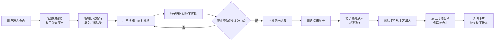

## 1. 产品概述

基于三维粒子系统的时间线回溯交互可视化应用，通过将历史事件以粒子形式在三维空间中呈现，让用户通过拖拽时间轴滑块直观地观察历史事件的演化过程。

- 主要目的：以沉浸式的三维可视化方式展示人类历史重大事件，增强历史学习与探索的趣味性
- 目标用户：历史爱好者、学生、教育工作者、对可视化交互感兴趣的用户
- 产品价值：将抽象的时间概念转化为可交互的三维空间体验，提供直观的历史全景视角

## 2. 核心功能

### 2.1 功能模块

1. **三维粒子场景**：800-1200个粒子代表历史事件，按时间与类型分类展示
2. **时间轴控制**：底部时间轴滑块，支持拖拽、点击跳转，实时驱动粒子动画
3. **粒子交互**：点击粒子高亮显示，弹出事件信息卡片
4. **相机控制**：自动旋转、鼠标拖拽旋转视角、滚轮缩放
5. **星空背景**：深邃星空与星云效果，营造沉浸式氛围

### 2.2 页面详情

| 页面名称 | 模块名称 | 功能描述 |
|-----------|-------------|---------------------|
| 主场景 | 三维粒子系统 | 历史事件粒子在球壳/螺旋路径上分布，颜色按类型分类，支持时间轴驱动的扩散动画 |
| 主场景 | 时间轴控制器 | 底部滑块控制时间进度，显示刻度与年份，停止500ms后自动平滑过渡 |
| 主场景 | 粒子信息卡片 | 点击粒子弹出事件详情，包含名称、年份、描述、类型图标，磨砂玻璃效果 |
| 主场景 | 背景环境 | 深邃星空（1000颗闪烁星点）+ 缓慢旋转星云纹理 |

## 3. 核心流程

用户进入页面后，场景自动初始化，粒子聚集在原点，相机缓慢自动旋转。用户通过底部时间轴拖拽滑块，观察粒子按时间顺序从原点向外扩散到三维空间预定位置。点击任意粒子可查看事件详情，点击其他区域或再次点击粒子关闭详情。

## 4. 用户界面设计

### 4.1 设计风格

- **主色调**：深邃暗色主题 #0a0a1a，搭配 #1a1a2e → #16213e 渐变
- **强调色**：时间轴滑块 #ff6b35（带发光效果），高亮粒子金色 #ffd700
- **粒子颜色分类**：
  - 战争：#e74c3c（红色）
  - 文化：#3498db（蓝色）
  - 科技：#2ecc71（绿色）
  - 灾难：#f39c12（橙色）
- **字体**：无衬线字体，刻度标签 12px，信息卡片内容清晰易读
- **视觉特效**：磨砂玻璃 backdrop-filter: blur(12px)、粒子发光、星空闪烁、星云旋转

### 4.2 页面设计概述

| 页面名称 | 模块名称 | UI 元素 |
|-----------|-------------|-------------|
| 主场景 | 三维渲染区域 | 全屏 canvas，#0a0a1a 背景，粒子、星空、星云、相机自动旋转 |
| 主场景 | 时间轴区域 | 底部 80px 高渐变条，#2d3436 边框，80% 宽滑块，#ff6b35 发光旋钮 |
| 主场景 | 时间刻度 | 白色细线刻度（高5px），12px rgba(255,255,255,0.6) 年份标签 |
| 主场景 | 信息卡片 | 左上角 220px 宽卡片，圆角12px，磨砂玻璃背景，16px 内边距，0.3s 滑入动画 |
| 主场景 | 高亮粒子效果 | 1.5x 放大，#ffd700 金色，8 个环绕光环粒子（半径0.8，周期2s） |

### 4.3 响应性

- 桌面端优先设计
- 时间轴宽度自适应屏幕（80% 宽度）
- Canvas 全屏自适应窗口大小
- 信息卡片固定左上角，适配不同分辨率

### 4.4 三维场景指引

- **环境/氛围**：深邃宇宙星空，营造历史长河的浩瀚感
- **光照设置**：粒子自发光效果，无外部光源依赖
- **相机设置**：透视相机，自动旋转 0.002 rad/s，俯仰限制 -30°~60°，缩放范围 5~30 单位
- **构图与焦点**：原点为中心，粒子分布在直径20单位的球壳/螺旋路径上
- **交互与动画**：三次贝塞尔插值粒子位置，ease-out 缓动 1.5s，扩散速度因子 1.0-3.0
- **性能优化**：BufferGeometry + PointsMaterial，距离相机 >40 单位剔除渲染，目标 30fps+
