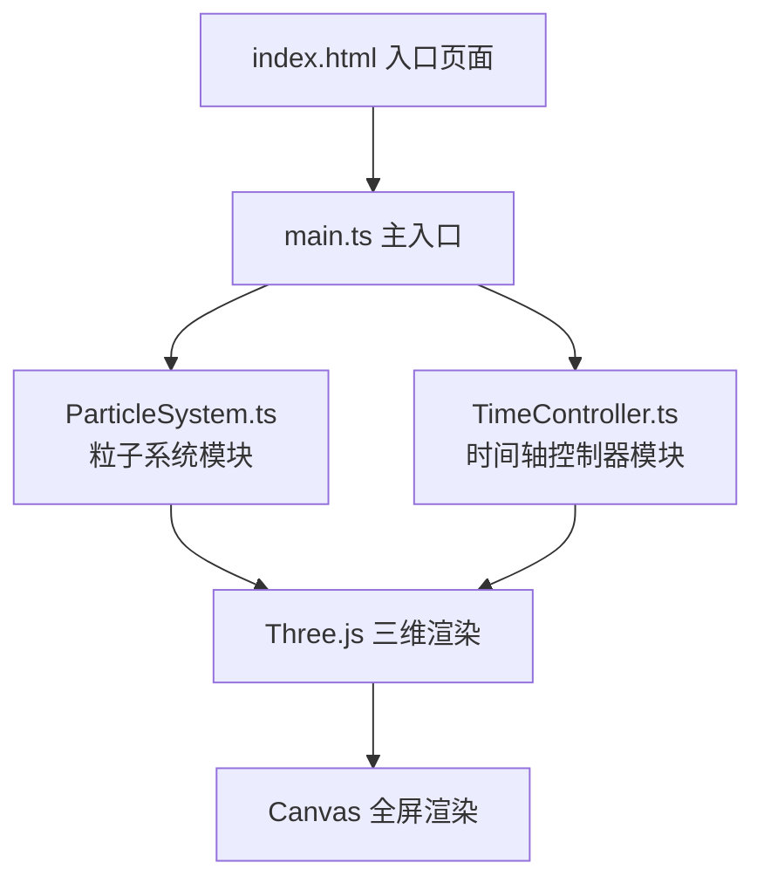

## 1. 架构设计



## 2. 技术描述

- **前端框架**：原生 TypeScript（无 UI 框架）
- **三维引擎**：Three.js（three, @types/three）
- **构建工具**：Vite
- **语言**：TypeScript（严格模式，target ES2020，module ESNext）
- **样式**：原生 CSS（内联在 index.html）

## 3. 文件结构

| 文件路径 | 用途 |
|-------|---------|
| `package.json` | 项目依赖配置：three, @types/three, vite, typescript |
| `vite.config.js` | Vite 配置：输出目录 dist，开发端口 5173 |
| `tsconfig.json` | TypeScript 配置：严格模式，ES2020 target，ESNext module |
| `index.html` | 入口页面：全屏 canvas 容器，UI 结构，内嵌样式 |
| `src/main.ts` | 主入口：场景/相机/渲染器初始化，模块组装，渲染循环，交互处理 |
| `src/ParticleSystem.ts` | 粒子系统：粒子生命周期、位置映射、颜色管理、动画插值、高亮效果、星空背景 |
| `src/TimeController.ts` | 时间控制器：滑块 UI、时间状态管理、刻度生成、平滑过渡驱动 |

## 4. 核心数据模型

### 4.1 历史事件粒子数据

```typescript
interface HistoricalEvent {
  id: number;
  name: string;
  year: number;           // -500 至 2000
  type: 'war' | 'culture' | 'science' | 'disaster';
  description: string;
  targetPosition: { x: number; y: number; z: number };
  pathType: 'sphere' | 'spiral1' | 'spiral2';
}

interface ParticleState {
  currentPosition: THREE.Vector3;
  targetPosition: THREE.Vector3;
  startPosition: THREE.Vector3;
  color: THREE.Color;
  size: number;
  opacity: number;
  isHighlighted: boolean;
  activationProgress: number; // 0.0 - 1.0
}
```

### 4.2 时间状态

```typescript
interface TimeState {
  currentYear: number;      // -500 至 2000
  targetYear: number;
  isAnimating: boolean;
  rateFactor: number;       // 1.0 - 3.0
}
```

## 5. 核心算法说明

### 5.1 粒子位置映射
- **球壳分布**：基于年份生成球坐标（φ, θ），半径 10 单位
- **螺旋路径**：两条螺旋线，半径随时间线性增长，极角随时间旋转

### 5.2 时间-进度映射
- 年份范围：公元前500年 (-500) 至 公元2000年 (2000)
- 归一化公式：`progress = (year + 500) / 2500`
- 粒子激活条件：`event.year <= currentYear`

### 5.3 动画插值
- 位置插值：三次贝塞尔曲线 `(1-t)³P₀ + 3(1-t)²tP₁ + 3(1-t)t²P₂ + t³P₃`
- 缓动函数：ease-out `t => 1 - (1-t)³`
- 平滑过渡：停止操作 500ms 后触发，持续 1.5 秒

### 5.4 性能优化
- 使用 `THREE.BufferGeometry` + `THREE.PointsMaterial`
- 视距剔除：距离相机 >40 单位的粒子跳过渲染更新
- 帧率目标：30fps+
