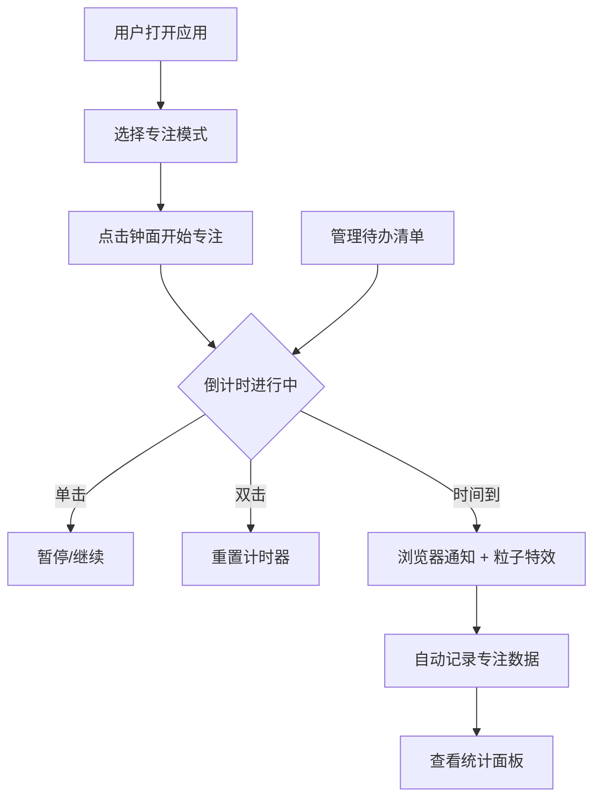

## 1. 产品概述

番茄工作法智能闹钟与专注统计应用，将传统番茄钟、待办清单和专注时长统计整合为一个可交互的Web应用，帮助用户提高工作效率并回顾每日高效时段。

- 核心目标：通过浏览器通知API和番茄工作法原理，帮助用户管理专注时间，追踪效率数据
- 目标用户：需要提升专注力和时间管理的工作者、学生、自由职业者

## 2. 核心功能

### 2.1 用户角色

| 角色 | 注册方式 | 核心权限 |
|------|----------|----------|
| 普通用户 | 无需注册，本地存储 | 使用番茄钟、管理待办、查看统计 |

### 2.2 功能模块

1. **主界面**：番茄钟倒计时显示、模式切换、状态控制
2. **待办清单**：添加、勾选完成、删除待办事项
3. **统计面板**：专注次数柱状图、总专注时长统计

### 2.3 页面详情

| 页面名称 | 模块名称 | 功能描述 |
|----------|----------|----------|
| 主界面 | 番茄钟组件 | 大号数字倒计时、旋转圆环进度条、单击暂停/继续、双击重置 |
| 主界面 | 模式切换按钮 | 25/45/90分钟三种专注模式切换，弹性过渡动画 |
| 主界面 | 待办清单侧边栏 | 右侧固定侧边栏，CRUD操作，完成状态动画 |
| 主界面 | 统计面板浮动按钮 | 右下角按钮，点击弹出磨砂玻璃面板，显示柱状图和总时长 |

## 3. 核心流程

用户打开应用 → 选择专注模式（25/45/90分钟）→ 点击开始专注 → 倒计时进行中（可暂停/继续）→ 倒计时结束 → 浏览器通知 + 粒子庆祝特效 → 自动记录到统计面板 → 用户可查看统计数据和管理待办事项。

## 4. 用户界面设计

### 4.1 设计风格

- 主色调：深蓝灰 #1a1a2e
- 强调色：冷青蓝 #4fc3f7、暖红 #ff6b6b
- 文字色：浅灰 #e0e0e0
- 字体：Segoe UI
- 按钮样式：圆角胶囊型，选中时颜色高亮
- 整体风格：暗色主题、科技感、磨砂玻璃效果

### 4.2 页面设计概览

| 页面名称 | 模块名称 | UI元素 |
|----------|----------|--------|
| 主界面 | 番茄钟 | 300px圆形钟面、120px大号数字、2px边框#4fc3f7、外发光、旋转渐变圆环进度条 |
| 主界面 | 模式切换 | 三个100x40px圆角按钮、弹性过渡动画300ms |
| 主界面 | 待办清单 | 280px右侧侧边栏、60px高卡片、圆点指示器、完成删除线渐隐动画 |
| 主界面 | 统计面板 | 50px浮动按钮、磨砂玻璃面板、320x400px、柱状图30px柱宽 |

### 4.3 响应式

桌面端优先设计，所有可点击元素悬停时有0.2秒平滑过渡和2px上移动效，面板切换使用400ms淡入淡出动画。

### 4.4 动效规范

- 倒计时每帧刷新（60fps）
- 模式切换：300ms弹性过渡 cubic-bezier(0.68, -0.55, 0.27, 1.55)
- 待办完成：500ms渐隐动画
- 面板切换：400ms ease-in-out 淡入淡出
- 悬停效果：0.2s背景过渡 + 2px上移
- 统计图表切换响应时间 ≤ 200ms
