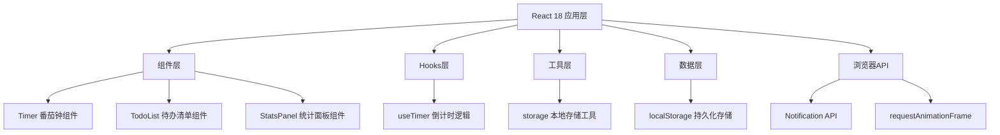

## 1. 架构设计



## 2. 技术说明

- 前端框架：React@18 + TypeScript
- 构建工具：Vite
- 状态管理：React useState/useReducer（局部状态）
- 数据持久化：localStorage
- 通知服务：浏览器 Notification API
- 动画方案：CSS动画 + requestAnimationFrame
- 图标方案：lucide-react

## 3. 目录结构

```
auto90/
├── index.html
├── package.json
├── vite.config.js
├── tsconfig.json
└── src/
    ├── main.tsx
    ├── App.tsx
    ├── components/
    │   ├── Timer.tsx
    │   ├── TodoList.tsx
    │   └── StatsPanel.tsx
    ├── hooks/
    │   └── useTimer.ts
    └── utils/
        └── storage.ts
```

## 4. 数据模型

### 4.1 专注记录类型定义

```typescript
interface FocusRecord {
  id: string;
  duration: number; // 分钟数
  mode: 'pomodoro' | 'short' | 'long'; // 25/45/90
  completedAt: number; // 时间戳
  date: string; // YYYY-MM-DD
}
```

### 4.2 待办事项类型定义

```typescript
interface TodoItem {
  id: string;
  text: string;
  completed: boolean;
  createdAt: number;
}
```

### 4.3 统计数据类型定义

```typescript
interface DailyStats {
  date: string;
  count: number;
  totalMinutes: number;
}
```

## 5. 核心API说明

### 5.1 useTimer Hook

```typescript
interface UseTimerReturn {
  timeLeft: number; // 剩余秒数
  isRunning: boolean;
  progress: number; // 0-1
  start: () => void;
  pause: () => void;
  reset: () => void;
  setDuration: (minutes: number) => void;
}
```

### 5.2 storage 工具函数

```typescript
function saveFocusRecord(record: FocusRecord): void;
function getFocusRecords(): FocusRecord[];
function getDailyStats(): DailyStats[];
function saveTodos(todos: TodoItem[]): void;
function getTodos(): TodoItem[];
```
