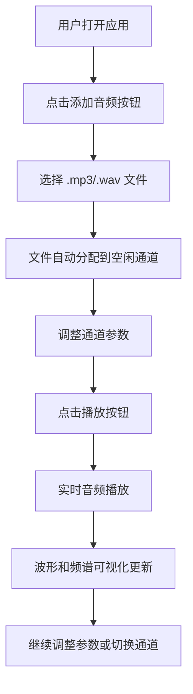

## 1. 产品概述

在线音频混合器与可视化控制台是一款基于Web Audio API的专业音频处理应用，用户可通过多通道推子和效果器实时调整音频参数，并查看波形与频谱反馈。

- 主要用途：提供多通道音频混合、实时效果处理和可视化反馈，面向音乐制作人、播客创作者和音频爱好者
- 核心价值：无需安装任何软件，在浏览器中即可实现专业级音频混合操作

## 2. 核心功能

### 2.1 功能模块

1. **多通道音频管理**：支持至少4个独立音频通道，每个通道可独立加载音频文件
2. **通道参数控制**：音量推子、声像旋钮、静音/独奏按钮、低通滤波器开关
3. **实时可视化**：每个通道波形图 + 动态频谱条
4. **全局播放控制**：播放/暂停、停止、主音量推子
5. **文件管理**：支持上传 .mp3 和 .wav 文件，自动分配到空闲通道

### 2.2 页面详情

| 页面名称 | 模块名称 | 功能描述 |
|---------|---------|---------|
| 主控制台 | 顶部播放控制区 | 播放/暂停按钮、停止按钮、主音量推子、文件上传按钮 |
| 主控制台 | 通道卡片区域 | 水平滚动显示4个音频通道卡片，每张卡包含推子、旋钮、按钮和可视化 |
| 主控制台 | 右侧详情面板 | 显示当前选中通道的详细参数（通道名、音量数字、滤波截止频率滑块） |
| 主控制台 | 底部主控栏 | 固定高度80px，显示整体状态 |

## 3. 核心流程

用户打开应用 → 点击"添加音频"上传音频文件 → 文件自动分配到空闲通道 → 通过推子/旋钮调整参数 → 点击播放按钮试听 → 查看实时波形和频谱反馈 → 可切换静音/独奏/滤波器进行精细调整

## 4. 用户界面设计

### 4.1 设计风格

- **主色调**：暗色主题，背景 #1a1a2e，卡片背景 #2d2d3f
- **强调色**：#4fc3f7（青色），辅助色 #ff8a65（橙色），#81c784（绿色），#ce93d8（紫色）
- **文字颜色**：#e0e0e0（浅灰白）
- **按钮风格**：圆角设计，带有悬停动画和按下/弹起缩放效果
- **字体**：系统字体 Segoe UI, sans-serif，默认大小 14px
- **布局风格**：左右结构，左侧通道卡片水平滚动，右侧固定详情面板
- **动画过渡**：统一 cubic-bezier(0.25, 0.1, 0.25, 1)，时长 200ms

### 4.2 页面设计概览

| 页面名称 | 模块名称 | UI 元素 |
|---------|---------|---------|
| 主控制台 | 播放控制区 | 圆形播放/暂停按钮（直径50px）、方形停止按钮（40x40px）、横向主音量推子（宽200px）、虚线边框上传按钮 |
| 主控制台 | 通道卡片 | 每张宽280px，圆角12px，内边距16px；垂直推子（宽6px高200px）、圆形旋钮（直径40px）、功能按钮、Canvas可视化区域 |
| 主控制台 | 右侧面板 | 选中通道名称、音量数值显示、滤波截止频率滑块 |
| 主控制台 | 底部栏 | 固定高度80px，上边框2px #4fc3f7，背景 #0d0d1a |

### 4.3 响应式设计

- 桌面端（>768px）：左右结构布局，推子高度200px
- 移动端（≤768px）：垂直堆叠布局，推子高度缩短至120px
- 触摸优化：所有控件支持触摸事件，推子和旋钮有更大的触摸热区

### 4.4 交互反馈细节

- **推子拖动**：滑块周围出现光晕，颜色从 #4fc3f7 到 #ff8a65 渐变（对应0-100%）
- **旋钮旋转**：发出400Hz正弦波提示音（50ms，音量0.1）
- **按钮点击**：缩放 0.95 → 1.05，时长100ms
- **静音状态**：通道卡片半透明（opacity 0.4），波形冻结
- **独奏状态**：非独奏通道边缘红色脉冲边框动画（周期1.5s）
