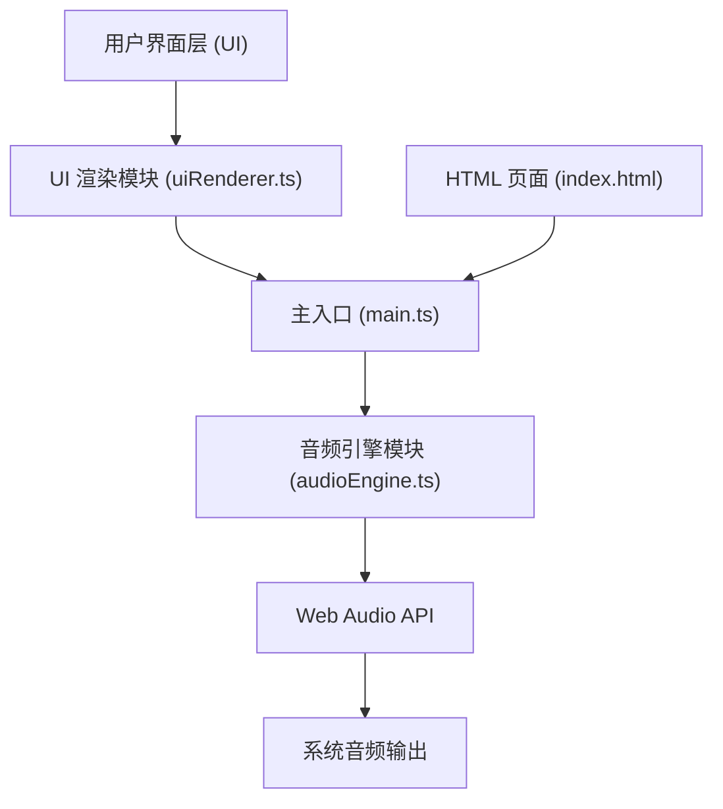
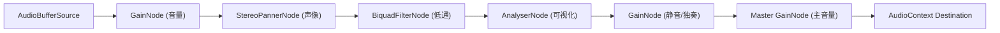

## 1. 架构设计



## 2. 技术描述

- **前端框架**：原生 TypeScript + Vite（无框架依赖）
- **构建工具**：Vite 5.x
- **音频处理**：原生 Web Audio API（不使用任何外部音频库）
- **UI 渲染**：原生 DOM + Canvas API
- **语言**：TypeScript（严格模式，target ES2020，module ESNext）

## 3. 文件结构

| 文件路径 | 用途 |
|---------|-----|
| package.json | 项目依赖和脚本配置 |
| vite.config.js | Vite 构建配置（输出目录 dist，端口 5173） |
| tsconfig.json | TypeScript 编译配置 |
| index.html | 入口 HTML 页面 |
| src/main.ts | 应用入口，初始化音频上下文和 UI |
| src/audioEngine.ts | 音频引擎：音频上下文、多通道管理、Gain节点、滤波器 |
| src/uiRenderer.ts | UI 渲染：推子、旋钮、按钮、Canvas 可视化 |

## 4. 核心模块 API 定义

### 4.1 音频引擎 (audioEngine.ts)

```typescript
interface TrackState {
  id: number;
  name: string;
  volume: number;      // 0-100
  pan: number;         // -1 to 1
  muted: boolean;
  solo: boolean;
  filterEnabled: boolean;
  filterFrequency: number;  // 20-20000 Hz
}

interface AudioEngineAPI {
  addTrack(audioBuffer: AudioBuffer, name: string): number;
  removeTrack(id: number): void;
  setVolume(id: number, value: number): void;
  setPan(id: number, value: number): void;
  toggleMute(id: number): void;
  toggleSolo(id: number): void;
  toggleFilter(id: number): void;
  setFilterFrequency(id: number, freq: number): void;
  play(): void;
  pause(): void;
  stop(): void;
  setMasterVolume(value: number): void;
  getTrackState(id: number): TrackState;
  getAllTrackStates(): TrackState[];
  getAnalyser(id: number): AnalyserNode;
  getMasterAnalyser(): AnalyserNode;
  on(event: string, callback: Function): void;
}
```

### 4.2 UI 渲染 (uiRenderer.ts)

```typescript
interface UICallbacks {
  onVolumeChange: (trackId: number, value: number) => void;
  onPanChange: (trackId: number, value: number) => void;
  onMuteToggle: (trackId: number) => void;
  onSoloToggle: (trackId: number) => void;
  onFilterToggle: (trackId: number) => void;
  onFilterFrequencyChange: (trackId: number, freq: number) => void;
  onPlay: () => void;
  onPause: () => void;
  onStop: () => void;
  onMasterVolumeChange: (value: number) => void;
  onFileUpload: (files: FileList) => void;
  onTrackSelect: (trackId: number) => void;
}

interface UIRendererAPI {
  init(container: HTMLElement, callbacks: UICallbacks): void;
  updateTrack(trackId: number, state: TrackState): void;
  updateMasterVolume(value: number): void;
  setPlaying(isPlaying: boolean): void;
  setSelectedTrack(trackId: number): void;
  renderWaveform(trackId: number, data: Uint8Array): void;
  renderSpectrum(trackId: number, data: Uint8Array): void;
}
```

## 5. 音频信号流程图



## 6. 性能优化策略

- **音频处理**：使用 Web Audio API 原生节点，确保处理延迟 < 50ms
- **可视化绘制**：Canvas 渲染限制为 30FPS，使用 requestAnimationFrame 调度
- **内存管理**：及时释放不再使用的 AudioBuffer，限制单文件大小 ≤ 10MB
- **事件节流**：推子/旋钮拖动事件使用节流，避免过度触发音频参数更新
