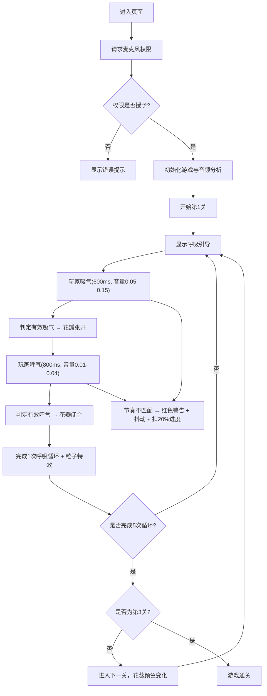

## 1. 产品概述

一款基于浏览器麦克风音频分析的呼吸冥想交互游戏，玩家通过呼吸节奏控制虚拟花朵的绽放与闭合，在放松身心的同时完成关卡目标。

- 核心目标：通过生物反馈式的呼吸训练帮助用户冥想放松，同时提供游戏化的关卡体验
- 目标用户：需要减压放松、学习冥想呼吸法的独立用户

## 2. 核心特性

### 2.1 功能模块

1. **音频采集与分析模块**：实时捕获麦克风输入，计算音量均值与呼吸波形
2. **游戏逻辑引擎**：呼吸节奏判定状态机、关卡进度管理、惩罚机制
3. **花朵视觉渲染**：Canvas绘制动态花朵（花瓣贝塞尔曲线、花蕊光晕、粒子特效）
4. **UI覆盖层**：呼吸引导指示器、关卡进度、音量波形、交互反馈

### 2.2 页面详情

| 页面名称 | 模块名称 | 功能描述 |
|-----------|-------------|---------------------|
| 游戏主界面 | 全屏Canvas | 渲染花朵动画、粒子特效、背景径向渐变 |
| 游戏主界面 | 呼吸引导指示器 | 左上角半圆形渐变指示器，同步显示吸气/呼气引导 |
| 游戏主界面 | 关卡进度 | 右上角3个圆点指示器（已完成/进行中/未完成） |
| 游戏主界面 | 音量波形控制条 | 底部半透明控制条，实时显示麦克风音量波形 |
| 游戏主界面 | 警告反馈 | 呼吸节奏不匹配时的红色边缘闪烁与花朵抖动 |

## 3. 核心流程

玩家进入页面 → 请求麦克风权限 → 开始关卡 → 跟随呼吸引导进行吸气/呼气 → 系统实时分析音频判定呼吸状态 → 花朵根据状态绽放/闭合 → 完成5次呼吸循环通关 → 进入下一关（共3关）

## 4. 用户界面设计

### 4.1 设计风格

- **主色调**：深蓝夜空径向渐变（#0a0a2e → #1a0a2e），营造冥想氛围
- **强调色**：
  - 花蕊色：#ffb347（第1关）→ #ff6b6b（第2关）→ #a29bfe（第3关）
  - 成功绿：#00b894
  - 警告红：#ff0000（透明度0.3）
  - 波形蓝：#74b9ff
  - 进度黄：#fdcb6e
  - 未完成灰：#636e72
- **字体与动效**：简洁现代字体，所有UI元素悬停0.3秒透明度淡入（0.6→0.9），点击轻微缩放（1.05倍）
- **布局风格**：全屏沉浸式，响应式居中留白（最小1024×768）

### 4.2 页面设计概述

| 页面名称 | 模块名称 | UI元素 |
|-----------|-------------|-------------|
| 游戏主界面 | Canvas花朵 | 8片贝塞尔曲线花瓣、发光花蕊、粒子特效、呼吸状态过渡动画 |
| 游戏主界面 | 呼吸指示器 | 左上角直径80px半圆，吸气绿色填充，呼气清空 |
| 游戏主界面 | 关卡进度 | 右上角3个圆点，颜色区分状态 |
| 游戏主界面 | 波形控制条 | 底部半透明圆角条，实时波形绘制 |

### 4.3 响应式

- 桌面优先，最小尺寸1024×768
- 超出最小尺寸时画布居中留白
- 所有UI元素相对画布定位

## 5. 性能要求

- 游戏主循环稳定60FPS
- 音频分析单帧耗时≤2ms
- Canvas重绘每帧≤16ms
- 1920×1080下花瓣贝塞尔曲线计算≤1ms/帧
