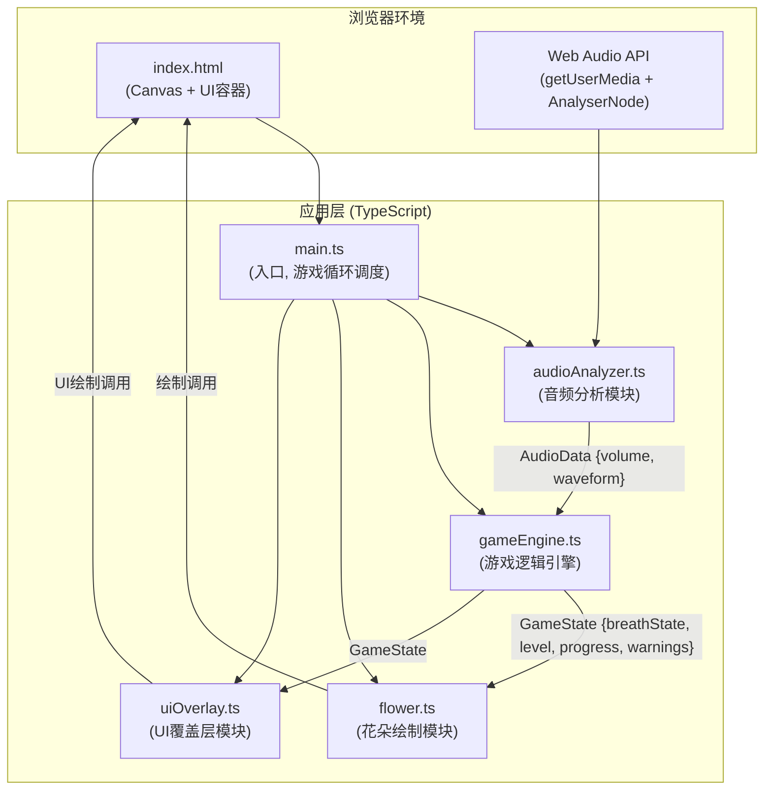

## 1. 架构设计



## 2. 技术描述

- **前端框架**：原生 TypeScript（无框架依赖）
- **构建工具**：Vite 5.x
- **音频处理**：原生 Web Audio API（`getUserMedia` + `AnalyserNode` + `getByteTimeDomainData`）
- **图形渲染**：HTML5 Canvas 2D API
- **包管理**：npm
- **编译目标**：ES2020
- **模块系统**：ESNext

**不使用的技术**：无外部游戏引擎、无第三方音频库、无React/Vue、无tailwindcss

## 3. 文件结构与职责

| 文件路径 | 职责描述 | 输入 | 输出/对外接口 |
|---------|---------|------|-------------|
| `package.json` | 项目依赖与脚本配置 | - | `npm run dev` |
| `vite.config.js` | Vite构建配置（端口5173, HMR, dist输出） | - | - |
| `tsconfig.json` | TypeScript编译配置（严格模式, ES2020） | - | - |
| `index.html` | 入口页面，全屏Canvas容器 | - | DOM元素 |
| `src/main.ts` | 入口文件：初始化AudioContext、GameEngine、FlowerRenderer、UIOverlay；驱动requestAnimationFrame主循环 | DOM | 每帧调用各模块update/render |
| `src/audioAnalyzer.ts` | 音频分析：获取麦克风流、AnalyserNode频谱计算、音量均值输出 | `start()`, `stop()` | `getAudioData(): AudioData` |
| `src/gameEngine.ts` | 游戏逻辑：呼吸状态机、阈值判定、关卡进度、惩罚机制、粒子系统 | `update(audioData, deltaTime)` | `getState(): GameState` |
| `src/flower.ts` | 花朵渲染：8片贝塞尔花瓣、花蕊光晕、闪烁动画、粒子特效 | `render(ctx, gameState)` | Canvas绘制 |
| `src/uiOverlay.ts` | UI渲染：呼吸指示器、关卡圆点、音量波形、警告闪烁、交互反馈 | `render(ctx, gameState, audioData)` | Canvas绘制 + 事件监听 |

## 4. 核心数据类型定义

```typescript
// src/audioAnalyzer.ts
interface AudioData {
  volume: number;           // 当前帧音量均值 (0.0-1.0)
  waveform: Float32Array;   // 时域波形数据 (用于UI绘制)
}

// src/gameEngine.ts
type BreathState = 'idle' | 'inhaling' | 'exhaling' | 'hold_in' | 'hold_out';

interface GameState {
  breathState: BreathState;
  breathProgress: number;       // 当前呼吸阶段进度 (0.0-1.0)
  currentLevel: number;         // 当前关卡 (1-3)
  cyclesCompleted: number;      // 当前关卡完成的呼吸循环数 (0-5)
  cycleProgress: number;        // 当前循环进度 (0.0-1.0)
  petalAngle: number;           // 当前花瓣张开角度 (15-80度)
  coreColor: string;            // 当前花蕊颜色
  warningActive: boolean;       // 警告是否激活
  warningTimer: number;         // 警告剩余时间 (ms)
  shakeOffset: { x: number; y: number }; // 抖动位移
  particles: Particle[];        // 粒子特效列表
  isComplete: boolean;          // 游戏是否全部通关
}

interface Particle {
  x: number; y: number;
  vx: number; vy: number;
  radius: number;
  color: string;
  life: number;      // 剩余生命 (ms)
  maxLife: number;
}
```

## 5. 数据流向

1. **main.ts** 启动时调用 `audioAnalyzer.start()` 请求麦克风权限并创建音频节点
2. 每帧（60FPS）主循环执行顺序：
   - `audioAnalyzer.getAudioData()` → 计算当前 `AudioData`
   - `gameEngine.update(audioData, deltaTime)` → 内部状态机判定呼吸、更新进度、处理惩罚
   - `flower.render(ctx, gameState)` → 绘制花朵、粒子
   - `uiOverlay.render(ctx, gameState, audioData)` → 绘制UI层
3. 事件流：UIOverlay监听Canvas交互事件，反馈至GameEngine

## 6. 关键算法与参数

### 6.1 呼吸判定算法
- FFT大小：2048，采样率44100Hz
- 音量均值：对`getByteTimeDomainData`归一化后取绝对值均值
- **有效吸气**：音量 ∈ [0.05, 0.15] 持续 ≥ 600ms，判定延迟 ≤ 200ms
- **有效呼气**：音量 ∈ [0.01, 0.04] 持续 ≥ 800ms，判定延迟 ≤ 200ms
- 状态转换：`idle → inhaling → hold_in → exhaling → hold_out → idle`（完成1循环）

### 6.2 动画插值
- 花瓣张开：15° → 80°，1秒线性插值
- 花瓣闭合：80° → 15°，1.2秒线性插值
- 停留闪烁：完成张开/闭合后停留0.3秒，花瓣边缘透明度0.8↔1.0振荡（周期0.5秒sin波）
- 粒子：20个随机方向粒子，半径2-5px，800ms线性淡出

### 6.3 惩罚机制
- 触发条件：音量超出阈值 或 持续时间不足
- 视觉反馈：画布边缘红色#ff0000闪烁（透明度0.3，4Hz，1.5秒）+ 花朵抖动5px 0.2秒
- 进度扣除：当前循环进度 × 0.2

## 7. 性能优化策略

- **音频分析**：缓存`Uint8Array`缓冲区，避免每帧分配；使用简单均值计算而非FFT
- **Canvas渲染**：
  - 背景渐变使用离屏Canvas缓存
  - 花瓣贝塞尔曲线控制点预计算，仅角度变化时重算
  - 粒子使用对象池复用
- **主循环**：使用`performance.now()`计算deltaTime，确保60FPS稳定
- **UI层**：波形数据降采样绘制，避免过多路径点
