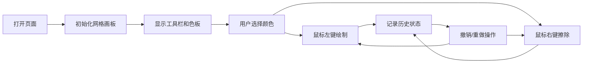

## 1. 产品概述

像素画编辑器是一款基于 Canvas API 的网页端像素艺术创作工具，用户可以像在纸上画格子一样，通过鼠标点击来创作像素艺术作品。

- 目标用户：像素艺术爱好者、游戏开发者、设计师
- 核心价值：提供简洁直观的像素画创作体验，支持基础的绘制、擦除、撤销重做功能
- 产品定位：轻量级、高性能、像素风格的在线像素画编辑器

## 2. 核心功能

### 2.1 用户角色
| 角色 | 注册方式 | 核心权限 |
|------|----------|----------|
| 普通用户 | 无需注册 | 使用全部绘制功能 |

### 2.2 功能模块
1. **网格画板**：可缩放的像素网格，支持鼠标绘制和擦除
2. **工具栏**：颜色选取、预设色板、撤销重做按钮
3. **历史记录**：支持最多20步撤销和重做操作

### 2.3 页面详情
| 页面名称 | 模块名称 | 功能描述 |
|---------|----------|----------|
| 主页面 | 网格画板 | 50x50 像素网格，左键绘制、右键擦除，自适应屏幕大小 |
| 主页面 | 左侧工具栏 | 颜色拾取器、12色预设色板、当前颜色预览、撤销/重做按钮 |
| 主页面 | 状态栏 | 显示当前坐标、网格尺寸等信息 |

## 3. 核心流程

用户打开页面 → 查看居中的网格画板和左侧工具栏 → 选择颜色（从预设色板或颜色拾取器）→ 在网格上左键绘制像素 → 右键擦除像素 → 可随时撤销/重做操作 → 完成创作

## 4. 用户界面设计

### 4.1 设计风格
- **主题色系**：深灰背景（#1a1a2e）配浅色文字（#e0e0e0），暗色系主题
- **强调色**：像素风格的鲜艳色彩，用于选中状态和交互反馈
- **按钮样式**：块状直角按钮，像素风格，悬停时有轻微缩放效果
- **字体**：Monospace 等宽字体，营造像素复古风格
- **布局风格**：左侧固定工具栏 + 中央画板区域，简洁直观

### 4.2 页面设计概述
| 页面名称 | 模块名称 | UI 元素 |
|---------|----------|---------|
| 主页面 | 网格画板 | Canvas 画布、网格线、悬停高亮、点击弹性动画 |
| 主页面 | 工具栏 | 颜色预览块、12色色板、颜色拾取器、撤销按钮、重做按钮 |
| 主页面 | 整体布局 | 深色背景、像素风格边框、平滑过渡动画 |

### 4.3 响应式设计
- 桌面端（笔记本）：左侧工具栏固定宽度，画板自适应剩余空间
- 平板端：工具栏可折叠或调整宽度，画板保持居中
- 格子大小自适应屏幕，确保 50x50 网格完整显示
- 触摸设备优化：支持触摸绘制

### 4.4 动效设计
- 点击格子时：微小的缩放弹性动画（scale 0.9 → 1.05 → 1.0）
- 颜色切换时：预览块平滑渐变过渡动画
- 按钮悬停：轻微上移 + 阴影加深
- 鼠标悬停格子：半透明高亮效果
- 网格线：若隐若现的低透明度线条
