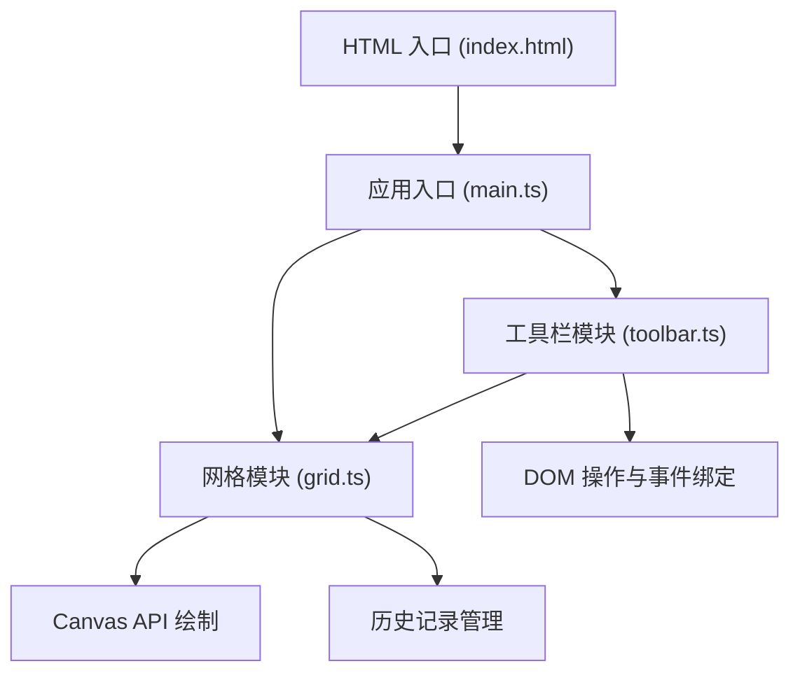
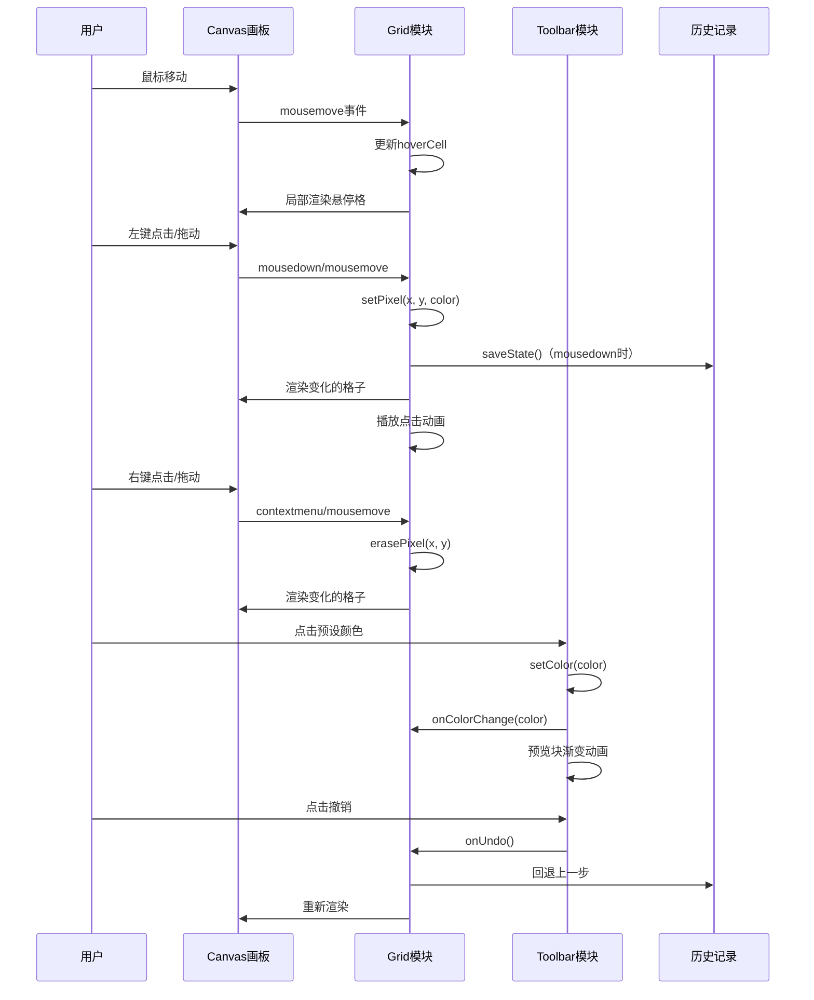

## 1. 架构设计

## 2. 技术选型

- **前端框架**：原生 TypeScript（无框架，使用 Canvas API）
- **构建工具**：Vite 5.x
- **开发语言**：TypeScript 5.x（严格模式，目标 ES2020）
- **样式方案**：内联样式 + CSS 变量，像素风格设计
- **状态管理**：模块内私有状态 + 事件回调

## 3. 文件结构

| 文件路径 | 职责 |
|---------|------|
| `package.json` | 项目依赖与脚本配置 |
| `vite.config.js` | Vite 构建配置 |
| `tsconfig.json` | TypeScript 编译配置 |
| `index.html` | 入口 HTML 页面 |
| `src/main.ts` | 应用入口，初始化画板和 UI，协调各模块 |
| `src/grid.ts` | 网格数据结构、绘制逻辑、历史记录管理 |
| `src/toolbar.ts` | 工具栏 UI 组件，颜色选取、撤销重做按钮 |

## 4. 核心模块设计

### 4.1 Grid 模块 (grid.ts)

**职责**：管理网格数据状态，负责 Canvas 绘制和历史记录

**核心类：PixelGrid**
- 属性：
  - `width: number` - 网格宽度（格子数）
  - `height: number` - 网格高度（格子数）
  - `cellSize: number` - 每个格子的像素大小
  - `pixels: string[][]` - 二维数组存储每个格子的颜色
  - `canvas: HTMLCanvasElement` - Canvas 元素
  - `ctx: CanvasRenderingContext2D` - 画布上下文
  - `history: HistoryState[]` - 历史记录栈
  - `historyIndex: number` - 当前历史索引
  - `maxHistory: number` - 最大历史记录数（20）
  - `hoverCell: {x: number, y: number} | null` - 悬停格子坐标
  - `animatingCells: Map<string, number>` - 动画中的格子

- 方法：
  - `constructor(canvas, width, height)` - 构造函数
  - `setCellSize(size)` - 设置格子大小
  - `getPixel(x, y)` - 获取指定位置颜色
  - `setPixel(x, y, color)` - 设置像素颜色（记录历史）
  - `fillPixel(x, y, color)` - 填充单个像素（不记录历史）
  - `erasePixel(x, y)` - 擦除像素（设为透明/背景色）
  - `render()` - 渲染整个网格
  - `renderCell(x, y)` - 渲染单个格子
  - `renderGridLines()` - 渲染网格线
  - `renderHover()` - 渲染悬停高亮
  - `handleMouseMove(e)` - 鼠标移动处理
  - `handleMouseDown(e)` - 鼠标按下处理
  - `handleMouseUp(e)` - 鼠标释放处理
  - `getCellFromEvent(e)` - 根据事件获取格子坐标
  - `undo()` - 撤销
  - `redo()` - 重做
  - `canUndo()` - 是否可以撤销
  - `canRedo()` - 是否可以重做
  - `saveState()` - 保存当前状态到历史
  - `resize()` - 调整画布大小

### 4.2 Toolbar 模块 (toolbar.ts)

**职责**：管理工具栏 UI，包括颜色选取、预设色板、撤销重做按钮

**核心类：Toolbar**
- 属性：
  - `container: HTMLElement` - 工具栏容器
  - `currentColor: string` - 当前选中颜色
  - `onColorChange: (color: string) => void` - 颜色变化回调
  - `onUndo: () => void` - 撤销回调
  - `onRedo: () => void` - 重做回调
  - `presetColors: string[]` - 预设色板颜色数组

- 方法：
  - `constructor(container, options)` - 构造函数
  - `createColorPicker()` - 创建颜色拾取器
  - `createPresetPalette()` - 创建预设色板
  - `createUndoRedoButtons()` - 创建撤销重做按钮
  - `createColorPreview()` - 创建颜色预览块
  - `setColor(color)` - 设置当前颜色
  - `updateUndoRedoState(canUndo, canRedo)` - 更新撤销重做按钮状态
  - `animateColorChange()` - 颜色切换动画

### 4.3 主入口 (main.ts)

**职责**：应用入口，初始化各模块，绑定事件，协调各模块工作

主要逻辑：
1. 获取 DOM 元素
2. 创建 PixelGrid 实例
3. 创建 Toolbar 实例
4. 绑定事件回调（颜色变化、撤销、重做）
5. 处理窗口大小变化
6. 初始化渲染

## 5. 性能优化策略

- **局部渲染**：只重绘变化的格子，而非整个画布
- **双缓冲**：使用离屏 Canvas 预渲染静态内容
- **节流处理**：鼠标移动事件节流，减少渲染次数
- **历史记录优化**：使用操作记录而非完整快照（或限制大小）
- **requestAnimationFrame**：使用 rAF 进行动画渲染

## 6. 交互事件流

## 7. 预设色板（12色）

| 颜色 | 色值 | 说明 |
|------|------|------|
| 黑色 | #000000 | 纯黑 |
| 深灰 | #333333 | 深灰色 |
| 白色 | #ffffff | 纯白 |
| 红色 | #ff0000 | 正红 |
| 橙色 | #ff8800 | 橙色 |
| 黄色 | #ffff00 | 黄色 |
| 绿色 | #00ff00 | 绿色 |
| 青色 | #00ffff | 青色 |
| 蓝色 | #0088ff | 蓝色 |
| 紫色 | #8800ff | 紫色 |
| 粉色 | #ff00ff | 粉色 |
| 棕色 | #884400 | 棕色 |
