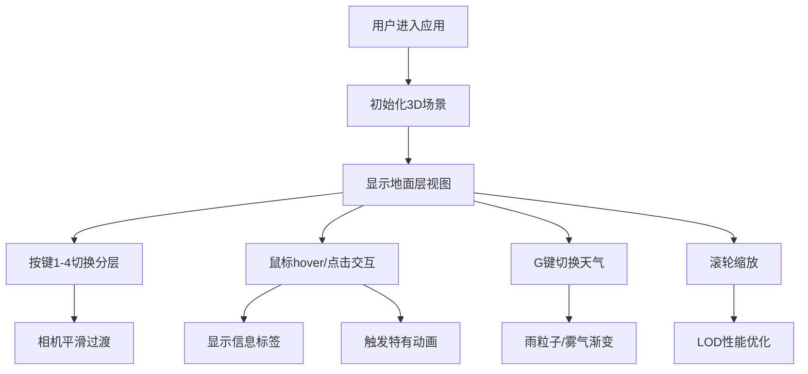

## 1. 产品概述

热带雨林生态分层与生物动态分布交互式可视化应用，让用户以生态学家视角，通过分层切换和缩放操作观察不同高度层级中的动植物群落与气象交互。

- 主要目的：提供沉浸式的热带雨林生态学习体验，展示雨林垂直分层生态系统的复杂性和生物多样性
- 目标用户：学生、生态爱好者、教育工作者
- 市场价值：创新的自然科学教育工具，寓教于乐

## 2. 核心功能

### 2.1 用户角色

| 角色 | 注册方式 | 核心权限 |
|------|----------|----------|
| 普通用户 | 无需注册 | 自由浏览、交互操作、切换分层 |

### 2.2 功能模块

1. **3D场景渲染模块**：热带雨林垂直分层可视化（地面层0-5m、灌木层5-15m、树冠层15-35m、露生层35-50m）
2. **分层交互模块**：点击/hover动植物显示信息、触发动态反馈
3. **天气模拟模块**：雨粒子系统、雾气动态、天气切换
4. **相机控制模块**：按键1-4切换分层、滚轮缩放、平滑动画过渡
5. **性能优化模块**：LOD切换、FPS监控、动态粒子数调整

### 2.3 页面详情

| 页面名称 | 模块名称 | 功能描述 |
|-----------|----------|----------|
| 主场景 | 3D雨林场景 | 四层生态结构、植物动物模型、实时渲染 |
| 主场景 | 分层切换按钮 | 4个垂直排列圆形按钮，1-4键切换，悬停光晕效果 |
| 主场景 | 交互反馈 | 点击高亮、信息标签、波纹特效、层特有动画 |
| 主场景 | 天气系统 | G键切换晴朗/降雨，雨粒子、雾气、雨声 |
| 主场景 | 性能监控 | FPS监测、动态调整粒子数和几何体细分 |

## 3. 核心流程

用户打开应用 → 进入3D雨林场景 → 通过1-4键或点击按钮切换分层 → 相机平滑过渡到目标层 → 鼠标hover/点击动植物查看信息 → G键切换天气体验不同气象效果 → 滚轮缩放观察细节

## 4. 用户界面设计

### 4.1 设计风格

- **主色调**：深丛林绿色系 `#0a1a0a`、`#0a2a0a`、`#2a5a2a`、`#7cfc00`
- **按钮风格**：圆形带SVG图标，悬停膨胀1.1倍，外围柔和光晕
- **字体**：monospace等宽字体，浅灰色文字
- **布局**：左侧垂直排列4个分层切换按钮，悬浮信息标签
- **图标风格**：SVG简化植物轮廓图标

### 4.2 页面设计概览

| 页面名称 | 模块名称 | UI元素 |
|-----------|----------|----------|
| 主场景 | 分层按钮组 | 4个垂直圆形按钮，SVG图标，`#7cfc00`激活色，`#333333aa`未激活色，悬停光晕阴影模糊10px |
| 主场景 | 信息标签 | 半透明深灰背景 `#222222aa`，圆角6px，白色12px monospace字体，投影模糊4px |
| 主场景 | 3D场景 | 深绿背景 `#0a1a0a`，棕绿色半透明地面，四层植物动物模型 |

### 4.3 响应式设计

- 桌面端：按钮48px，信息标签12px字体
- 移动端：按钮36px，信息标签10px字体
- 所有过渡动画0.3s ease-in-out

### 4.4 3D场景指引

- **环境**：深绿色雾气背景，垂直分层颜色渐变
- **光照**：环境光+方向光，模拟热带雨林散射光
- **相机**：PerspectiveCamera，初始看向(0,0,0)，Y轴位置随分层变化
- **交互**：鼠标点击/hover射线检测，滚轮缩放5-60m范围
- **动画**：所有过渡ease-out/ease-in-out缓动，1s分层切换，0.3s交互反馈
- **性能预算**：每层植物≤15，动物≤5，FPS≥45，低角度自动关闭远处分层渲染
