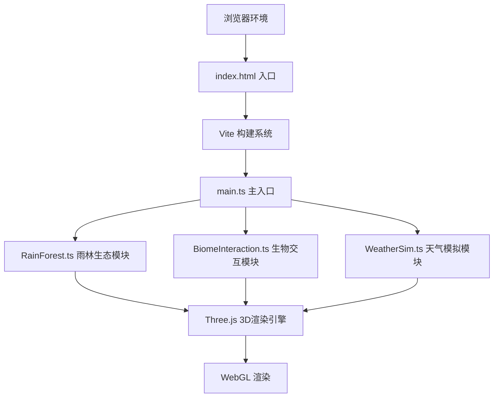

## 1. 架构设计



## 2. 技术描述

- **前端框架**：TypeScript + Three.js@0.160.0 + Vite
- **动画库**：GSAP（缓动动画）
- **UI控制**：Tweakpane（调试面板）
- **类型支持**：@types/three
- **后端**：无（纯前端应用）
- **数据库**：无

## 3. 文件结构

```
auto100/
├── package.json          # 项目依赖配置
├── vite.config.js        # Vite构建配置
├── tsconfig.json         # TypeScript配置
├── index.html            # HTML入口
└── src/
    ├── main.ts           # 主入口，场景初始化与主循环
    ├── RainForest.ts     # 雨林分层管理
    ├── BiomeInteraction.ts  # 交互处理
    └── WeatherSim.ts     # 天气模拟
```

## 4. 模块定义

### 4.1 RainForest 类

| 方法/属性 | 类型 | 描述 |
|----------|------|------|
| `layers` | Layer[] | 4个生态分层配置 |
| `constructor(scene)` | 构造函数 | 初始化雨林场景 |
| `createPlants(layerIndex)` | Method | 创建指定层植物模型 |
| `createAnimals(layerIndex)` | Method | 创建指定层动物精灵 |
| `switchLayer(index)` | Method | 切换到指定分层 |
| `update(delta)` | Method | 帧更新，调整相机和雾气 |
| `setLayerVisibility(layerIndex, visible)` | Method | 设置层可见性 |

### 4.2 BiomeInteraction 类

| 方法/属性 | 类型 | 描述 |
|----------|------|------|
| `constructor(scene, camera, renderer)` | 构造函数 | 初始化交互系统 |
| `handleClick(event)` | Method | 处理鼠标点击 |
| `handleHover(event)` | Method | 处理鼠标悬停 |
| `createRipple(position)` | Method | 创建波纹扩散特效 |
| `showInfoLabel(position, text)` | Method | 显示信息标签 |
| `triggerLayerEffect(layerIndex, position)` | Method | 触发层特有动画 |
| `update(delta)` | Method | 帧更新动画 |

### 4.3 WeatherSim 类

| 方法/属性 | 类型 | 描述 |
|----------|------|------|
| `rainParticles` | Points | 雨滴粒子系统 |
| `constructor(scene)` | 构造函数 | 初始化天气系统 |
| `createRainParticles(count)` | Method | 创建雨滴粒子 |
| `toggleWeather()` | Method | 切换晴朗/降雨 |
| `setFogDensity(target)` | Method | 设置雾气密度 |
| `update(delta)` | Method | 帧更新粒子运动 |
| `adjustForFPS(fps)` | Method | 根据FPS调整粒子数 |

## 5. 核心数据结构

```typescript
interface Layer {
  name: string;
  yRange: [number, number];
  centerY: number;
  fogColor: string;
  plants: PlantConfig[];
  animals: AnimalConfig[];
  maxPlants: number;
  maxAnimals: number;
}

interface PlantConfig {
  type: string;
  color: string;
  heightRange: [number, number];
  segments: number;
}

interface AnimalConfig {
  type: string;
  color: string;
  size: number;
  behavior: 'idle' | 'float' | 'fly' | 'jump';
}

interface RippleEffect {
  mesh: Mesh;
  startTime: number;
  duration: number;
  maxRadius: number;
}
```

## 6. 性能优化策略

1. **LOD分层渲染**：相机低角度(<5m)时自动关闭树冠层及以上渲染
2. **FPS监控**：低于30FPS时雨滴粒子数从600减半至300
3. **几何体细分**：低FPS时降低几何体细分度
4. **视锥体剔除**：Three.js内置视锥体剔除
5. **粒子复用**：雨滴粒子对象池复用
