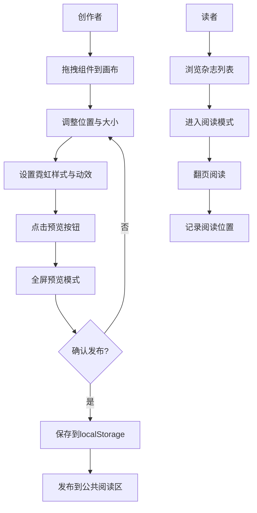

## 1. 产品概述

赛博朋克风格交互式电子杂志创作平台，为独立创作者提供专业的图文排版工具和发布平台，让用户像主编一样在浏览器中通过拖拽组合文字、图片、动效组件，生成具有霓虹光效与扫描线效果的动态杂志页面，并一键发布到公共阅读区。

- **核心目标**：解决独立创作者缺乏专业排版工具和发布平台的问题
- **目标用户**：独立创作者、内容创作者、赛博朋克文化爱好者
- **市场价值**：填补赛博朋克风格交互式内容创作工具的空白，提供零门槛的沉浸式内容创作体验

## 2. 核心功能

### 2.1 用户角色
| 角色 | 注册方式 | 核心权限 |
|------|----------|----------|
| 创作者 | 无需注册，本地存储 | 创建、编辑、预览、发布杂志 |
| 读者 | 无需注册 | 浏览公共阅读区、阅读杂志、记录阅读位置 |

### 2.2 功能模块
1. **编辑器页面**：网格画布、组件拖拽、样式控制面板、工具栏
2. **阅读器页面**：全屏预览、翻页动画、扫描线特效
3. **公共阅读区**：杂志列表、封面展示、时间排序
4. **本地存储模块**：杂志数据持久化、阅读位置记录

### 2.3 页面详情
| 页面名称 | 模块名称 | 功能描述 |
|---------|----------|----------|
| 编辑器页面 | 网格画布 | 深灰背景#1a1a2e，半透明青色网格线#0f3460，间距20px |
| 编辑器页面 | 组件面板 | 6种组件：标题块、正文块、图片框、分隔线、动效按钮、计时器 |
| 编辑器页面 | 样式控制面板 | 霓虹色选择、动效模式切换、字体字号、滤镜参数 |
| 编辑器页面 | 工具栏 | 预览、保存、发布、返回按钮 |
| 阅读器页面 | 全屏阅读 | 纯黑背景、扫描线动画、霓虹灯条、页码显示 |
| 阅读器页面 | 翻页功能 | 3D翻转动画、左右点击/键盘翻页、光晕特效 |
| 公共阅读区 | 杂志列表 | 封面缩略图、标题、作者、发布时间，时间倒序 |

## 3. 核心流程

### 3.1 创作流程
用户从组件面板拖拽模块到画布 → 调整组件位置（网格吸附）和大小 → 通过控制面板设置霓虹色和动效 → 点击预览进入全屏阅读模式 → 确认后发布到公共阅读区

### 3.2 阅读流程
读者在公共阅读区选择杂志 → 进入全屏阅读模式 → 点击左右半屏或按键盘箭头翻页 → 系统自动记录阅读位置

## 4. 用户界面设计

### 4.1 设计风格
- **主色调**：深灰 #1a1a2e
- **霓虹青色**：#00ffff（主强调色）
- **霓虹紫色**：#b366ff（次强调色）
- **霓虹品红**：#ff00ff（装饰色）
- **霓虹黄色**：#ffff00（装饰色）
- **霓虹红色**：#ff3333（装饰色）
- **霓虹绿色**：#39ff14（装饰色）
- **按钮样式**：霓虹边框1px #00ffff，悬停背景#00ffff20%，圆角4px
- **字体**：无衬线科技感字体（Orbitron / Rajdhani / system-ui）
- **动效**：所有交互0.2-0.4秒缓动过渡，霓虹闪烁、呼吸、扫描线效果
- **布局**：三栏布局（组件面板+画布+控制面板），桌面优先设计

### 4.2 页面设计概述
| 页面名称 | 模块名称 | UI元素 |
|---------|----------|--------|
| 编辑器页面 | 网格画布 | 20px间距青色网格、拖拽高亮虚线框#00ffff、0.4秒渐隐动画 |
| 编辑器页面 | 组件面板 | 垂直排列6种组件卡片，悬停霓虹光晕 |
| 编辑器页面 | 控制面板 | 颜色选择器、动效模式切换、滑块控件 |
| 编辑器页面 | 工具栏 | 半透明黑底，霓虹边框按钮 |
| 阅读器页面 | 阅读区域 | 纯黑背景、CSS扫描线动画（间距3px，透明度0.08）、顶部霓虹渐变灯条 |
| 阅读器页面 | 翻页交互 | 3D翻转0.6s，缓动cubic-bezier(0.4,0,0.2,1)，边缘光晕特效 |
| 公共阅读区 | 杂志卡片 | 封面缩略图、赛博朋克风格标题、作者时间信息 |

### 4.3 响应性
- **桌面优先**：适配1920x1080和1440x900屏幕
- **画布自适应**：编辑器画布根据屏幕尺寸缩放
- **触摸优化**：翻页支持触摸滑动

### 4.4 性能要求
- 预览模式帧率不低于55 FPS
- 翻页动画响应时间<200ms
- 组件拖拽流畅无卡顿
