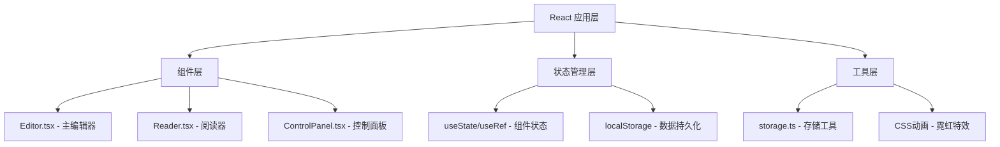

## 1. 架构设计



## 2. 技术描述

- **前端框架**：React 18 + TypeScript
- **构建工具**：Vite 5.x
- **状态管理**：React Hooks (useState, useRef, useEffect)
- **数据存储**：localStorage 浏览器本地存储
- **样式方案**：CSS Modules + CSS Variables
- **动画方案**：CSS Animations + Transitions
- **依赖库**：
  - react: 18.x
  - react-dom: 18.x
  - typescript: 5.x
  - vite: 5.x
  - @vitejs/plugin-react: 4.x
  - uuid: 9.x

## 3. 文件结构

```
e:\solo\VersionFast\tasks\auto101\
├── package.json
├── vite.config.js
├── tsconfig.json
├── index.html
├── .trae/
│   └── documents/
│       ├── PRD.md
│       └── tech-arch.md
└── src/
    ├── main.tsx
    ├── App.tsx
    ├── App.css
    ├── components/
    │   ├── Editor.tsx
    │   ├── Reader.tsx
    │   └── ControlPanel.tsx
    └── storage.ts
```

## 4. 数据模型定义

### 4.1 TypeScript 类型定义

```typescript
// 组件类型
type ComponentType = 'title' | 'text' | 'image' | 'divider' | 'button' | 'timer';

// 霓虹颜色
type NeonColor = '#00ffff' | '#ff00ff' | '#ffff00' | '#ff3333' | '#39ff14';

// 动效模式
type EffectMode = 'blink' | 'breathe' | 'scanline' | 'none';

// 画布组件
interface CanvasComponent {
  id: string;
  type: ComponentType;
  x: number;
  y: number;
  width: number;
  height: number;
  content: string;
  color: NeonColor;
  effect: EffectMode;
  fontSize: number;
  imageData?: string;
  hasNeonBorder?: boolean;
}

// 杂志数据
interface Magazine {
  id: string;
  title: string;
  author: string;
  createdAt: number;
  publishedAt?: number;
  coverImage?: string;
  pages: CanvasComponent[][];
}
```

### 4.2 存储键定义
- `cyberpunk_magazines`: 所有杂志列表
- `cyberpunk_last_read_{magazineId}`: 单本杂志最后阅读页码

## 5. 核心模块说明

### 5.1 storage.ts - 本地存储工具
- `saveMagazine(magazine: Magazine): void` - 保存/更新杂志
- `loadMagazineList(): Magazine[]` - 加载所有杂志列表
- `loadMagazine(id: string): Magazine | null` - 加载单本杂志
- `deleteMagazine(id: string): void` - 删除杂志
- `saveReadPosition(magazineId: string, page: number): void` - 保存阅读位置
- `loadReadPosition(magazineId: string): number` - 加载阅读位置

### 5.2 Editor.tsx - 主编辑器组件
- 渲染网格画布（20px间距，半透明青色网格线）
- 处理组件拖拽（从面板拖入画布，吸附到网格）
- 处理组件位置调整（边缘高亮#00ffff虚线框，0.4秒渐隐）
- 处理组件大小调整（拖拽右下角手柄，50%-200%缩放）
- 接收当前选中组件和样式变更回调

### 5.3 ControlPanel.tsx - 样式控制面板
- 霓虹色选择器（5种颜色）
- 动效模式切换（闪烁、呼吸、扫描线）
- 字体字号滑块（12-60px）
- 图片上传处理（jpg/png，5MB限制）
- 赛博朋克滤镜参数控制
- 霓虹边框动画开关

### 5.4 Reader.tsx - 阅读器组件
- 全屏阅读模式（纯黑背景#000000）
- CSS扫描线动画（间距3px，透明度0.08，60fps）
- 顶部霓虹渐变灯条（#ff00ff到#00ffff，2秒闪烁周期）
- 3D翻页动画（0.6秒，cubic-bezier(0.4,0,0.2,1)）
- 翻页光晕特效（#00ffff，透明度0.3，持续0.8秒）
- useRef 管理翻页状态和阅读位置

## 6. 性能优化策略

1. **组件懒渲染**：仅渲染当前可见页面的组件
2. **CSS动画优化**：使用 transform 和 opacity 实现动画，避免重排
3. **will-change**：对翻页动画元素使用 will-change: transform
4. **requestAnimationFrame**：复杂动画使用 RAF 确保60fps
5. **图片优化**：上传图片自动压缩，使用 CSS 滤镜替代 Canvas 处理
6. **防抖节流**：拖拽操作使用节流，避免频繁状态更新

## 7. 浏览器兼容性

- Chrome 90+
- Firefox 88+
- Safari 14+
- Edge 90+
