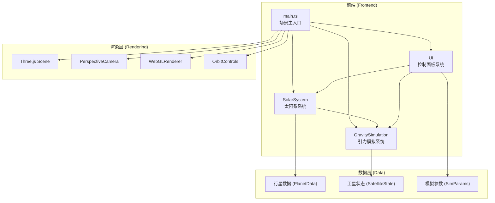

## 1. 架构设计



**调用关系与数据流向：**
- `main.ts` 作为入口，初始化Three.js场景、相机、渲染器、轨道控制器
- `main.ts` 实例化 `SolarSystem`、`GravitySimulation`、`UI` 三大模块
- `SolarSystem` 创建太阳、行星、轨道，接收鼠标交互，向 `GravitySimulation` 提供行星位置数据
- `GravitySimulation` 基于行星数据进行引力计算，更新卫星状态，输出到 `main.ts` 渲染
- `UI` (tweakpane) 接收用户参数输入，实时传递给 `SolarSystem` (轨道速度) 和 `GravitySimulation` (引力强度)

## 2. 技术描述
- **前端框架**：原生 TypeScript (无React/Vue，按用户要求使用Three.js直接操作DOM)
- **3D引擎**：Three.js @0.160.0
- **构建工具**：Vite (启用TypeScript，base: './')
- **UI控件**：Tweakpane (参数控制面板)
- **动画库**：GSAP (交互动画、缓动效果)
- **类型定义**：@types/three
- **初始化方式**：手动创建项目结构（用户指定了精确的文件列表和技术栈）

## 3. 文件结构
```
auto102/
├── package.json          # 项目依赖与脚本
├── vite.config.js        # Vite构建配置
├── tsconfig.json         # TypeScript配置 (严格模式 ES2020)
├── index.html            # 入口HTML (全屏黑色背景)
└── src/
    ├── main.ts           # Three.js场景主入口
    ├── solarSystem.ts    # 太阳系行星与轨道系统
    ├── gravitySim.ts     # 引力弹弓与轨道力学模拟
    └── ui.ts             # tweakpane控制面板与信息显示
```

## 4. 核心数据模型

### 4.1 行星数据 (PlanetData)
```typescript
interface PlanetData {
  name: string;           // 行星名称
  radius: number;         // 半径 (单位)
  color: string;          // 表面颜色 (hex)
  distance: number;       // 与太阳距离 (轨道半径)
  orbitalPeriod: number;  // 公转周期 (地球日)
  inclination: number;    // 轨道倾角 (度)
  temperature: number;    // 表面温度 (K)
  hasRing?: boolean;      // 是否有光环 (土星)
}
```

### 4.2 卫星状态 (SatelliteState)
```typescript
interface SatelliteState {
  position: THREE.Vector3;   // 当前位置
  velocity: THREE.Vector3;   // 当前速度
  active: boolean;           // 是否活跃
  trail: THREE.Vector3[];    // 轨迹点数组
  capturedBy?: string;       // 被捕获的行星名称
  deflectionAngle: number;   // 偏转角度 (度)
}
```

### 4.3 模拟参数 (SimParams)
```typescript
interface SimParams {
  orbitalSpeed: number;    // 轨道速度倍率 (0.5-5)
  gravityStrength: number; // 引力强度系数 (0.1-2.0)
}
```

## 5. 性能优化策略
| 优化点 | 方案 |
|--------|------|
| 星空粒子 | 使用THREE.Sprite + 共享材质，减少DrawCall |
| 阴影映射 | 仅当相机距离<30单位时启用阴影 |
| 卫星轨迹 | 限制轨迹点数量，渐变色可视化 |
| 光晕效果 | 距离剔除 + LOD策略 |
| 帧率保障 | 目标45FPS，使用增量时间(deltaTime)解耦物理更新 |

## 6. 物理模型
- **引力公式**：F = G * M * m / r² （牛顿万有引力）
- **时间步长**：dt = 0.01秒
- **逃逸速度**：v_escape = √(2GM/r)
- **偏转角度**：基于速度方向变化实时计算
- **公转速度**：真实比例1/1000（地球约365天/周）
