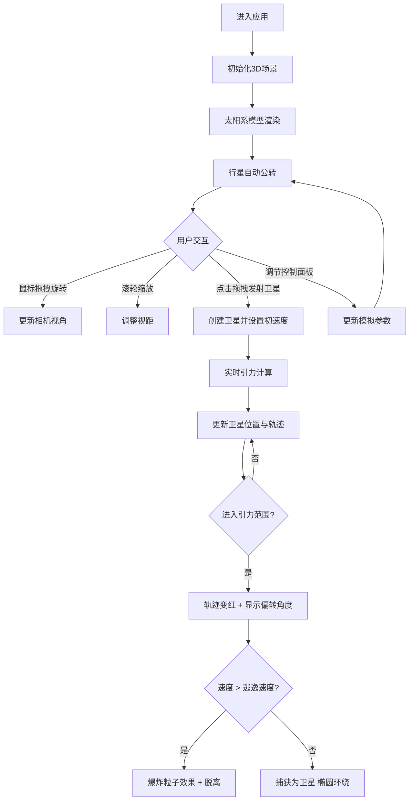

## 1. 产品概述
交互式太阳系轨道模拟与引力弹弓演示应用，面向天文学爱好者与教育工作者，提供直观的3D行星公转、卫星环绕及引力辅助变轨物理规律演示。
- 核心用途：天文教育演示、物理规律可视化、引力弹弓效应交互体验
- 目标用户：天文学爱好者、物理教师、学生、科普工作者

## 2. 核心功能

### 2.1 用户角色
| 角色 | 注册方式 | 核心权限 |
|------|----------|----------|
| 普通用户 | 无需注册 | 浏览太阳系、发射卫星、调节参数、查看行星数据 |

### 2.2 功能模块
1. **3D太阳系场景**：太阳动态光晕、八大行星公转与自转、半透明椭圆轨道、星空背景
2. **卫星发射系统**：拖拽发射探测卫星、初速度方向指示、轨迹可视化
3. **引力弹弓模拟**：实时引力计算、轨道偏转显示、逃逸/捕获判定、爆炸粒子效果
4. **参数控制面板**：轨道速度调节、引力强度调节、卫星重置、行星数据展示
5. **视角交互系统**：缩放、旋转、平移、相机信息面板

### 2.3 页面详情
| 页面名称 | 模块名称 | 功能描述 |
|----------|----------|----------|
| 主场景 | 3D太阳系渲染 | 太阳发光球体+动态光晕、八大行星带纹理自转公转、椭圆形虚线轨道、500颗闪烁星空粒子 |
| 主场景 | 卫星交互 | 点击拖拽发射卫星、青色箭头指示线、蓝白渐变点状轨迹、引力范围内红色轨迹 |
| 主场景 | 引力效果 | 牛顿万有引力实时计算、偏转角度标签、逃逸爆炸粒子(30个)、捕获椭圆轨道 |
| 控制面板 | 参数调节 | 轨道速度滑块(0.5x-5x)、引力强度滑块(0.1-2.0)、重置卫星按钮 |
| 控制面板 | 行星信息 | 展开显示所选行星的公转周期、轨道倾角、与太阳距离、表面温度 |
| 信息面板 | 相机状态 | 右下角显示缩放比例和相机坐标 |

## 3. 核心流程
用户进入应用后，首先看到完整的3D太阳系模型，行星正在按各自轨道公转。用户可以通过鼠标拖拽旋转视角、滚轮缩放。点击空白处并拖拽可发射探测卫星，卫星飞行过程中会受到行星引力影响产生偏转。用户可通过左侧控制面板调节模拟速度和引力强度，查看行星详细数据。

## 4. 用户界面设计

### 4.1 设计风格
- **主色调**：深空渐变背景(#000014 到 #0a0a2a)，面板深灰(#1a1a2e / #2a2a3a)
- **强调色**：青色(#00d4ff / #00ffcc)用于交互元素、超链接、卫星箭头
- **行星配色**：水星#b0a89a、金星#e8c87a、地球#4a90d9、火星#c46a4a、木星#d4a070、土星#e0c08a、天王星#80c0d0、海王星#3060a0、太阳#ffaa00
- **按钮样式**：圆角矩形，半透明背景，0.2秒ease-out缓动悬停效果
- **字体**：无衬线字体，白色主文字，层级分明的字号系统
- **布局**：全屏3D场景 + 左侧浮动控制面板 + 右下角相机信息面板
- **视觉效果**：毛玻璃(backdrop-filter: blur(5px))、阴影映射、光晕散射

### 4.2 页面设计概览
| 页面名称 | 模块名称 | UI元素 |
|----------|----------|--------|
| 主场景 | 3D渲染 | 全屏黑色背景渐变、发光太阳、纹理行星、虚线椭圆轨道、闪烁星空、点状卫星轨迹 |
| 控制面板 | 参数面板 | 半透明深灰圆角卡片、白色文字标签、青色滑块/按钮、毛玻璃效果、可折叠行星信息区 |
| 信息面板 | 相机状态 | 半透明黑底圆角小卡片、白色等宽字体显示缩放比例和XYZ坐标 |

### 4.3 响应性
- 桌面端优先设计，全屏自适应
- 控制面板固定宽度，可折叠收起
- 支持鼠标和触摸板操作

### 4.4 3D场景指引
- **环境**：深空渐变背景 + 500颗Sprite星星粒子，闪烁频率0.5-2Hz
- **光照**：太阳点光源(阴影映射，亮度偏移0.3) + 环境光补充
- **相机**：PerspectiveCamera，OrbitControls控制，缩放范围0.5-50，阻尼0.8
- **构图**：太阳位于场景中心，行星按真实比例1/1000速度公转
- **交互**：鼠标悬停显示行星名称标签、点击拖拽发射卫星(青色箭头)、滚轮缩放、右键平移
- **后处理**：太阳自定义着色器光晕、200个粒子光晕、阴影仅在距离<30时启用
- **性能**：帧率≥45FPS，卫星粒子≤200，星空使用Sprite减少DrawCall
