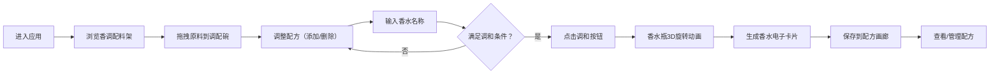

## 1. 产品概述

虚拟调香师实验室是一个在线互动式香水调配体验应用，让用户能够像专业调香师一样，通过拖拽和混合不同香调的香气分子，创造出独一无二的个人香水配方，并生成精美的电子卡片分享。

- 目标用户：对香水和创意DIY感兴趣的普通用户
- 核心价值：提供沉浸式、可视化的调香体验，将抽象的香气转化为直观的视觉艺术
- 市场定位：轻量级创意互动应用，兼具娱乐性和艺术性

## 2. 核心功能

### 2.1 功能模块

1. **香调配料架**：三排分层展示前调、中调、后调共24种基础香原料
2. **调配碗区域**：中央圆形调配区，支持拖拽添加、实时显示已选原料、删除操作
3. **调和生成**：满足条件后触发调和动画，生成香水电子卡片
4. **香气图谱**：Canvas绘制的径向堆叠色环，可视化展示香水配方结构
5. **配方画廊**：横向滚动的已保存配方卡片列表，支持查看、删除
6. **香水卡片**：水彩纸质感的电子卡片，展示香水名称、日期、香气图谱

### 2.2 功能详情

| 功能模块 | 子功能 | 详细描述 |
|---------|--------|----------|
| 香调配料架 | 三层展示 | 前调（淡青色）、中调（暖橙色）、后调（深紫色）各8种原料 |
| 香调配料架 | 原料卡片 | 色块+图标表示，支持拖拽 |
| 调配碗 | 拖拽添加 | 卡片拖入碗中消失，出现闪光动画 |
| 调配碗 | 原料列表 | 碗上方实时显示已添加原料，带删除按钮 |
| 调配碗 | 删除动效 | 删除时原料淡出，碗中产生对应颜色涟漪 |
| 调和功能 | 条件判断 | 至少3种原料，且前中后调各至少一种 |
| 调和功能 | 香水瓶动画 | 3D旋转动画（rotateY 360度，1.5秒） |
| 香水卡片 | 自定义名称 | 用户输入香水名称，衬线字体 |
| 香水卡片 | 香气图谱 | Canvas绘制三个同心半透明色环 |
| 香水卡片 | 设计风格 | 水彩纸质感、水渍纹理、金边装饰 |
| 配方画廊 | 保存功能 | 最多保存12个配方 |
| 配方画廊 | 横向滚动 | 卡片缩略图，hover上升放大效果 |
| 配方画廊 | 查看详情 | 点击查看完整香气图谱和原料详情 |
| 配方画廊 | 删除功能 | 长按删除，抖动+红色遮罩确认动画 |

## 3. 核心流程

用户进入应用 → 浏览香调配料架 → 拖拽原料到调配碗 → 添加/删除原料调整配方 → 输入香水名称 → 点击调和按钮 → 香水瓶旋转动画 → 生成香水卡片 → 保存到配方画廊 → 查看/管理已保存配方

## 4. 用户界面设计

### 4.1 设计风格

- **整体风格**：实验室风格，冷静克制，深灰蓝主色调
- **主色调**：深灰蓝 #1a2634（背景）
- **点缀色**：
  - 前调区：淡青色 #e0f7fa
  - 中调区：暖橙色 #ffe0b2
  - 后调区：深紫色 #ce93d8
  - 金色装饰：#d4af37
- **磨砂玻璃效果**：backdrop-filter: blur(8px)，半透明背景，细白边框
- **圆角设计**：统一12px圆角
- **字体**：无衬线体 Inter，香水名称用优雅衬线体
- **动效**：所有过渡动画 0.2-0.3秒，精确控制

### 4.2 页面布局

| 区域 | 位置 | UI元素 |
|------|------|--------|
| 标题区 | 顶部 | 应用标题、副标题 |
| 香调配料架 | 上/左部 | 三层原料卡片，横向排列 |
| 调配碗 | 中央 | 圆形调配碗、已选原料列表、调和按钮、名称输入 |
| 配方画廊 | 底部 | 横向滚动卡片列表 |
| 香水卡片弹窗 | 中央叠加 | 全屏/半屏展示生成的香水卡片 |

### 4.3 响应式设计

- **桌面端**：三排香调区横向排列，调配碗居中
- **移动端（<768px）**：三排香调区纵向排列，调配碗缩小到屏幕宽度80%，保持圆形
- **触控优化**：拖拽手势适配，按钮尺寸适合触控操作

### 4.4 动画与交互

- **拖拽**：60fps流畅拖拽，卡片跟随鼠标/手指
- **添加**：0.3秒扩散光环闪光动画
- **删除**：原料淡出 + 0.5秒颜色涟漪扩散
- **调和**：香水瓶 rotateY 360度，1.5秒 ease-in-out
- **卡片hover**：上升3px + 放大1.05倍
- **长按删除**：0.3秒抖动 + 半透明红色遮罩
- **横向滚动**：流畅无闪烁
