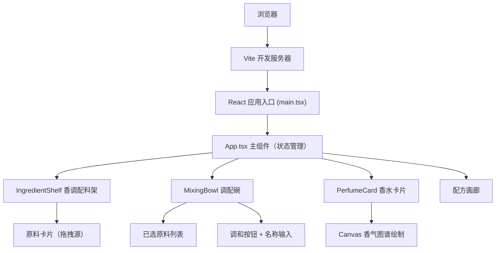

## 1. 架构设计

本项目为纯前端应用，采用 React + TypeScript + Vite 技术栈，使用 framer-motion 处理动画，Canvas 绘制香气图谱。



## 2. 技术描述

- **前端框架**：React 18 + TypeScript
- **构建工具**：Vite 5.x + @vitejs/plugin-react
- **动画库**：framer-motion
- **唯一ID生成**：uuid
- **状态管理**：React useState/useReducer（轻量级，无需额外状态管理库）
- **样式方案**：原生 CSS + CSS Variables，全局样式文件
- **图形绘制**：HTML5 Canvas API
- **拖拽实现**：HTML5 Drag and Drop API + framer-motion 增强

## 3. 目录结构

```
src/
├── main.tsx              # 应用入口
├── App.tsx               # 主应用组件
├── components/
│   ├── IngredientShelf.tsx   # 香调配料架组件
│   ├── MixingBowl.tsx        # 调配碗组件
│   └── PerfumeCard.tsx       # 香水卡片组件
├── styles/
│   └── global.css            # 全局样式
└── types/                  # TypeScript 类型定义（可选）
```

## 4. 数据模型

### 4.1 香原料类型定义

```typescript
interface Ingredient {
  id: string;
  name: string;
  noteType: 'top' | 'middle' | 'base';
  color: string;
  icon: string;
}
```

### 4.2 香水配方类型定义

```typescript
interface PerfumeRecipe {
  id: string;
  name: string;
  createdAt: Date;
  ingredients: Ingredient[];
}
```

### 4.3 应用状态

```typescript
interface AppState {
  selectedIngredients: Ingredient[];
  perfumeName: string;
  savedRecipes: PerfumeRecipe[];
  isBlending: boolean;
  showCard: boolean;
  currentRecipe: PerfumeRecipe | null;
}
```

## 5. 核心交互实现

### 5.1 拖拽交互

- 使用 HTML5 Drag and Drop API 实现基础拖拽
- 原料卡片设置 draggable="true"，携带 ingredient 数据
- 调配碗设置 onDragOver、onDrop 事件处理
- framer-motion 提供拖拽过程中的视觉反馈

### 5.2 动画实现

- **添加闪光动画**：framer-motion AnimatePresence + scale/opacity 动画
- **删除涟漪效果**：Canvas 或 CSS radial-gradient 动画
- **香水瓶旋转**：CSS transform: rotateY(360deg) + animation
- **卡片过渡**：framer-motion 实现列表的添加/删除动画

### 5.3 Canvas 香气图谱

- 三个同心半透明色环
- 最外环：前调颜色混合
- 中间环：中调颜色混合
- 中心：后调颜色混合
- 色环透明度 0.4，环间柔和光晕渐变

## 6. 性能优化策略

- **拖拽帧率**：使用 requestAnimationFrame 或 CSS transform 保证 60fps
- **列表渲染**：React key 优化，避免不必要重渲染
- **Canvas 绘制**：仅在数据变化时重绘，使用 requestAnimationFrame 节流
- **动画性能**：优先使用 transform 和 opacity 属性，避免触发重排
- **画廊滚动**：使用 CSS transform + will-change 优化滚动性能

## 7. 响应式设计

- 桌面端：三排香调区横向排列，调配碗居中
- 移动端（<768px）：三排香调区纵向堆叠，调配碗 80% 屏宽
- 使用 CSS Grid + Flexbox 实现自适应布局
- 媒体查询处理断点

## 8. 构建配置

- Vite 配置 React 插件和 TypeScript 支持
- TypeScript 严格模式，目标 ES2020
- jsx: react-jsx 模式
- 开发服务器热更新
