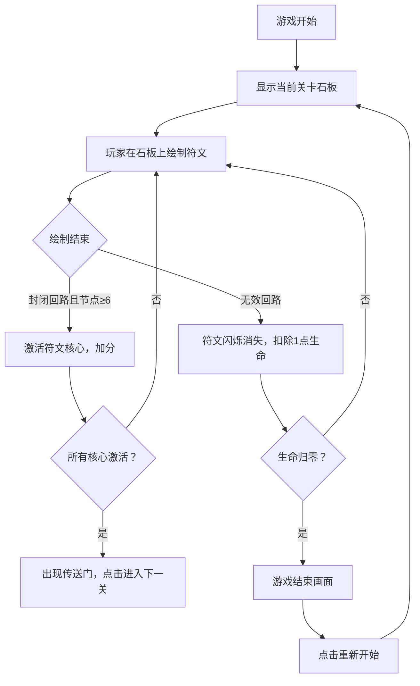

## 1. 产品概述

符文铭刻师是一款在浏览器中运行的交互式解谜游戏，玩家扮演古代符文师，在石板上绘制符文形状，通过连通符文路径来激活能量矩阵并解开机关。游戏采用古老遗迹的暗色调视觉风格，结合流畅的绘制体验和华丽的能量特效，为玩家带来沉浸式的符文解谜体验。

- **核心玩法**：在8x8网格的石板上用鼠标绘制封闭的符文回路，激活符文核心
- **目标用户**：喜欢解谜、益智类游戏的玩家
- **产品价值**：通过精美的视觉效果和流畅的交互体验，让玩家感受古代符文魔法的魅力

## 2. 核心功能

### 2.1 功能模块

1. **游戏主场景**：石板网格渲染、符文绘制系统、能量充能判定、关卡进度管理
2. **符文系统**：符文路径绘制、吸附机制、封闭回路检测、能量核心激活
3. **UI界面**：生命值显示、关卡信息、充能进度、分数统计、重置按钮
4. **特效系统**：能量波纹、粒子效果、传送门动画、失败反馈特效

### 2.2 页面详情

| 页面名称 | 模块名称 | 功能描述 |
|----------|----------|----------|
| 游戏主界面 | 石板网格 | 8x8网格显示，支持鼠标拖拽绘制符文路径，线段自动吸附到网格交叉点 |
| 游戏主界面 | 符文核心 | 每块石板中央的圆形核心，被有效符文回路激活时产生能量波纹动画 |
| 游戏主界面 | 传送门 | 所有石板激活后出现的旋转粒子环，点击进入下一关 |
| 游戏主界面 | UI系统 | 显示关卡号、生命值心形图标、重置按钮、分数信息 |
| 游戏结束界面 | 结束画面 | 生命归零时淡入，显示最终得分和重新开始按钮 |

## 3. 核心流程

### 3.1 游戏主流程



### 3.2 符文绘制流程

玩家在石板网格上按下鼠标开始绘制，移动鼠标时显示发光的白色线段，松开鼠标后线段吸附到最近的网格交叉点并固定为淡金色。当绘制的路径形成封闭回路且经过的交叉点不少于6个时，符文核心被激活。

## 4. 用户界面设计

### 4.1 设计风格

- **主色调**：深灰色背景 (#1a1a24)、深棕色石板 (#2b1f14)、暗金色网格线 (#8b7355)
- **强调色**：淡蓝色发光 (#a0c4ff)、金色 (#d4af37、#ffd700)、橙色 (#ff8c00)、红色警告 (#ff6b6b)
- **字体**：仿手写的暖金色字体 (#d4af37)
- **整体风格**：古老遗迹的神秘暗色调，配合发光符文和能量特效

### 4.2 视觉元素

| 元素 | 设计规范 |
|------|----------|
| 石板网格 | 8x8格子，每格40x40像素，石板底色深棕 #2b1f14，网格线暗金色半透明 #8b7355 |
| 绘制线段 | 绘制中为发光白色（线宽3px，淡蓝色外发光半径8px），固定后为淡金色 #d4af37 |
| 符文核心 | 圆形，半径20px，初始暗淡灰色 #555，激活时从灰→橙→金渐变，伴随能量波纹 |
| 符文灯柱 | 左右两侧各一个，高度300px，发蓝光，渐变圆形光晕模拟 |
| 背景粒子 | 40个漂浮粒子，大小1-3px，蓝紫色，移动速度0.3px/帧 |
| 传送门 | 60个粒子构成旋转环，粒子大小3-6px，紫到蓝渐变，转速0.5圈/秒 |
| 按钮 | 暗金色边框，悬停时半透明白色背景 |

### 4.3 页面布局

```
┌─────────────────────────────────────────────────────┐
│  关卡: 符文遗迹 - 第X层    ❤️ ❤️ ❤️ (生命)          │
├─────────────────────────────────────────────────────┤
│                                                     │
│  [灯柱]   [石板1] [石板2] [石板3]   [灯柱]          │
│                                                     │
├─────────────────────────────────────────────────────┤
│                  [重置当前石板]                     │
│                  分数: XXXX                         │
└─────────────────────────────────────────────────────┘
```

### 4.4 响应式设计

- 桌面端优先设计，游戏区域居中显示
- 固定分辨率设计，确保绘制精度和视觉效果
- 鼠标交互优化，支持精确的符文绘制

## 5. 性能要求

- 游戏帧率稳定在55FPS以上
- 粒子特效数量控制在80个以内
- 关闭抗锯齿以优化性能
- 内存占用合理，无内存泄漏
