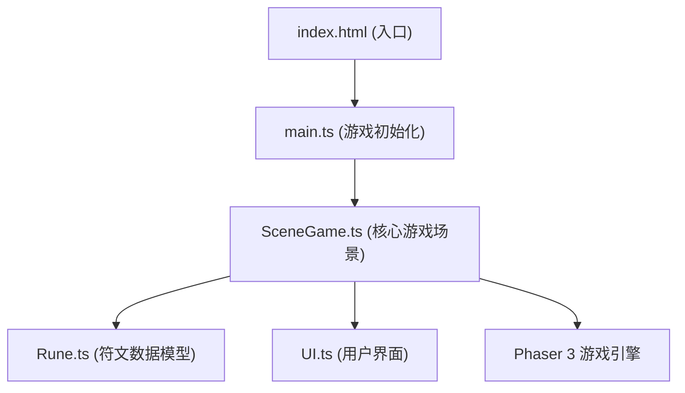

## 1. 架构设计



游戏采用 Phaser 3 作为核心渲染引擎，TypeScript 进行类型安全开发，Vite 作为构建工具。整体架构分为三层：

- **入口层**：index.html + main.ts，负责游戏启动和配置
- **场景层**：SceneGame.ts，核心游戏逻辑，管理石板、绘制、碰撞检测
- **工具层**：Rune.ts（符文数据）、UI.ts（界面组件）

## 2. 技术描述

- **前端框架**：Phaser 3.60.0（HTML5游戏框架）
- **开发语言**：TypeScript（严格模式，目标ES2020）
- **构建工具**：Vite
- **渲染方式**：Canvas 2D（Phaser内置）
- **无后端、无数据库**，纯前端游戏

### 2.1 依赖说明

| 依赖 | 版本 | 用途 |
|------|------|------|
| phaser | 3.60.0 | HTML5游戏引擎，提供渲染、输入、动画等核心功能 |
| typescript | latest | 类型安全的JavaScript超集 |
| vite | latest | 现代化前端构建工具 |

## 3. 文件结构

```
项目根目录/
├── package.json          # 项目配置与依赖
├── vite.config.js        # Vite构建配置
├── tsconfig.json         # TypeScript配置
├── index.html            # 入口HTML
└── src/
    ├── main.ts           # 游戏主入口
    ├── SceneGame.ts      # 核心游戏场景
    ├── Rune.ts           # 符文数据模型
    └── UI.ts             # 用户界面组件
```

## 4. 核心模块设计

### 4.1 Rune.ts - 符文数据模型

```typescript
// 符文路径点
interface RunePoint {
    x: number;
    y: number;
    gridX: number;
    gridY: number;
}

// 符文线段
interface RuneSegment {
    start: RunePoint;
    end: RunePoint;
    graphics: Phaser.GameObjects.Graphics;
}

// 符文核心状态
enum CoreState {
    INACTIVE = 'inactive',
    ACTIVATING = 'activating',
    ACTIVE = 'active'
}

class Rune {
    points: RunePoint[] = [];
    segments: RuneSegment[] = [];
    isClosed: boolean = false;
    
    // 检查路径是否封闭
    checkClosed(): boolean;
    
    // 检查路径节点数量
    getPointCount(): number;
    
    // 清空符文路径
    clear(): void;
    
    // 吸附到最近网格交叉点
    snapToGrid(x: number, y: number): RunePoint;
}
```

### 4.2 UI.ts - 用户界面组件

```typescript
class UI {
    scene: Phaser.Scene;
    health: number = 3;
    score: number = 0;
    level: number = 1;
    
    // 创建生命值心形图标
    createHealthIcons(): Phaser.GameObjects.Group;
    
    // 更新生命值显示
    updateHealth(health: number): void;
    
    // 更新分数
    updateScore(points: number): void;
    
    // 更新关卡显示
    updateLevel(level: number): void;
    
    // 显示游戏结束画面
    showGameOver(finalScore: number, onRestart: () => void): void;
    
    // 创建重置按钮
    createResetButton(onClick: () => void): Phaser.GameObjects.Text;
}
```

### 4.3 SceneGame.ts - 核心游戏场景

```typescript
class SceneGame extends Phaser.Scene {
    // 常量配置
    static readonly GRID_SIZE = 8;
    static readonly CELL_SIZE = 40;
    static readonly SNAP_DISTANCE = 12;
    
    // 游戏状态
    currentSlab: number = 0;
    slabsActivated: boolean[] = [false, false, false];
    isDrawing: boolean = false;
    currentRune: Rune | null = null;
    
    // 生命周期
    preload(): void;
    create(): void;
    update(time: number, delta: number): void;
    
    // 石板系统
    createSlabs(): void;
    createSlabGrid(x: number, y: number): void;
    activateSlabCore(slabIndex: number): void;
    
    // 绘制系统
    startDrawing(pointer: Phaser.Input.Pointer): void;
    onDrawing(pointer: Phaser.Input.Pointer): void;
    endDrawing(pointer: Phaser.Input.Pointer): void;
    
    // 判定系统
    validateRune(rune: Rune): boolean;
    checkLevelComplete(): boolean;
    
    // 特效系统
    createEnergyRipple(x: number, y: number): void;
    createPortal(): void;
    createBackgroundParticles(): void;
    createLampPosts(): void;
}
```

## 5. 关键技术实现

### 5.1 符文绘制与吸附

- 使用 `Phaser.Input.Pointer` 监听鼠标事件
- 绘制中使用 `Graphics` 实时渲染线段
- 吸附算法：计算鼠标位置到最近网格交叉点的距离，小于12像素则吸附
- 发光效果：使用 `lineStyle` 的 `glow` 属性或后处理

### 5.2 封闭回路检测

- 记录绘制路径的所有网格交叉点
- 判断起点和终点是否为同一网格点
- 统计路径经过的唯一交叉点数量

### 5.3 粒子特效

- 使用 `Phaser.GameObjects.Particles.ParticleEmitter` 实现粒子系统
- 传送门使用旋转的粒子环，通过 `emitter.angle` 控制旋转
- 能量波纹使用 `Tween` 控制圆形的缩放和透明度变化

### 5.4 性能优化

- 关闭 Phaser 抗锯齿：`antialias: false`
- 控制粒子总数不超过80个
- 复用 `Graphics` 对象，避免频繁创建销毁
- 使用对象池管理粒子

## 6. 配置文件说明

### 6.1 package.json

```json
{
  "name": "rune-inscriber",
  "private": true,
  "version": "0.1.0",
  "type": "module",
  "scripts": {
    "dev": "vite",
    "build": "tsc && vite build",
    "preview": "vite preview"
  },
  "dependencies": {
    "phaser": "3.60.0"
  },
  "devDependencies": {
    "typescript": "^5.0.0",
    "vite": "^4.0.0"
  }
}
```

### 6.2 vite.config.js

```javascript
export default {
  root: '.',
  base: './',
  build: {
    outDir: 'dist',
    assetsDir: 'assets'
  },
  server: {
    port: 5173,
    open: true
  }
};
```

### 6.3 tsconfig.json

```json
{
  "compilerOptions": {
    "target": "ES2020",
    "module": "ESNext",
    "strict": true,
    "esModuleInterop": true,
    "skipLibCheck": true,
    "moduleResolution": "bundler",
    "resolveJsonModule": true,
    "isolatedModules": true,
    "noEmit": true,
    "lib": ["ES2020", "DOM", "DOM.Iterable"]
  },
  "include": ["src"]
}
```
