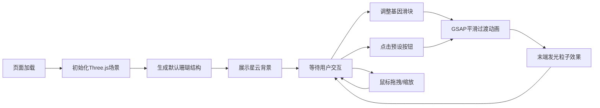

## 1. 产品概述

数字珊瑚与基因突变模拟器是一款面向科幻爱好者和概念艺术家的交互式3D生成工具。用户可以通过调整基因参数，在浏览器中实时观察数字有机体像珊瑚或藤蔓一样在3D空间中动态生长、分叉和形态变异的过程。

- **核心价值**：提供直观的基因参数操控界面，让用户探索无限可能的生物形态，激发创意灵感
- **目标用户**：科幻爱好者、概念艺术家、游戏设计师、生物美学研究者
- **技术特点**：基于 Three.js 的实时 3D 渲染，GSAP 平滑动画过渡，高性能粒子系统

## 2. 核心功能

### 2.1 用户角色

| 角色 | 注册方式 | 核心权限 |
|------|----------|----------|
| 普通用户 | 无需注册 | 直接使用所有功能，调整参数，保存截图 |

### 2.2 功能模块

1. **3D 珊瑚渲染区**：全屏 3D 画布，展示动态生长的数字珊瑚结构
2. **基因控制面板**：8 个参数滑块，实时调控珊瑚形态特征
3. **预设形态系统**：3 种一键预设（海葵模式、鹿角珊瑚、随机变异）
4. **交互视角控制**：鼠标拖拽旋转、滚轮缩放
5. **背景星云效果**：缓慢旋转的粒子星云背景
6. **平滑过渡动画**：参数变化时 0.8 秒缓动过渡 + 末端发光粒子效果

### 2.3 页面详情

| 页面名称 | 模块名称 | 功能描述 |
|----------|----------|----------|
| 主页面 | 3D 渲染区 | 全屏 Three.js 画布，展示珊瑚结构，支持鼠标交互 |
| 主页面 | 基因控制面板 | 右上角悬浮面板，8 个滑块 + 3 个预设按钮，半透明毛玻璃风格 |
| 主页面 | 星云背景 | 1000 个蓝紫色粒子缓慢旋转，深度闪烁效果 |

## 3. 核心流程

用户打开页面 → 默认珊瑚结构生成并展示 → 用户调整基因参数 → 珊瑚形态平滑过渡 → 用户选择预设 → 形态动画切换 → 用户拖拽/缩放视角 → 持续探索形态变化

## 4. 用户界面设计

### 4.1 设计风格

- **整体风格**：深色太空主题 + 生物荧光美学
- **主背景色**：#0a0a14 深蓝黑色
- **UI 元素背景**：#1e1e3a 半透明灰紫色，毛玻璃效果 (backdrop-filter: blur(6px))
- **发光边框**：内发光 #7a5a9a 0 0 6px inset
- **珊瑚主色调**：底部深紫 #3b0a45 → 顶部亮橙 #ff6b35 渐变
- **按钮光晕**：#6b5b95 外发光，模糊 8px
- **圆角**：8px 控件圆角，12px 面板圆角
- **字体**：现代无衬线字体，数字使用等宽字体增强科技感

### 4.2 页面设计概述

| 页面名称 | 模块名称 | UI 元素 |
|----------|----------|---------|
| 主页面 | 3D 渲染区 | 全屏画布、OrbitControls 交互、无多余边框 |
| 主页面 | 基因控制面板 | 宽 280px、右上角悬浮、半透明背景、8 个带数值显示的滑块、复位按钮、3 个渐变预设按钮 |
| 主页面 | 星云背景 | 1000 个粒子、蓝紫色系、缓慢旋转、深度闪烁 |

### 4.3 响应式

- **桌面端**（≥768px）：控制面板固定在右上角，宽 280px
- **移动端**（<768px）：控制面板收缩为可折叠侧边栏，点击右上角图标展开/收起
- 珊瑚渲染区始终自适应画布尺寸变化
- 触摸设备支持手势缩放和旋转

### 4.4 3D 场景指导

- **环境**：深空背景 + 星云粒子系统，营造宇宙生物悬浮感
- **光照**：柔和的环境光 + 两盏侧光（紫色和橙色）模拟生物荧光效果
- **摄像机**：PerspectiveCamera，初始位置 (0, 4, 12)，看向原点
- **交互**：OrbitControls，俯仰角限制 -30° 到 60°，距离范围 5-30 单位
- **后期效果**：发光粒子飘散、轻微光晕效果
- **性能预算**：递归深度 6 时多边形 ≤ 50000，粒子总数 ≤ 1500，每帧计算 ≤ 3ms
