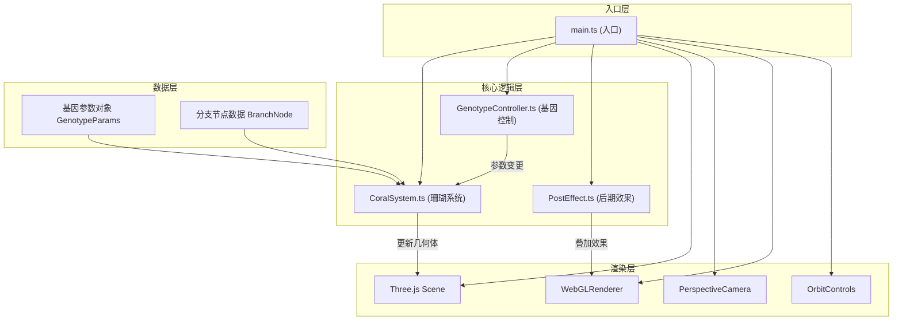

## 1. 架构设计



## 2. 技术描述

- **前端框架**：原生 TypeScript + Vite 构建（非 React/Vue，用户明确指定 Three.js 直接操作）
- **3D 渲染引擎**：three@0.160.0
- **UI 控制面板**：tweakpane
- **动画库**：gsap
- **构建工具**：Vite 5.x
- **类型系统**：TypeScript 5.x 严格模式，目标 ES2020

## 3. 文件结构与调用关系

| 文件路径 | 职责 | 调用方向 | 输入 | 输出 |
|----------|------|----------|------|------|
| `index.html` | 页面入口，全屏画布容器 | → main.ts | DOM 容器 | 无 |
| `src/main.ts` | 初始化 Three.js 场景、摄像机、渲染器，驱动动画循环 | → CoralSystem, GenotypeController, PostEffect | DOM 容器 | 渲染帧 |
| `src/coral/CoralSystem.ts` | 核心类，接收基因参数，动态生成/更新珊瑚几何体 | ← GenotypeController → THREE.Group | 基因参数对象 | 珊瑚网格对象 |
| `src/coral/GenotypeController.ts` | 使用 tweakpane 创建 UI 控制面板，监听参数变化 | → CoralSystem | 用户输入 | 参数变更回调 |
| `src/effects/PostEffect.ts` | 背景粒子雾效和屏幕后期光晕 | ← main.ts → 场景 | 渲染器、场景 | 叠加效果 |
| `src/types/genotype.ts` | 基因参数类型定义 | ← CoralSystem, GenotypeController | 无 | 类型定义 |
| `src/utils/math.ts` | 数学工具函数 | ← CoralSystem | 无 | 工具函数 |
| `src/styles/main.css` | 全局样式 | ← index.html | 无 | 样式 |

**数据流方向**：
```
用户输入 → GenotypeController → 参数对象 → CoralSystem → BufferGeometry更新 → Three.js渲染 → PostEffect → 最终画面
```

## 4. 核心数据结构

### 4.1 基因参数 GenotypeParams

```typescript
interface GenotypeParams {
  branchDensity: number;      // 分支密度 0.5-2.0
  spiralAngle: number;        // 螺旋角度 0-90 度
  branchLength: number;       // 分支长度缩放 0.5-2.0
  recursionDepth: number;     // 递归深度 1-6
  colorVariation: number;     // 颜色变异 0-1
  stemTwist: number;          // 主茎扭曲 0-5 度/单位
  tipBulge: number;           // 末端膨大量 0.8-2.0
  growthSpeed: number;        // 生长速度 0.5-3.0 秒/层
}
```

### 4.2 分支节点 BranchNode

```typescript
interface BranchNode {
  id: string;
  level: number;              // 层级，0 为主茎
  position: THREE.Vector3;    // 起始位置
  direction: THREE.Vector3;   // 生长方向
  length: number;             // 长度
  radius: number;             // 底部半径
  color: THREE.Color;         // 颜色
  children: BranchNode[];     // 子分支
  isTip: boolean;             // 是否为末端
}
```

### 4.3 预设配置 PresetConfig

```typescript
interface PresetConfig {
  name: string;
  params: Partial<GenotypeParams>;
  gradient: { bottom: string; top: string };
}
```

## 5. 核心算法

### 5.1 珊瑚生成算法

1. **主茎生成**：从原点 (0,0,0) 沿 Y 轴向上生长，高度 8 单位
2. **侧枝生成**：沿主茎每隔 0.5 单位（受密度影响）分出侧枝
3. **侧枝角度**：偏离主茎 30-60 度随机，绕 Y 轴螺旋分布
4. **递归分支**：每个末端生出 2-3 个次生分支，递归深度 4 层（默认）
5. **几何体**：圆柱体（半径随层级递减 0.15→0.05）+ 末端球体
6. **颜色渐变**：HSL 插值，从底部深紫到顶部亮橙，受颜色变异参数影响

### 5.2 形态过渡算法

1. 保存旧形态的所有分支节点状态（位置、旋转、颜色）
2. 计算新形态的所有分支节点状态
3. 使用 GSAP 的 fromTo 动画，0.8 秒 easeInOutCubic 缓动
4. 每帧更新 BufferGeometry 的顶点位置和颜色
5. 过渡期间触末端发光粒子飘散效果（50-150 个粒子）

### 5.3 性能优化策略

1. **合并几何体**：所有圆柱体和球体合并为单一 BufferGeometry
2. **实例化渲染**：使用 InstancedMesh 优化重复几何体
3. **按需更新**：仅参数变化时重新计算，动画中仅插值
4. **粒子池化**：复用粒子对象，避免频繁 GC
5. **LOD 策略**：远距离减少粒子数量和细节

## 6. 性能指标

| 指标 | 目标值 |
|------|--------|
| 帧率 | ≥ 60 FPS |
| 递归深度 6 时多边形数 | ≤ 50,000 |
| 粒子总数 | ≤ 1,500 |
| 每帧脚本计算时间 | ≤ 3ms（不含渲染） |
| 初始加载时间 | ≤ 2s |
| 过渡动画流畅度 | 无卡顿、无跳帧 |
