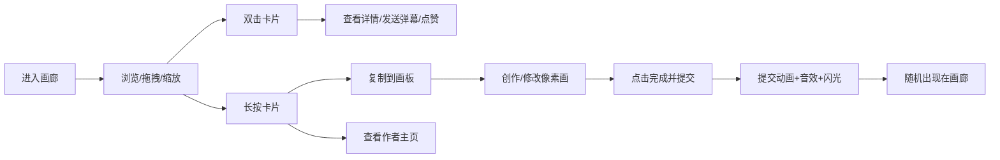

## 1. 产品概述
像素创意工坊是一个在线虚拟协作画廊，让用户像在数字化街头涂鸦墙上一样，用像素画笔自由创作小块像素画，并将作品拼接在无限延伸的虚拟画廊墙上，形成持续演变的社群像素壁画。

- 核心价值：提供低门槛的像素艺术创作与社交体验，激发社群共创乐趣
- 目标用户：像素艺术爱好者、朋友社群、创意工作者

## 2. 核心功能

### 2.1 用户角色
| 角色 | 注册方式 | 核心权限 |
|------|---------|---------|
| 访客用户 | 无需注册，自动生成昵称 | 浏览画廊、创作像素画、提交作品、点赞弹幕、复制二次创作 |

### 2.2 功能模块
1. **像素画板**：12色调色板、3种画笔尺寸、实时绘画、提交动画与音效
2. **画廊网格**：无限滚动2D墙、拖拽平移、滚轮缩放、卡片随机分布
3. **卡片详情**：双击放大、弹幕评论、点赞互动
4. **长按菜单**：复制到画板、查看作者主页、举报
5. **用户主页**：侧滑面板、最近作品展示
6. **响应式布局**：桌面端/移动端自适应

### 2.3 页面详情
| 页面名称 | 模块名称 | 功能描述 |
|---------|---------|---------|
| 主页面 | 像素画板 | 深灰色石板纹理背景，左侧工具栏，12种经典8位游戏色盘，画笔尺寸1/2/4px，点击缩放动画，Web Audio音效，右上角提交按钮 |
| 主页面 | 画廊网格 | 夜蓝色背景(#1a1a2e)，128x138px网格位，拖拽平移，滚轮缩放(0.5x-3x)，卡片随机分布 |
| 主页面 | 卡片详情 | 双击放大至屏幕中央(cubic-bezier动画)，弹幕输入框，从右向左飘过的彩色弹幕 |
| 主页面 | 长按菜单 | 0.5秒长按触发三选项：复制到画板、查看作者主页、举报 |
| 主页面 | 用户主页侧滑 | 从右侧滑出，显示作者最近5次提交的缩略图 |
| 移动端 | 底部工具栏 | 横向滑动色块栏，高度50px，3列网格布局 |

## 3. 核心流程

## 4. 用户界面设计

### 4.1 设计风格
- 主色调：夜蓝 #1a1a2e + 像素绿 #00cc88 + 经典白 #ffffff
- 石板纹理背景：#2c2c2c + repeating-conic-gradient 模拟颗粒
- 色盘：经典8位游戏色盘（12色）
- 按钮：圆角、悬停变色/发光、过渡动画 0.2s ease
- 字体：无衬线体（微软雅黑/系统默认）
- 卡片：白色边框2px，圆角8px，阴影效果
- 动画：缩放淡入、弹幕飘动、提交闪光

### 4.2 页面设计概述
| 页面名称 | 模块名称 | UI元素 |
|---------|---------|-------|
| 主页面 | 像素画板 | 深灰石板背景、圆形色块(24px)、选中白色发光晕、画笔尺寸按钮、提交按钮(绿色)、像素点亮缩放动画 |
| 主页面 | 画廊网格 | 夜蓝背景、半透明网格线(#404060)、卡片(128x128)、昵称(灰色小字)、点赞数+❤️、拖拽grabbing手势 |
| 主页面 | 弹幕系统 | 白色/彩色弹幕、透明度0.8、2-4秒横穿屏幕、输入框(透明底白边圆角12px) |
| 主页面 | 侧滑面板 | 右侧滑入、缩放+淡入动画0.3s、最近作品缩略图网格 |
| 移动端 | 底部工具栏 | 横向滚动色盘、50px高度、3列画廊网格、点击查看模态框 |

### 4.3 响应式
- 桌面端优先设计，宽度 < 768px 切换移动端布局
- 工具栏从左侧移至底部，横向滑动
- 画廊改为3列布局
- 双击卡片改为点击弹出模态框
- 所有动画时长缩短至 70%

### 4.4 性能指标
- 100+ 张卡片时滚动/缩放帧率 ≥ 50fps
- 双击卡片放大动画延迟 ≤ 100ms
- 移动端动画流畅度优化
