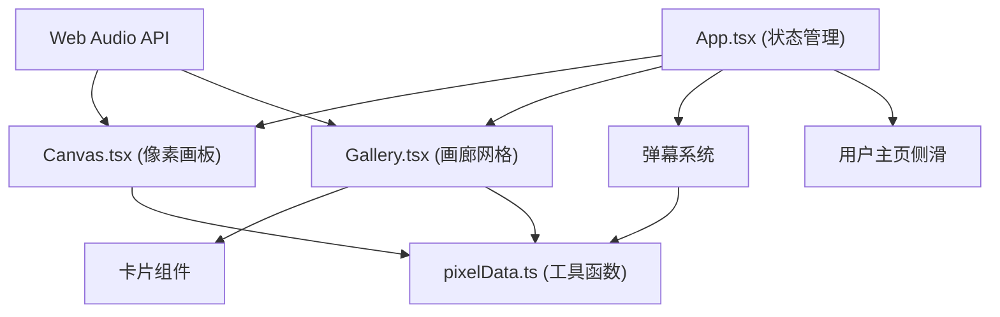

## 1. 架构设计



## 2. 技术描述

- 前端框架：React 18 + TypeScript
- 构建工具：Vite 5
- 状态管理：React useState/useReducer (轻量级，无需额外状态库)
- 样式方案：原生 CSS + CSS Modules (内联样式 + styled-components 风格的 CSS-in-JS)
- 像素渲染：Canvas API / 直接 DOM 网格
- 音效：Web Audio API (方波滴答声、白噪声咔嚓声)
- 唯一标识：uuid

## 3. 目录结构

```
src/
├── main.tsx              # React 入口
├── App.tsx               # 主应用，路由/视图切换、全局状态
├── components/
│   ├── Canvas.tsx        # 像素画板组件
│   ├── Gallery.tsx       # 画廊网格组件
│   ├── PixelCard.tsx     # 像素卡片组件
│   ├── DanmakuSystem.tsx # 弹幕系统
│   ├── UserProfile.tsx   # 用户主页侧滑
│   └── LongPressMenu.tsx # 长按菜单
├── utils/
│   └── pixelData.ts      # 像素数据序列化/反序列化等工具
├── hooks/
│   ├── useWebAudio.ts    # Web Audio 音效 hook
│   └── useLongPress.ts   # 长按检测 hook
└── types/
    └── index.ts          # TypeScript 类型定义
```

## 4. 数据模型

### 4.1 像素数据
```typescript
// 32x32 像素画，每个像素存储颜色索引 (0-11 对应 12 色调色板)
// 或直接存储 hex 颜色值
type PixelData = string[][]; // 32x32 的颜色值二维数组
```

### 4.2 卡片数据
```typescript
interface PixelCard {
  id: string;           // 唯一编号 (uuid)
  authorId: string;     // 作者ID
  authorName: string;   // 作者昵称
  pixelData: PixelData; // 像素数据
  likes: number;        // 点赞数
  createdAt: number;    // 创建时间戳
  position: { x: number; y: number }; // 画廊网格坐标
}
```

### 4.3 用户数据
```typescript
interface User {
  id: string;
  name: string;
  recentWorks: PixelCard[]; // 最近 5 个作品
}
```

### 4.4 弹幕数据
```typescript
interface Danmaku {
  id: string;
  text: string;
  color: string;
  speed: number; // 横穿屏幕秒数
  top: number;   // 垂直位置百分比
}
```

## 5. 核心交互实现方案

### 5.1 像素画板
- 使用 32x32 的 div 网格 (或 Canvas 2D)
- 鼠标按下 + 移动 = 连续绘画
- 点击缩放动画：CSS transform: scale(1.05) + transition
- 颜色选择：点击圆形色块，选中状态发光晕 shadow
- 画笔尺寸：1px/2px/4px，通过绘制多个像素点实现

### 5.2 画廊网格
- 2D 可平移/缩放视口
- 拖拽平移：mousedown + mousemove + mouseup
- 滚轮缩放：wheel 事件，transform: scale()
- 卡片位置随机分布：基于网格坐标随机放置
- 性能优化：只渲染可视区域内的卡片 (虚拟滚动/视口裁剪)

### 5.3 卡片详情
- 双击放大：fixed 定位 + transform: scale() + cubic-bezier 动画
- 弹幕系统：绝对定位 + CSS animation/transition 从右向左移动
- 点赞 + 弹幕输入

### 5.4 长按菜单
- mousedown/touchstart 开始计时
- 0.5 秒后显示菜单
- mouseup/touchend 取消计时

### 5.5 Web Audio 音效
- 点击像素：100ms 方波 (square wave)，频率约 800Hz
- 提交作品：80ms 白噪声衰减，模拟"咔嚓"声

## 6. 性能优化

- **虚拟渲染**：只渲染视口内的卡片
- **CSS transform**：使用 transform/opacity 做动画，触发 GPU 加速
- **防抖/节流**：滚轮缩放、拖拽事件使用 rAF 节流
- **will-change**：对频繁变化的元素添加 will-change
- **requestAnimationFrame**：弹幕动画使用 rAF 驱动

## 7. 入口文件

- `index.html` - 全屏深色背景入口
- `vite.config.js` - Vite 配置 (React 插件)
- `tsconfig.json` - TypeScript 配置 (严格模式, ES2020)
- `package.json` - 依赖与脚本
