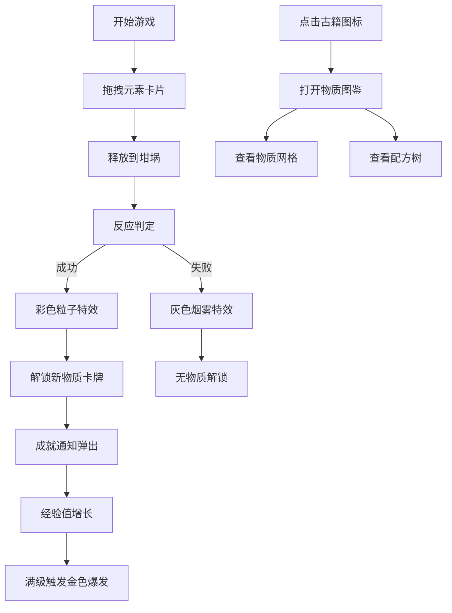

## 1. 产品概述

炼金术士工坊是一款交互式元素合成实验游戏，玩家通过拖拽组合基础元素（火、水、土、气）及其衍生物质，观察连锁化学反应，解锁新物质图谱，获得沉浸式炼金术探索体验。

- **核心目标**：提供直观有趣的元素合成玩法，让玩家在虚拟实验室中体验发现新物质的乐趣
- **目标用户**：对化学、炼金术、解谜游戏感兴趣的休闲玩家
- **市场价值**：寓教于乐的科学启蒙游戏，融合复古美学与现代交互技术

## 2. 核心功能

### 2.1 用户角色
| 角色 | 注册方式 | 核心权限 |
|------|----------|----------|
| 普通玩家 | 无需注册 | 完整游戏体验、解锁物质、查看图鉴 |

### 2.2 功能模块
1. **炼金工作台**：中央反应坩埚、元素拖拽放置区、合成动画展示
2. **元素架系统**：左右两侧元素卡片展示、拖拽交互、卡片状态管理
3. **物质卡牌系统**：磨砂玻璃质感卡牌、解锁/锁定状态、锁链动画
4. **配方反应系统**：15+种合成配方、反应判定、产物生成
5. **成就与经验系统**：合成成功通知、经验条增长、满级特效
6. **物质图鉴系统**：周期表式网格布局、配方树可视化、节点拖拽
7. **视觉反馈系统**：粒子特效、音效反馈、触觉动画

### 2.3 页面详情
| 页面名称 | 模块名称 | 功能描述 |
|----------|----------|----------|
| 主游戏界面 | 炼金工作台 | 圆形坩埚（直径200px）、黄铜渐变边框、漩涡旋转动画（1度/秒）、合成粒子效果 |
| 主游戏界面 | 元素架 | 左侧6个基础元素卡片、拖拽交互、悬停光晕、点击凹陷效果 |
| 主游戏界面 | 经验条与通知 | 顶部经验条（深褐底色+金色填充）、成就横幅通知（滑入+淡出） |
| 主游戏界面 | 右侧面板 | 图鉴入口按钮（古籍SVG图标）、物质信息展示 |
| 图鉴弹窗 | 物质网格 | 周期表式布局、已解锁/未解锁状态、问号占位 |
| 图鉴弹窗 | 配方树 | 有向图展示、节点可拖拽、连线渐变色 |

## 3. 核心流程

玩家进入游戏后，从左右元素架拖拽元素卡片到中央坩埚上方释放，系统进行合成判定：
- 成功：坩埚爆出彩色粒子闪光（30个粒子，扩散半径100px，持续0.5秒），解锁新物质卡牌，弹出成就通知，经验值+10%
- 失败：坩埚冒出灰色烟雾（8个粒子，上升速度2px/帧，持续1秒）

玩家可点击右上角古籍图标打开图鉴，查看所有物质和配方树。

## 4. 用户界面设计

### 4.1 设计风格
- **主色调**：羊皮纸黄 (#f4e4c1)、深褐色 (#3e2723)、古铜金 (#cfa144)
- **辅助色**：火 (#e74c3c)、水 (#3498db)、土 (#8b4513)、气 (#b0c4de)
- **卡片风格**：磨砂玻璃质感（背景rgba(255,255,255,0.15)、半透明白色边框1px、圆角12px）
- **羊皮纸纹理**：CSS repeating-linear-gradient 模拟纤维纹路，透明度0.08，角度45度
- **按钮效果**：悬停时古铜色光晕（box-shadow扩散5px，颜色#cfa144，透明度0.3），点击时凹陷（transform scale 0.95）
- **字体**：中世纪古籍风格衬线字体，标题使用装饰性字体
- **图标**：使用emoji和SVG图标组合，风格统一

### 4.2 页面设计概述
| 页面名称 | 模块名称 | UI元素 |
|----------|----------|--------|
| 主游戏界面 | 整体布局 | 三分栏：左20%元素架、中60%工作台、右20%信息面板 |
| 主游戏界面 | 坩埚 | 直径200px圆形、黄铜渐变外框、半透明漩涡旋转动画、放置热区 |
| 主游戏界面 | 元素卡片 | 羊皮纸纹理背景、磨砂玻璃效果、物质名称+化学符号+等级+描述 |
| 主游戏界面 | 锁定卡牌 | 灰色遮罩、锁链图标左右摆动（幅度5度，周期2秒） |
| 主游戏界面 | 经验条 | 顶部横向条、深褐底色#6b4423、金色填充#d4a017 |
| 主游戏界面 | 成就通知 | 顶部横幅、金色渐变#ffd700到#ffaa00、滑入动画、2秒后淡出 |
| 图鉴弹窗 | 物质网格 | 周期表式排列、暗色格子+问号、点击查看详情 |
| 图鉴弹窗 | 配方树 | 有向图、节点半径30px、连线渐变色、节点可拖拽 |

### 4.3 响应式设计
- **桌面端**：三分栏布局（20% / 60% / 20%）
- **移动端**（<768px）：上下布局，元素架移至顶部横向滚动
- **触摸优化**：增大可点击区域，支持触摸拖拽

### 4.4 动画与特效
- **拖拽动画**：卡片跟随鼠标，放大至1.1倍
- **释放动画**：卡片缩小消失（0.2秒），回弹动画（spring物理模拟，刚度180，阻尼12）
- **漩涡动画**：坩埚内壁漩涡1度/秒旋转
- **锁链动画**：锁定卡牌锁链左右摆动5度，周期2秒
- **成功粒子**：30个彩色粒子，随机颜色，扩散半径100px，持续0.5秒
- **失败粒子**：8个灰色烟雾，上升速度2px/帧，透明度递减，持续1秒
- **满级粒子**：100个金色粒子爆发，持续1秒
- **音效**：Web Audio API生成200-800Hz随机短促音调，时长0.1秒

### 4.5 性能要求
- 200个粒子同时显示保持60fps
- 动画帧率不低于55fps
- 初次加载时间不超过2秒
