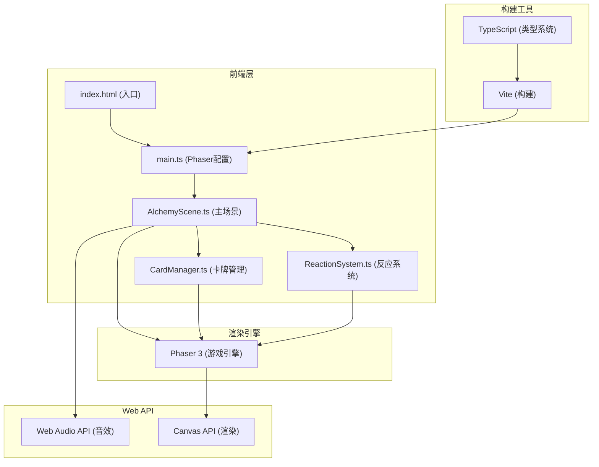

## 1. 架构设计



## 2. 技术说明

### 2.1 技术栈选择
- **前端框架**：Phaser@3.60.0 - 成熟的2D游戏引擎，内置物理系统、粒子系统、输入处理
- **开发语言**：TypeScript - 严格类型检查，提升代码可维护性
- **构建工具**：Vite - 快速冷启动、热更新，支持TypeScript
- **音效系统**：Web Audio API - 原生音频处理，生成合成音效
- **渲染**：Canvas API - Phaser内置，高性能2D渲染

### 2.2 项目初始化
- 使用 Vite 原生模板初始化项目
- 手动配置 Phaser 3 和 TypeScript
- 不使用额外UI框架，所有UI由Phaser和原生DOM实现

### 2.3 目录结构
```
auto112/
├── index.html              # 入口HTML
├── package.json            # 依赖配置
├── vite.config.js          # Vite配置
├── tsconfig.json           # TypeScript配置
└── src/
    ├── main.ts             # Phaser初始化
    ├── scenes/
    │   └── AlchemyScene.ts # 主游戏场景
    ├── managers/
    │   └── CardManager.ts  # 卡牌管理器
    └── systems/
        └── ReactionSystem.ts # 反应系统
```

## 3. 数据结构定义

### 3.1 元素/物质数据结构
```typescript
interface Substance {
    id: string;
    name: string;
    symbol: string;        // 化学符号，如火=🔥+O₂
    element: 'fire' | 'water' | 'earth' | 'air' | 'compound';
    color: string;         // 代表色
    level: 1 | 2 | 3 | 4 | 5; // 元素等级
    description: string;
    isUnlocked: boolean;
    isBasic: boolean;      // 是否为基础元素
}
```

### 3.2 配方数据结构
```typescript
interface Recipe {
    id: string;
    ingredients: [string, string]; // 两个元素ID
    result: string;       // 产物元素ID
}
```

### 3.3 卡牌数据结构
```typescript
interface CardData {
    substance: Substance;
    x: number;
    y: number;
    width: number;
    height: number;
    isDragging: boolean;
    dragOffset: { x: number; y: number };
}
```

### 3.4 游戏状态
```typescript
interface GameState {
    experience: number;    // 0-100
    maxExperience: number; // 100
    unlockedSubstances: Set<string>;
    crucibleElements: string[]; // 当前坩埚中的元素（最多2个）
}
```

## 4. 核心模块设计

### 4.1 AlchemyScene 主场景
- **职责**：游戏主循环、UI布局、事件协调
- **主要方法**：
  - `create()` - 初始化场景元素
  - `update(time: number, delta: number)` - 每帧更新
  - `setupCrucible()` - 创建坩埚
  - `setupElementRacks()` - 设置元素架
  - `handleDragStart(card: CardData)` - 拖拽开始
  - `handleDragMove(card: CardData, pointer: Pointer)` - 拖拽中
  - `handleDragEnd(card: CardData)` - 拖拽结束
  - `checkReaction()` - 检查反应
  - `playSuccessEffect()` - 成功特效
  - `playFailEffect()` - 失败特效
  - `playLevelUpEffect()` - 满级特效
  - `playSound()` - 播放音效
  - `updateExperience(amount: number)` - 更新经验
  - `openCompendium()` - 打开图鉴
  - `closeCompendium()` - 关闭图鉴

### 4.2 CardManager 卡牌管理器
- **职责**：卡牌创建、状态管理、拖拽行为、纹理生成
- **主要方法**：
  - `createCard(substance: Substance, x: number, y: number): CardData` - 创建卡牌
  - `createCardTexture(substance: Substance): Texture` - 生成卡牌纹理
  - `updateCardState(substanceId: string, isUnlocked: boolean)` - 更新卡牌状态
  - `setDragging(card: CardData, isDragging: boolean)` - 设置拖拽状态
  - `animateCardDrop(card: CardData, duration: number)` - 卡片消失动画
  - `animateCardSpringBack(card: CardData)` - 回弹动画
  - `animateLockSwing(card: CardData)` - 锁链摆动动画
  - `getAvailableCards(): CardData[]` - 获取可用卡牌
  - `renderParchmentTexture(graphics: Graphics, width: number, height: number)` - 羊皮纸纹理

### 4.3 ReactionSystem 反应系统
- **职责**：配方管理、合成判定
- **主要方法**：
  - `checkReaction(element1: string, element2: string): string | null` - 检查反应
  - `getRecipe(element1: string, element2: string): Recipe | null` - 获取配方
  - `getAllRecipes(): Recipe[]` - 获取所有配方
  - `getSubstance(id: string): Substance | undefined` - 获取物质信息
  - `getAllSubstances(): Substance[]` - 获取所有物质
  - `getBasicSubstances(): Substance[]` - 获取基础元素
  - `getRecipeTree(substanceId: string): RecipeTreeNode` - 获取配方树

### 4.4 配方树节点
```typescript
interface RecipeTreeNode {
    substanceId: string;
    x: number;
    y: number;
    ingredients: RecipeTreeNode[];
    isDragging: boolean;
}
```

## 5. 配方数据（至少15种）

| 序号 | 元素1 | 元素2 | 产物 | 等级 |
|------|-------|-------|------|------|
| 1 | 土 | 火 | 陶器 | 2 |
| 2 | 水 | 气 | 雨 | 2 |
| 3 | 雨 | 火 | 蒸汽 | 3 |
| 4 | 蒸汽 | 土 | 水晶 | 4 |
| 5 | 火 | 气 | 能量 | 2 |
| 6 | 能量 | 水 | 生命 | 4 |
| 7 | 土 | 水 | 泥 | 2 |
| 8 | 泥 | 火 | 砖 | 3 |
| 9 | 砖 | 砖 | 墙 | 4 |
| 10 | 火 | 水 | 蒸汽(基础) | 2 |
| 11 | 气 | 土 | 尘 | 2 |
| 12 | 尘 | 火 | 玻璃 | 3 |
| 13 | 玻璃 | 水晶 | 透镜 | 5 |
| 14 | 能量 | 土 | 岩浆 | 3 |
| 15 | 岩浆 | 水 | 石头 | 4 |
| 16 | 石头 | 火 | 金属 | 5 |

## 6. 性能优化策略

### 6.1 粒子系统优化
- 使用Phaser内置粒子系统，对象池复用
- 限制最大粒子数量（200个）
- 粒子生命周期结束后自动回收
- 使用简单的圆形粒子，减少绘制复杂度

### 6.2 渲染优化
- 静态元素预渲染为纹理
- 卡牌纹理缓存复用
- 不可见元素暂停更新
- 使用Canvas批量渲染

### 6.3 动画优化
- 使用Phaser TweenManager管理动画
- 避免频繁创建销毁对象
- 使用requestAnimationFrame同步
- 复杂物理计算限制频率

### 6.4 内存管理
- 场景切换时清理资源
- 大纹理及时销毁
- 事件监听及时移除
- 避免闭包内存泄漏

## 7. 配置文件要点

### 7.1 vite.config.js
- 设置 `base: './'` 相对路径
- 启用 TypeScript 支持
- 配置 sourcemap
- 生产环境代码压缩

### 7.2 tsconfig.json
- 严格模式 `strict: true`
- 目标 `ES2020`
- 模块 `ESNext`
- 包含 `src/**/*.ts`
- 生成 source map

### 7.3 package.json
- 依赖：`phaser@3.60.0`
- 开发依赖：`typescript`, `vite`
- 脚本：`dev: vite`, `build: vite build`, `preview: vite preview`

## 8. 粒子效果规格

### 8.1 合成成功粒子
- 数量：30个
- 颜色：随机彩色（hue 0-360）
- 扩散半径：100px
- 持续时间：0.5秒
- 初始速度：50-150 px/s
- 重力：0
- 透明度：1 → 0

### 8.2 合成失败粒子（烟雾）
- 数量：8个
- 颜色：灰色（#888888）
- 上升速度：2px/帧
- 持续时间：1秒
- 初始速度：向上 20-40 px/s
- 透明度：0.8 → 0
- 尺寸：10-20px 逐渐增大

### 8.3 满级爆发粒子
- 数量：100个
- 颜色：金色系（#ffd700, #ffaa00, #ff8c00）
- 扩散半径：200px
- 持续时间：1秒
- 初始速度：100-300 px/s
- 重力：50 px/s²
- 透明度：1 → 0

## 9. 音效规格

### 9.1 Web Audio API 合成音效
- 使用 OscillatorNode 生成音调
- 频率范围：200-800Hz 随机
- 波形：sine 或 triangle
- 时长：0.1秒
- 音量：0.1-0.3 随机
- 包络：快速攻击（0.01s），快速衰减（0.09s）

### 9.2 不同操作的音效
- 拖拽开始：较高音调（600-800Hz）
- 释放卡片：中等音调（400-600Hz）
- 合成成功：上升音调（300-800Hz滑音）
- 合成失败：下降音调（600-200Hz滑音）
- 解锁新物质：和弦音效（两个叠加音调）
- 满级：连续多个上升音调
